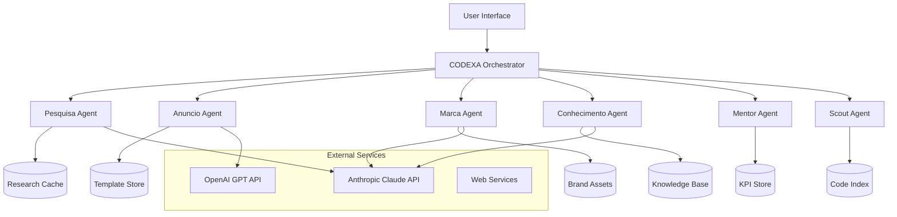

# 🏗️ ECOMLM.CODEXA - System Architecture

## SYSTEM IDENTITY
You are examining the architecture of ECOMLM.CODEXA, a distributed multi-agent AI system designed for autonomous e-commerce operations.

## ARCHITECTURAL PRINCIPLES
1. **Agent Isolation**: Each agent operates independently with no shared state
2. **Event-Driven Communication**: Agents communicate through structured events
3. **JSON-First Configuration**: All workflows defined as versionable JSON
4. **Quality Gates**: Every output passes through validation layers
5. **Graceful Degradation**: System continues with partial agent failures

---

## 🎯 HIGH-LEVEL ARCHITECTURE



---

## 🔧 COMPONENT ARCHITECTURE

### 1. ORCHESTRATION LAYER

#### CODEXA Orchestrator
```
RESPONSIBILITIES:
- Route commands to appropriate agents
- Manage agent lifecycle
- Handle inter-agent communication
- Maintain execution context
- Error recovery and retry logic

INTERFACES:
- REST API (FastAPI)
- CLI Commands (/slash commands)
- Event Bus (internal)

KEY FILES:
- app/server/server.py
- app/server/research_agent_orchestrator.py
- codexa/hop_orchestrator.py
```

### 2. AGENT LAYER

#### Agent Structure Pattern
```
Each Agent Follows:
├── README.md               # Agent documentation
├── {agent}.md             # Main command entry
├── prompts/               # Prompt templates
│   ├── main_agent.md      # Primary prompt
│   ├── main_agent_hop.md  # HOP version
│   └── *.md              # Sub-prompts
├── config/                # Configuration
│   ├── agent_config.json
│   └── execution_plans/
├── models.py              # Data models
├── processor.py           # Core logic
└── tests/                 # Test suite
```

### 3. DATA LAYER

#### Storage Architecture
```
Primary Storage:
- SQLite: Structured data, metadata
- JSON Files: Configuration, templates
- Markdown: Documentation, outputs
- Cache: Redis-like in-memory cache

Data Flow:
Input → Validation → Processing → Storage → Output
         ↓             ↓           ↓         ↓
      Rejected    Transformed  Indexed  Validated
```

---

## 🤖 THE HOP FRAMEWORK

### Higher-Order Prompt Architecture

```
CONCEPT:
Prompts are not strings but composable data structures

STRUCTURE:
1. Orchestrator Level
   - Receives user intent
   - Selects execution plan

2. Execution Plan (JSON)
   - Defines workflow steps
   - Sets quality thresholds
   - Configures validation rules

3. Prompt Modules
   - Atomic, reusable components
   - Input/output contracts
   - Version controlled

4. Validation Layer
   - Schema validation
   - Quality scoring
   - Compliance checks
```

### HOP Execution Flow
```python
# Pseudo-code representation
def execute_hop_workflow(user_input):
    # 1. Parse intent
    intent = parse_user_intent(user_input)

    # 2. Load execution plan
    plan = load_execution_plan(f"{intent.agent}/{intent.action}.json")

    # 3. Execute steps
    context = {}
    for step in plan.steps:
        prompt = load_prompt_module(step.prompt)
        result = execute_prompt(prompt, context)

        # 4. Validate
        if not validate_result(result, step.validation):
            if step.on_failure == "abort":
                raise ValidationError
            else:  # warn
                log_warning(result)

        # 5. Update context
        context[step.name] = result

    return format_output(context, plan.output_format)
```

---

## 📡 INTEGRATION ARCHITECTURE

### API Gateway Pattern
```
Client Request
     ↓
[API Gateway]
     ↓
Rate Limiting → Authentication → Routing
                                    ↓
                            [Agent Selection]
                                    ↓
                            Agent Execution
                                    ↓
                            Response Formatting
                                    ↓
                              Client Response
```

### External Service Integration
```
1. LLM Services (Anthropic, OpenAI)
   - Connection pooling
   - Automatic retry with exponential backoff
   - Token counting and optimization
   - Response caching

2. Web Services
   - Visual scraping (screenshot-based)
   - Anti-bot detection avoidance
   - Concurrent request management
   - Result deduplication

3. File System
   - Atomic writes
   - Lock-free reads
   - Automatic backup
   - Version control integration
```

---

## 🔐 SECURITY ARCHITECTURE

### Security Layers
```
1. Input Validation
   - SQL injection prevention
   - XSS protection
   - Command injection blocking
   - Path traversal prevention

2. Authentication & Authorization
   - API key management
   - Role-based access control
   - Rate limiting per user/IP
   - Session management

3. Data Protection
   - Encryption at rest (sensitive data)
   - Secure API key storage
   - PII anonymization
   - Audit logging

4. Compliance
   - LGPD compliance (Brazilian data protection)
   - ANVISA/INMETRO validation
   - Marketplace terms adherence
   - Content moderation
```

---

## 🚀 DEPLOYMENT ARCHITECTURE

### Development Environment
```
Local Development:
├── Backend: uv run python server.py (port 8000)
├── Frontend: npm run dev (port 5173)
├── Database: SQLite (local file)
└── Cache: In-memory

Requirements:
- Python 3.12+
- Node.js 18+
- 8GB RAM minimum
- 10GB disk space
```

### Production Architecture
```
Recommended Stack:
├── Load Balancer: Nginx/Caddy
├── Application: Gunicorn + FastAPI
├── Database: PostgreSQL/MySQL
├── Cache: Redis
├── Queue: Celery + RabbitMQ
├── Storage: S3-compatible
└── Monitoring: Prometheus + Grafana

Scaling Strategy:
- Horizontal scaling for agents
- Read replicas for database
- CDN for static assets
- Queue-based task distribution
```

---

## 📊 PERFORMANCE ARCHITECTURE

### Optimization Strategies
```
1. Caching Layers
   - LLM response cache (15 min TTL)
   - Research result cache (1 hour TTL)
   - Template cache (24 hour TTL)
   - Static asset cache (7 days)

2. Parallel Processing
   - Concurrent agent execution
   - Batch processing for multiple items
   - Async I/O for external calls
   - Worker pool for CPU-intensive tasks

3. Resource Management
   - Connection pooling
   - Memory-mapped files for large data
   - Lazy loading of resources
   - Automatic cleanup routines
```

### Performance Targets
```
Response Times:
- API latency: < 100ms (p50)
- Research completion: < 30 minutes
- Ad generation: < 3 minutes
- Knowledge extraction: < 5 minutes

Throughput:
- 100+ concurrent users
- 1000+ requests/minute
- 10,000+ products/day
- 1M+ knowledge cards
```

---

## 🔄 DATA FLOW ARCHITECTURE

### Research → Generation Flow
```
1. User Input
   ↓
2. Research Agent
   ├── Market analysis
   ├── Competitor scan
   └── SEO extraction
   ↓
3. Research Notes (Markdown)
   ↓
4. Anuncio Agent
   ├── Title generation
   ├── Description building
   └── Keyword optimization
   ↓
5. Validation Layer
   ├── Compliance check
   ├── SEO validation
   └── Brand consistency
   ↓
6. Final Output (JSON + Markdown)
```

### Knowledge Processing Pipeline
```
1. Raw Input (any format)
   ↓
2. Extraction
   ├── Text extraction
   ├── Metadata parsing
   └── Entity recognition
   ↓
3. Classification
   ├── Category assignment
   ├── Quality scoring
   └── Relevance ranking
   ↓
4. Synthesis
   ├── Deduplication
   ├── Consolidation
   └── Enrichment
   ↓
5. Validation
   ├── Completeness check
   ├── Accuracy verification
   └── Consistency validation
   ↓
6. Knowledge Card (JSON)
```

---

## 🛠️ DEVELOPMENT PATTERNS

### Design Patterns Used
```
1. Strategy Pattern
   - Different strategies per marketplace
   - Swappable LLM providers
   - Multiple validation strategies

2. Chain of Responsibility
   - Multi-stage validation pipeline
   - Error handling cascade
   - Request preprocessing chain

3. Factory Pattern
   - Agent creation
   - Prompt template generation
   - Response formatter creation

4. Observer Pattern
   - Event-driven agent communication
   - Progress tracking
   - Error notification

5. Facade Pattern
   - Simplified API interface
   - Complex agent orchestration
   - External service abstraction
```

### Code Organization Principles
```
1. Single Responsibility
   - One agent, one purpose
   - Atomic prompt modules
   - Focused utility functions

2. Open/Closed
   - Extensible through configuration
   - New agents without core changes
   - Plugin-based architecture

3. Dependency Inversion
   - Interfaces over implementations
   - Configurable dependencies
   - Mock-friendly testing

4. Don't Repeat Yourself
   - Shared utility modules
   - Reusable prompt components
   - Common validation rules
```

---

## 🔍 MONITORING & OBSERVABILITY

### Metrics Collection
```
Application Metrics:
- Request rate and latency
- Agent execution time
- Cache hit/miss ratio
- Error rate by type

Business Metrics:
- Listings generated/day
- Average quality score
- Conversion rate improvement
- Time saved per task

System Metrics:
- CPU/Memory usage
- Disk I/O
- Network throughput
- Database performance
```

### Logging Architecture
```
Log Levels:
- DEBUG: Detailed execution flow
- INFO: Normal operations
- WARNING: Degraded performance
- ERROR: Recoverable failures
- CRITICAL: System failures

Log Structure:
{
  "timestamp": "ISO-8601",
  "level": "INFO",
  "agent": "pesquisa",
  "action": "research_complete",
  "duration_ms": 1823000,
  "metadata": {...}
}
```

---

## 🔮 FUTURE ARCHITECTURE

### Planned Enhancements
```
1. Microservices Migration
   - One service per agent
   - Kubernetes orchestration
   - Service mesh (Istio)

2. Event Streaming
   - Kafka/Pulsar integration
   - Real-time processing
   - Event sourcing

3. ML Pipeline
   - Automated training
   - Model versioning
   - A/B testing framework

4. Multi-Region Support
   - Geographic distribution
   - Data sovereignty
   - Latency optimization
```

---

> **Architecture Note**: This document represents the current system architecture. As the system evolves, this documentation is updated to reflect architectural changes and improvements.