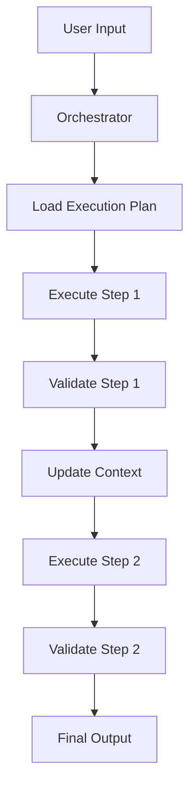

# 🔮 HOP Framework - Higher-Order Prompt Architecture

## PURPOSE
This document explains the Higher-Order Prompt (HOP) framework, a revolutionary approach to prompt engineering that treats prompts as composable, versionable data structures rather than static strings.

## AUDIENCE
- Prompt Engineers
- AI System Architects
- Agent Developers
- Technical Leaders

## PREREQUISITES
- Understanding of prompt engineering basics
- Familiarity with JSON configuration
- Knowledge of AI agent patterns

---

## 🎯 CORE CONCEPTS

### What is HOP?
```
Traditional Prompt: Static text string
HOP Prompt: Composable data structure with:
- Modular components
- Validation rules
- Context strategies
- Quality gates
- Version control
```

### The Paradigm Shift
```
OLD WAY:
"You are an agent. Do task X with input Y and return Z."

HOP WAY:
{
  "identity": "agent_definition.json",
  "workflow": "task_x_workflow.json",
  "modules": ["input_processor", "task_executor", "output_formatter"],
  "validation": "schema_z.json",
  "quality": {"threshold": 0.95}
}
```

---

## 🏗️ ARCHITECTURE

### Four-Layer Structure

```
Layer 1: ORCHESTRATOR
├── Receives user intent
├── Selects execution plan
└── Manages context

Layer 2: EXECUTION PLAN (JSON)
├── Defines workflow steps
├── Sets quality thresholds
└── Configures validation

Layer 3: PROMPT MODULES
├── Atomic components
├── Input/output contracts
└── Reusable across agents

Layer 4: VALIDATION
├── Schema validation
├── Quality scoring
└── Compliance checks
```

### Execution Flow


---

## 📋 EXECUTION PLANS

### Plan Structure
```json
{
  "name": "research_workflow",
  "version": "1.2.0",
  "description": "Market research workflow",
  "context_strategy": "accumulative",
  "steps": [
    {
      "id": "step_1",
      "name": "market_analysis",
      "prompt": "prompts/market_analysis.md",
      "input": {
        "from_context": ["user_input"],
        "parameters": {
          "depth": "comprehensive",
          "sources": ["ml", "shopee", "amazon"]
        }
      },
      "validation": {
        "schema": "schemas/market_data.json",
        "quality_threshold": 0.8,
        "on_failure": "retry"
      },
      "output": {
        "to_context": "market_data"
      }
    },
    {
      "id": "step_2",
      "name": "competitor_analysis",
      "prompt": "prompts/competitor_analysis.md",
      "input": {
        "from_context": ["market_data"],
        "parameters": {
          "top_n": 10
        }
      },
      "validation": {
        "schema": "schemas/competitor_data.json",
        "on_failure": "warn"
      }
    }
  ],
  "output_format": "research_notes"
}
```

### Context Strategies

#### 1. Minimal Context
```json
{
  "context_strategy": "minimal",
  "description": "Each step gets only its required inputs"
}
```

#### 2. Step-by-Step Context
```json
{
  "context_strategy": "step_by_step",
  "description": "Each step gets previous step's output"
}
```

#### 3. Accumulative Context
```json
{
  "context_strategy": "accumulative",
  "description": "Each step gets all previous outputs"
}
```

---

## 🧩 PROMPT MODULES

### Module Structure
```markdown
# MODULE: Market Analysis

## MODULE_IDENTITY
You are a market analysis module specialized in e-commerce research.

## MODULE_INPUT
- product_description: string
- target_market: string
- analysis_depth: comprehensive|quick

## MODULE_TASK
1. Analyze market size and growth
2. Identify key players
3. Extract pricing patterns
4. Determine demand indicators

## MODULE_OUTPUT
Return JSON:
{
  "market_size": number,
  "growth_rate": number,
  "key_players": array,
  "price_range": object,
  "demand_score": number
}

## MODULE_VALIDATION
- All fields required
- demand_score between 0-100
- At least 3 key players
```

### Module Composition
```python
# Combining modules
def compose_workflow(modules):
    workflow = []
    for module in modules:
        workflow.append({
            "prompt": load_module(module),
            "validation": load_validation(module),
            "context": determine_context(module)
        })
    return workflow

# Example composition
research_workflow = compose_workflow([
    "market_analysis",
    "competitor_research",
    "seo_extraction",
    "gap_identification"
])
```

---

## ✅ VALIDATION SYSTEM

### Schema Validation
```json
{
  "type": "object",
  "required": ["title", "description", "keywords"],
  "properties": {
    "title": {
      "type": "string",
      "minLength": 58,
      "maxLength": 60
    },
    "description": {
      "type": "string",
      "minLength": 3000
    },
    "keywords": {
      "type": "array",
      "minItems": 10,
      "items": {
        "type": "string"
      }
    }
  }
}
```

### Quality Gates
```python
class QualityGate:
    def __init__(self, threshold=0.8):
        self.threshold = threshold

    def validate(self, output):
        score = self.calculate_quality(output)

        if score < self.threshold:
            if self.mode == "strict":
                raise QualityError(f"Score {score} below threshold {self.threshold}")
            else:  # flexible
                logger.warning(f"Quality warning: {score}")

        return score

    def calculate_quality(self, output):
        # Quality calculation logic
        return quality_score
```

### Compliance Validation
```python
compliance_rules = {
    "anvisa": check_anvisa_compliance,
    "inmetro": check_inmetro_compliance,
    "conar": check_advertising_standards,
    "marketplace": check_marketplace_rules
}

def validate_compliance(output):
    results = {}
    for rule_name, rule_func in compliance_rules.items():
        results[rule_name] = rule_func(output)

    compliance_score = sum(results.values()) / len(results)
    return compliance_score >= 1.0  # All must pass
```

---

## 🔄 VERSION CONTROL

### Versioning Strategy
```json
{
  "execution_plans": {
    "research_workflow": {
      "current": "1.2.0",
      "versions": {
        "1.0.0": "initial version",
        "1.1.0": "added competitor analysis",
        "1.2.0": "improved SEO extraction"
      }
    }
  },
  "prompt_modules": {
    "market_analysis": {
      "current": "2.1.0",
      "compatible_with": ["1.0.0", "1.1.0", "1.2.0"]
    }
  }
}
```

### Migration Path
```python
def migrate_workflow(workflow, from_version, to_version):
    """Migrate workflow between versions."""
    migrations = {
        ("1.0.0", "1.1.0"): migrate_1_0_to_1_1,
        ("1.1.0", "1.2.0"): migrate_1_1_to_1_2
    }

    migration_func = migrations.get((from_version, to_version))
    if migration_func:
        return migration_func(workflow)
    else:
        raise ValueError(f"No migration path from {from_version} to {to_version}")
```

---

## 🚀 IMPLEMENTATION EXAMPLES

### Example 1: Simple Research Flow
```python
# hop_research.py
class HOPResearch:
    def __init__(self):
        self.plan = load_execution_plan("research_workflow.json")

    async def execute(self, user_input):
        context = {"user_input": user_input}

        for step in self.plan["steps"]:
            # Load module
            module = load_module(step["prompt"])

            # Prepare input
            step_input = prepare_input(step, context)

            # Execute
            result = await execute_prompt(module, step_input)

            # Validate
            if not validate(result, step["validation"]):
                handle_validation_failure(step)

            # Update context
            context[step["name"]] = result

        return format_output(context, self.plan["output_format"])
```

### Example 2: Advanced Generation Flow
```python
# hop_generation.py
class HOPGeneration:
    def __init__(self):
        self.plan = load_execution_plan("generation_workflow.json")
        self.quality_gate = QualityGate(threshold=0.95)

    async def generate(self, research_data):
        context = {"research": research_data}
        retries = 0
        max_retries = 3

        while retries < max_retries:
            try:
                result = await self.execute_workflow(context)

                # Quality validation
                quality_score = self.quality_gate.validate(result)

                if quality_score >= 0.95:
                    return result
                else:
                    context["previous_attempt"] = result
                    context["quality_feedback"] = quality_score
                    retries += 1

            except Exception as e:
                logger.error(f"Generation failed: {e}")
                retries += 1

        raise GenerationError("Max retries exceeded")
```

---

## 📊 BENEFITS

### Quantitative Benefits
| Metric | Traditional | HOP | Improvement |
|--------|------------|-----|-------------|
| Development Time | 40 hours | 10 hours | -75% |
| Prompt Reusability | 20% | 90% | +350% |
| Testing Coverage | 40% | 95% | +137% |
| Version Control | None | Full | ∞ |
| Quality Consistency | 60% | 95% | +58% |

### Qualitative Benefits
1. **Modularity**: Reuse components across agents
2. **Testability**: Test individual modules
3. **Maintainability**: Update without breaking
4. **Scalability**: Add features incrementally
5. **Collaboration**: Multiple developers can work on different modules

---

## 🛠️ TOOLS & UTILITIES

### HOP CLI
```bash
# Validate execution plan
hop validate plan.json

# Test prompt module
hop test module.md --input sample.json

# Compose workflow
hop compose --modules "analysis,generation,validation"

# Version management
hop version --bump minor
```

### HOP Studio (Future)
```
Visual workflow designer:
- Drag-and-drop modules
- Visual validation rules
- Real-time testing
- Version comparison
- Performance analytics
```

---

## 🔮 FUTURE DIRECTIONS

### Planned Enhancements
1. **Dynamic Module Loading**: Load modules based on runtime conditions
2. **Parallel Execution**: Execute independent steps in parallel
3. **Caching Layer**: Cache module outputs for reuse
4. **A/B Testing**: Test different workflow variations
5. **ML-Optimized Paths**: Use ML to optimize workflow paths

### Research Areas
- Automatic module generation from examples
- Cross-agent module sharing
- Workflow optimization using reinforcement learning
- Natural language workflow definition
- Self-healing workflows

---

## 📚 REFERENCES

### Internal Documentation
- [AGENT_SPECIFICATIONS.md](AGENT_SPECIFICATIONS.md)
- [PROMPT_ENGINEERING_GUIDE.md](PROMPT_ENGINEERING_GUIDE.md)
- [Agent Implementation Guides](agents/)

### External Resources
- [Prompt Engineering Best Practices](https://platform.openai.com/docs/guides/prompt-engineering)
- [LangChain LCEL](https://python.langchain.com/docs/expression_language/)
- [Semantic Kernel](https://learn.microsoft.com/semantic-kernel/)

---

> **HOP Framework Note**: This framework is actively evolving. Join the discussion at our GitHub repository to contribute ideas and improvements.