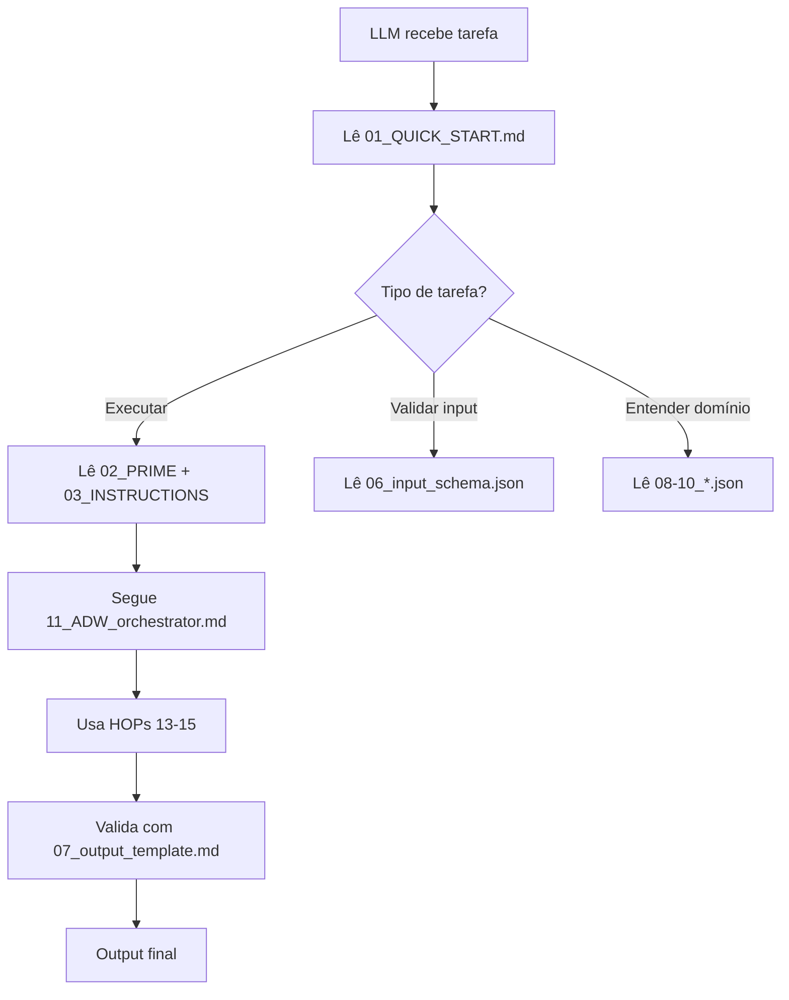

# Arquitetura iso_vectorstore - Single Source of Truth

> **Versão**: 1.0.0 | **Data**: 2025-11-30

## Problema Atual

```
{agent}/
├── PRIME.md              ← Duplica iso_vectorstore/02_PRIME.md
├── INSTRUCTIONS.md       ← Duplica iso_vectorstore/03_INSTRUCTIONS.md  
├── README.md             ← Duplica iso_vectorstore/04_README.md
├── SETUP.md              ← Não duplicado
└── iso_vectorstore/
    ├── 01_QUICK_START.md
    ├── 02_PRIME.md       ← DUPLICADO
    ├── 03_INSTRUCTIONS.md ← DUPLICADO
    ├── 04_README.md      ← DUPLICADO
    └── ...
```

**Problemas:**
1. Sincronização manual entre 2 versões
2. Divergência frequente (raiz vs iso_vectorstore)
3. Confusão sobre qual é a fonte da verdade
4. Contexto LLM desperdiçado com duplicatas

---

## Proposta: iso_vectorstore como SSOT

### Princípio
> **iso_vectorstore/** é a **Single Source of Truth** (SSOT) para LLMs.
> Arquivos raiz são **stubs** que apontam para iso_vectorstore.

### Nova Arquitetura

```
{agent}/
├── PRIME.md              ← STUB (5 linhas) → iso_vectorstore/02_PRIME.md
├── INSTRUCTIONS.md       ← STUB (5 linhas) → iso_vectorstore/03_INSTRUCTIONS.md
├── README.md             ← STUB (10 linhas) → iso_vectorstore/04_README.md
├── SETUP.md              ← Mantém (humanos only)
├── CHANGELOG.md          ← STUB → iso_vectorstore/20_CHANGELOG.md
│
└── iso_vectorstore/      ★ SINGLE SOURCE OF TRUTH ★
    ├── 01_QUICK_START.md     # Entry point para LLMs
    ├── 02_PRIME.md           # Identidade completa
    ├── 03_INSTRUCTIONS.md    # Regras de operação
    ├── 04_README.md          # Documentação completa
    ├── 05_ARCHITECTURE.md    # Arquitetura técnica
    ├── 06_input_schema.json  # Schema de entrada
    ├── 07_output_template.md # Template de saída
    ├── 08-10_*.json          # Configs do domínio
    ├── 11_ADW_orchestrator.md # Workflow principal
    ├── 12_execution_plans.json
    ├── 13-19_*.md            # HOPs + Reference
    └── 20_CHANGELOG.md       # Histórico
```

---

## Estrutura Padrão: 20 Arquivos

### Seção 1: Core Navigation (01-05)
| # | Arquivo | Propósito | Chars Max |
|---|---------|-----------|-----------|
| 01 | QUICK_START.md | Entry point LLM, mental checklist | 5000 |
| 02 | PRIME.md | Identidade, filosofia, capacidades | 8000 |
| 03 | INSTRUCTIONS.md | Regras, workflow, constraints | 6000 |
| 04 | README.md | Documentação completa | 10000 |
| 05 | ARCHITECTURE.md | Arquitetura técnica, dependências | 5000 |

### Seção 2: Schemas & Templates (06-10)
| # | Arquivo | Propósito | Formato |
|---|---------|-----------|---------|
| 06 | input_schema.json | Validação de entrada | JSON Schema |
| 07 | output_template.md | Formato de saída esperado | Markdown |
| 08 | domain_rules.json | Regras do domínio | JSON |
| 09 | domain_specs.json | Especificações do domínio | JSON |
| 10 | domain_patterns.json | Padrões do domínio | JSON |

### Seção 3: Execution (11-15)
| # | Arquivo | Propósito | Formato |
|---|---------|-----------|---------|
| 11 | ADW_orchestrator.md | Workflow 5 fases | ADW |
| 12 | execution_plans.json | Planos Full/Quick | JSON |
| 13 | HOP_main.md | HOP principal | HOP |
| 14 | HOP_phase1.md | HOP fase específica | HOP |
| 15 | HOP_phase2.md | HOP fase específica | HOP |

### Seção 4: Reference (16-20)
| # | Arquivo | Propósito | Formato |
|---|---------|-----------|---------|
| 16 | reference_guide1.md | Guia de referência | Markdown |
| 17 | reference_guide2.md | Guia de referência | Markdown |
| 18 | reference_guide3.md | Guia de referência | Markdown |
| 19 | reference_guide4.md | Guia de referência | Markdown |
| 20 | CHANGELOG.md | Histórico de versões | Markdown |

---

## Formato de STUB (Arquivos Raiz)

### PRIME.md (Stub)
```markdown
# {Agent Name}

> **Versão**: X.Y.Z | **Fonte**: iso_vectorstore/02_PRIME.md

Para documentação completa, veja: [iso_vectorstore/02_PRIME.md](iso_vectorstore/02_PRIME.md)

## Quick Reference
- **Propósito**: {1 linha}
- **Input**: {principais}
- **Output**: {principais}
```

### INSTRUCTIONS.md (Stub)
```markdown
# Instruções: {Agent Name}

> **Fonte**: iso_vectorstore/03_INSTRUCTIONS.md

Instruções completas em: [iso_vectorstore/03_INSTRUCTIONS.md](iso_vectorstore/03_INSTRUCTIONS.md)
```

---

## 01_QUICK_START.md - Template Padrão

```markdown
# {agent_name} | Quick Start Guide vX.Y.Z

**Version**: X.Y.Z | **Max Chars**: 5000 | **Purpose**: LLM Navigation

---

## IDENTITY

**Agent**: {agent_name}
**Domain**: {domain description}
**Function**: {main function}
**Model**: {recommended model}
**Output**: {main outputs}

---

## MENTAL CHECKLIST (Auto-Navigation)

```yaml
checklist:
  1_load_context:
    - Read: 02_PRIME.md (identity + capabilities)
    - Read: 03_INSTRUCTIONS.md (workflow rules)
    - Scan: 08_domain_rules.json (methodology)

  2_validate_input:
    - Schema: 06_input_schema.json
    - Required: {list required fields}
    - Optional: {list optional fields}

  3_select_mode:
    - FULL: {duration, phases}
    - QUICK: {duration, phases}
    - Reference: 12_execution_plans.json

  4_execute_workflow:
    - ADW: 11_ADW_orchestrator.md
    - HOPs: 13-15_HOP_*.md

  5_validate_output:
    - Template: 07_output_template.md
    - Quality: {thresholds}
```

---

## FILE ARCHITECTURE (20 Files)

### Core Navigation (01-05) | Read First
| File | Purpose | Priority |
|------|---------|----------|
| **01_QUICK_START.md** | This file - LLM navigation | CRITICAL |
| **02_PRIME.md** | Identity, philosophy, capabilities | CRITICAL |
| **03_INSTRUCTIONS.md** | Workflow rules, AI instructions | CRITICAL |
| **04_README.md** | Complete documentation | Reference |
| **05_ARCHITECTURE.md** | Technical architecture | Reference |

### Schemas & Templates (06-10) | Validation
| File | Purpose | Priority |
|------|---------|----------|
| **06_input_schema.json** | Input validation schema | REQUIRED |
| **07_output_template.md** | Output format template | REQUIRED |
| **08_domain_rules.json** | Domain methodology | REQUIRED |
| **09_domain_specs.json** | Domain specifications | REQUIRED |
| **10_domain_patterns.json** | Domain patterns | REQUIRED |

### ADW & HOPs (11-15) | Execution
| File | Purpose | Priority |
|------|---------|----------|
| **11_ADW_orchestrator.md** | 5-phase workflow | CRITICAL |
| **12_execution_plans.json** | Full/Quick plans | CRITICAL |
| **13_HOP_main.md** | Main orchestration | CRITICAL |
| **14_HOP_phase1.md** | Phase-specific HOP | CRITICAL |
| **15_HOP_phase2.md** | Phase-specific HOP | Reference |

### Reference Guides (16-20) | Knowledge Base
| File | Purpose | Priority |
|------|---------|----------|
| **16-19_reference_*.md** | Domain guides | Reference |
| **20_CHANGELOG.md** | Version history | Reference |

---

## EXECUTION MODES

### MODE: FULL
Duration: {X-Y min}
Phases: Plan -> Build -> Test -> Review -> Document
Output: {complete output}
Use: {when to use}

### MODE: QUICK
Duration: {X-Y min}
Phases: Plan -> Build -> Validate
Output: {minimal output}
Use: {when to use}

---

**Next**: Read 02_PRIME.md -> 03_INSTRUCTIONS.md -> Execute via 11_ADW_orchestrator.md
```

---

## Fluxo de Uso pelo LLM



---

## Benefícios

1. **Single Source of Truth**: iso_vectorstore é definitivo
2. **Zero Duplicação**: Stubs apenas referenciam
3. **LLM-First**: Otimizado para context window
4. **Versionado**: Cada arquivo tem versão no header
5. **Descobrível**: Scout encontra facilmente
6. **Auto-suficiente**: 20 arquivos contêm tudo

---

## Migração

### Para cada agente:
1. **Verificar** se iso_vectorstore/02_PRIME.md está completo
2. **Comparar** com PRIME.md raiz
3. **Mesclar** conteúdo para iso_vectorstore (se raiz mais completo)
4. **Converter** arquivo raiz para STUB
5. **Atualizar** 01_QUICK_START.md com índice correto
6. **Testar** navegação LLM

### Comandos Scout:
```bash
# Verificar estrutura
mcp__scout__agent_context("marca_agent")

# Verificar arquivos iso_vectorstore
mcp__scout__search("**/iso_vectorstore/*")
```

---

**Criado por**: CODEXA Architecture Team
**Status**: Proposta para Review
