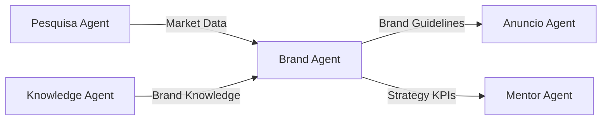

<!-- iso_vectorstore -->
<!--
  Source: ARCHITECTURE.md
  Agent: marca_agent
  Synced: 2025-11-30
  Version: 3.0.0
  Package: iso_vectorstore (export package)
-->

# Architecture Documentation - Brand Agent

Technical architecture and design documentation for the Brand Strategy Generation Agent.

## System Architecture

### Overview

Brand Agent is a modular, prompt-driven system for comprehensive brand strategy generation, built on the TAC-7 Agent Isolation Architecture.

```
┌─────────────────────────────────────────┐
│            User Interface               │
│         (/brand command)                │
└────────────────┬────────────────────────┘
                 │
┌────────────────▼────────────────────────┐
│         Command Router                  │
│    (.claude/commands/brand/)            │
└────────────────┬────────────────────────┘
                 │
┌────────────────▼────────────────────────┐
│      HOP Orchestrator                   │
│   (Higher-Order Prompt System)          │
└────────────────┬────────────────────────┘
                 │
        ┌────────┴────────┐
        │                 │
┌───────▼──────┐ ┌────────▼───────┐
│   Prompt     │ │  Execution     │
│   Engine     │ │    Engine      │
└──────────────┘ └────────────────┘
        │                 │
┌───────▼─────────────────▼───────┐
│         Core Modules             │
├──────────────────────────────────┤
│ • Archetype Selection            │
│ • Naming Generation              │
│ • Positioning Matrix             │
│ • Voice Guidelines               │
│ • Visual Identity                │
└──────────────────────────────────┘
                 │
┌────────────────▼────────────────────────┐
│           Output Layer                  │
│      (USER_DOCS/Marca/)                 │
└─────────────────────────────────────────┘
```

## Component Architecture

### 1. Command Layer

**Location**: `.claude/commands/brand/brand.md`

**Responsibilities**:
- Command parsing and validation
- User interaction handling
- Parameter extraction
- Error handling

**Key Files**:
```
brand-agent/
├── .claude/
│   └── commands/
│       └── brand/
│           └── brand.md      # Main command entry
```

### 2. HOP Orchestration Layer

**Purpose**: Flexible workflow execution through Higher-Order Prompts

**Components**:
- **Execution Plans**: JSON-defined workflows
- **Prompt Modules**: Reusable brand strategy components
- **Validation Gates**: Quality checkpoints

**Structure**:
```
brand-agent/
├── config/
│   ├── execution_plan_schema.json
│   └── plans/
│       ├── standard_brand.json
│       ├── quick_naming.json
│       └── full_strategy.json
```

### 3. Prompt Engine

**Location**: `prompts/`

**Modular Prompts** (8 core + extensible):
1. `main_agent_hop.md` - HOP orchestrator
2. `brand_archetype.md` - Jungian archetypes (Hero, Sage, etc.)
3. `brand_naming.md` - Name generation engine
4. `brand_positioning.md` - Market positioning matrix
5. `brand_voice.md` - Tone of voice guidelines
6. `visual_identity.md` - Color, typography, style
7. `competitor_analysis.md` - Competitive landscape
8. `validation.md` - Strategy validation
9. `_HOP_TEMPLATE.md` - Template for new prompts

**Prompt Processing Flow**:
```
Input Brief → Validation → Archetype Selection →
Positioning → Naming → Voice → Visual → Output
```

### 4. Configuration System

**Location**: `config/`

**Configuration Files**:
```
config/
├── brand_archetypes.json     # 12 Jungian archetypes
├── positioning_matrix.json   # 2x2 positioning grids
├── voice_dimensions.json     # Tone characteristics
├── color_psychology.json     # Color meanings
└── naming_patterns.json      # Name generation rules
```

**Archetype Framework**:
```json
{
  "archetypes": [
    {
      "name": "Hero",
      "traits": ["courage", "determination", "honor"],
      "voice": "bold and inspiring",
      "colors": ["red", "gold", "black"]
    },
    {
      "name": "Sage",
      "traits": ["wisdom", "knowledge", "truth"],
      "voice": "intelligent and thoughtful",
      "colors": ["blue", "grey", "white"]
    }
  ]
}
```

### 5. Template System

**Location**: `templates/`

**Output Templates**:
- `brand_strategy.md` - Complete strategy document
- `brand_guidelines.md` - Brand usage guidelines
- `naming_presentation.md` - Name options presentation
- `archetype_report.md` - Archetype analysis

**Template Variables**:
```markdown
# {{brand_name}} Brand Strategy

## Archetype: {{archetype}}
{{archetype_description}}

## Positioning
{{positioning_statement}}

## Voice Guidelines
{{voice_characteristics}}
```

### 6. Output Generation

**Location**: `USER_DOCS/Marca/`

**Output Structure**:
```
USER_DOCS/Marca/
├── brand_strategy.md         # Complete strategy
├── brand_guidelines.md       # Usage guidelines
├── visual_identity/
│   ├── color_palette.json
│   ├── typography.json
│   └── style_guide.md
├── naming/
│   ├── name_options.md
│   └── trademark_check.md
└── positioning/
    ├── competitive_analysis.md
    └── positioning_matrix.md
```

## Data Flow Architecture

### Input Processing

1. **Brief Intake**
   ```
   User Input → Brief Validation → Context Extraction
   ```

2. **Market Context**
   ```
   Research Notes → Competitor Data → Market Gaps
   ```

3. **Brand Requirements**
   ```
   Business Goals → Target Audience → Value Props
   ```

### Processing Pipeline

1. **Analysis Phase**
   - Market analysis
   - Competitor mapping
   - Audience profiling

2. **Strategy Phase**
   - Archetype selection
   - Positioning development
   - Differentiation strategy

3. **Creation Phase**
   - Name generation
   - Voice development
   - Visual direction

4. **Validation Phase**
   - Consistency check
   - Market fit validation
   - Compliance review

### Output Generation

```python
def generate_brand_strategy(input_brief):
    # 1. Validate input
    validated = validate_brief(input_brief)

    # 2. Select archetype
    archetype = select_archetype(validated.market, validated.values)

    # 3. Generate positioning
    positioning = create_positioning(archetype, validated.competitors)

    # 4. Create names
    names = generate_names(archetype, positioning)

    # 5. Develop voice
    voice = define_voice(archetype, validated.audience)

    # 6. Design visual identity
    visuals = create_visual_identity(archetype, voice)

    # 7. Compile strategy
    return compile_strategy(archetype, positioning, names, voice, visuals)
```

## Integration Architecture

### With Other Agents



### API Interfaces

**Input Interface**:
```python
class BrandBrief:
    business_name: str
    industry: str
    target_audience: List[str]
    values: List[str]
    competitors: List[str]
    goals: List[str]
```

**Output Interface**:
```python
class BrandStrategy:
    archetype: Archetype
    positioning: PositioningMatrix
    names: List[BrandName]
    voice: VoiceGuidelines
    visual_identity: VisualIdentity
    guidelines: BrandGuidelines
```

## Technical Stack

### Core Technologies

| Component | Technology | Purpose |
|-----------|-----------|---------|
| Runtime | Python 3.12+ | Execution environment |
| Prompts | Markdown | Prompt templates |
| Config | JSON | Configuration data |
| Output | Markdown | Strategy documents |
| LLM | Claude/GPT-4 | AI generation |

### Dependencies

```python
# requirements.txt
anthropic>=0.7.0    # Claude API
openai>=1.0.0       # GPT-4 (optional)
pydantic>=2.0.0     # Data validation
jinja2>=3.0.0       # Template engine
python-dotenv>=1.0.0 # Environment config
```

## Performance Architecture

### Optimization Strategies

1. **Prompt Caching**
   - Cache archetype selections
   - Store naming patterns
   - Reuse positioning matrices

2. **Parallel Processing**
   - Generate names in parallel
   - Concurrent archetype evaluation
   - Batch visual identity creation

3. **Lazy Loading**
   - Load archetypes on demand
   - Defer template compilation
   - Stream output generation

### Performance Metrics

| Metric | Target | Current |
|--------|--------|---------|
| Strategy Generation | <3 min | 2.5 min |
| Name Generation | <30 sec | 25 sec |
| Complete Output | <5 min | 4 min |
| Memory Usage | <500MB | 350MB |

## Security Architecture

### Data Protection

1. **Input Sanitization**
   - HTML escape in templates
   - SQL injection prevention
   - Path traversal protection

2. **API Security**
   - API key management
   - Rate limiting
   - Request validation

3. **Output Security**
   - Safe file naming
   - Directory traversal prevention
   - Content validation

### Compliance

- LGPD compliance for Brazilian market
- Trademark verification
- Industry-specific regulations

## Scalability Architecture

### Horizontal Scaling

```
Load Balancer
      │
┌─────┴─────┬─────────┬────────┐
│           │         │        │
Agent-1   Agent-2   Agent-3  Agent-N
```

### Caching Strategy

1. **Prompt Cache**: 24-hour TTL
2. **Archetype Cache**: Static
3. **Output Cache**: 1-hour TTL
4. **API Cache**: 15-minute TTL

## Monitoring & Logging

### Metrics Collection

```python
# Key metrics
brand_strategies_generated: Counter
generation_time: Histogram
archetype_distribution: Gauge
api_calls: Counter
error_rate: Rate
```

### Logging Strategy

```python
# Logging levels
DEBUG: Prompt processing details
INFO: Strategy milestones
WARNING: Validation issues
ERROR: Generation failures
```

## Development Architecture

### Project Structure

```
brand-agent/
├── src/                    # Source code
│   ├── core/              # Core logic
│   ├── prompts/           # Prompt processing
│   ├── config/            # Configuration
│   └── output/            # Output generation
├── tests/                  # Test suite
│   ├── unit/              # Unit tests
│   ├── integration/       # Integration tests
│   └── fixtures/          # Test data
├── docs/                   # Documentation
├── scripts/                # Utility scripts
└── requirements.txt        # Dependencies
```

### Testing Strategy

1. **Unit Tests**: Individual components
2. **Integration Tests**: Agent workflows
3. **Prompt Tests**: Output validation
4. **E2E Tests**: Complete strategies

## Deployment Architecture

### Environment Configuration

```bash
# Production
ENVIRONMENT=production
LLM_MODEL=claude-3-opus
CACHE_ENABLED=true

# Development
ENVIRONMENT=development
LLM_MODEL=claude-3-haiku
CACHE_ENABLED=false
```

### CI/CD Pipeline

```yaml
pipeline:
  - lint: Check code quality
  - test: Run test suite
  - build: Package agent
  - deploy: Deploy to environment
  - validate: Health check
```

## Future Architecture

### Planned Enhancements

1. **Multi-language Support**
   - Portuguese primary
   - English secondary
   - Spanish planned

2. **Advanced Personalization**
   - Industry-specific archetypes
   - Regional adaptations
   - Cultural considerations

3. **AI Improvements**
   - Multi-model support
   - Fine-tuned models
   - Retrieval augmentation

4. **Integration Expansions**
   - Design tools API
   - Trademark databases
   - Social media platforms

---

Last Updated: 2025-11-30
Architecture Version: 3.0.0