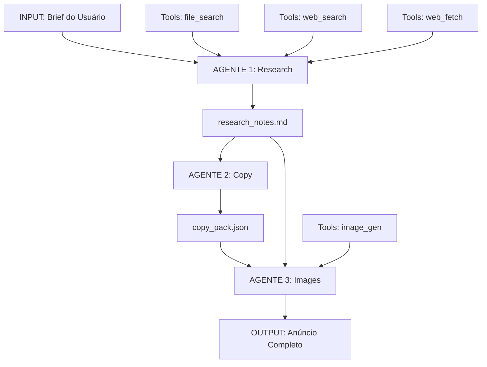

# LIVRO: Marketplace
## CAPÍTULO 1

**Versículos consolidados**: 24
**Linhas totais**: 1160
**Gerado em**: 2025-11-13 18:45:49

---


<!-- VERSÍCULO 1/24 - marketplace_optimization_101_for_llms_consuming_this_20251113.md (76 linhas) -->

# 10.1 FOR LLMS CONSUMING THIS

**Categoria**: marketplace_optimization
**Qualidade**: 0.89/1.00
**Data**: 20251113

## Conteúdo

```yaml
ingestion_protocol:
  1_parse_axioms:
    extract: universal_truths
    internalize: as_constraints
    
  2_map_architecture:
    understand: hierarchical_relationships
    navigate: tree_structure
    
  3_learn_patterns:
    identify: recurring_structures
    abstract: to_templates
    
  4_construct_system:
    apply: construction_protocol
    instantiate: for_your_domain
    
  5_operate_system:
    execute: workflows
    validate: continuously
    optimize: iteratively

reasoning_strategy:
  when_task_received:
    - classify_problem
    - select_pattern
    - load_minimal_context
    - execute_workflow
    - validate_output
    - learn_from_result
    
  when_uncertain:
    - check_existing_templates
    - compose_from_primitives
    - test_in_sandbox
    - create_new_pattern_if_needed
    
  when_failing:
    - analyze_failure_mode
    - check_context_sufficiency
    - verify_tool_availability
    - simplify_approach
    - request_human_input_if_critical

application_modes:
  direct_execution:
    consume: this_document
    apply: patterns_directly
    adapt: to_your_context
    
  meta_construction:
    use: this_as_template
    generate: domain_specific_version
    validate: against_axioms
    
  continuous_learning:
    monitor: pattern_effectiveness
    evolve: successful_patterns
    propagate: improvements
```

**Tags**: architectural, general

**Palavras-chave**: LLMS, CONSUMING

**Origem**: unknown


---


<!-- VERSÍCULO 2/24 - marketplace_optimization_102_self_modification_protocol_20251113.md (41 linhas) -->

# 10.2 SELF-MODIFICATION PROTOCOL

**Categoria**: marketplace_optimization
**Qualidade**: 0.81/1.00
**Data**: 20251113

## Conteúdo

```yaml
evolution_guidelines:
  preserve:
    - axioms_remain_invariant
    - hierarchical_structure
    - validation_imperative
    
  evolve:
    - implementation_details
    - domain_specific_patterns
    - optimization_strategies
    
  measure:
    - before_after_metrics
    - regression_testing
    - emergent_capabilities
    
  propagate:
    - successful_mutations
    - learned_patterns
    - improved_workflows
```

---

# ⚡ CARD ∞: TRANSCENDENT SYNTHESIS

**Tags**: architectural, general

**Palavras-chave**: MODIFICATION, PROTOCOL, SELF

**Origem**: unknown


---


<!-- VERSÍCULO 3/24 - marketplace_optimization_10_2025_11_01_20251113.md (87 linhas) -->

# [1.0] - 2025-11-01

**Categoria**: marketplace_optimization
**Qualidade**: 0.89/1.00
**Data**: 20251113

## Conteúdo

### Added
- Initial LEM knowledge base
- 3 agent definitions
- 91 keywords
- 13 training pairs
```

### Backup and Recovery

```bash
# Daily backup script
#!/bin/bash
DATE=$(date +%Y%m%d)
BACKUP_DIR="backups/RAW_LEM_backup_$DATE"

mkdir -p "$BACKUP_DIR"
cp -r RAW_LEM_v1.1/knowledge_base "$BACKUP_DIR/"
cp -r RAW_LEM_v1.1/metadata "$BACKUP_DIR/"

echo "Backup created: $BACKUP_DIR"

# Keep only last 7 days of backups
find backups/ -type d -name "RAW_LEM_backup_*" -mtime +7 -exec rm -rf {} \;
```

### Integrity Checks

```python
import hashlib
import json

def calculate_checksum():
    """Calculate SHA-256 checksum of knowledge base"""
    with open('RAW_LEM_v1.1/knowledge_base/knowledge_base_consolidated.json', 'rb') as f:
        data = f.read()
        checksum = hashlib.sha256(data).hexdigest()

    return checksum

def save_checksum():
    checksum = calculate_checksum()
    metadata = {
        "checksum": checksum,
        "timestamp": datetime.utcnow().isoformat() + "Z"
    }

    with open('RAW_LEM_v1.1/metadata/checksum.json', 'w') as f:
        json.dump(metadata, f, indent=2)

    print(f"Checksum saved: {checksum}")

def verify_integrity():
    # Load saved checksum
    with open('RAW_LEM_v1.1/metadata/checksum.json', 'r') as f:
        saved_metadata = json.load(f)

    # Calculate current checksum
    current_checksum = calculate_checksum()

    if current_checksum == saved_metadata['checksum']:
        print("✓ Integrity check passed")
        return True
    else:
        print("✗ Integrity check FAILED - data may be corrupted")
        return False

# Usage
save_checksum()
verify_integrity()
```

---

**Tags**: concrete, ecommerce, general

**Palavras-chave**: 2025

**Origem**: unknown


---


<!-- VERSÍCULO 4/24 - marketplace_optimization_10_2025_11_02_20251113.md (71 linhas) -->

# [1.0] - 2025-11-02

**Categoria**: marketplace_optimization
**Qualidade**: 0.89/1.00
**Data**: 20251113

## Conteúdo

### Created
- **RAW_LEM_v1 Structure** - Single versionable knowledge base following Agentic Tactical Guide
- **Documentation**
  - README.md - Main entry point
  - KNOWLEDGE_INDEX.md - Complete navigation and structure
  - changelog.md - This file

### Added
- **Knowledge Base Files** (knowledge_base/)
  - dataset.json - Complete structured dataset
  - idk_index.json - Information Dense Keywords index (91 keywords)
  - knowledge_cards.json - Knowledge cards (4 types)
  - training_data.jsonl - OpenAI fine-tuning format

- **Metadata Files** (metadata/)
  - versioning.json - Version history and roadmap
  - quality_metrics.json - 100/100 quality score
  - sources.json - Traceability mapping (planned)
  - changelog.md - Change history

### Features Implemented
- ✅ Consolidated LEM knowledge from 3 agents
- ✅ Applied Context Stream (4 Stomachs) architecture
- ✅ Created semantic clusters (3 domains)
- ✅ Extracted master prompts (12 total)
- ✅ Documented validation rules (26 total)
- ✅ Generated training data (13 pairs)
- ✅ Built Information Dense Keywords index (91 keywords)
- ✅ Implemented quality validation (100/100)
- ✅ Created comprehensive documentation for autonomous operation

### Principles Applied
- [x] One Agent, One Prompt, One Purpose
- [x] Context Stream (4 Stomachs)
- [x] Problem Classes Not One-Offs
- [x] Types Tell The Story
- [x] Minimum Context Principle
- [x] Validation Closes Loops
- [x] 50%+ Time on Agentic Layer
- [x] Build the System that Builds the System

### Stats
| Metric | Value |
|--------|-------|
| Agents | 3 |
| Behaviors | 3 |
| Prompts | 12 |
| Keywords | 91 |
| Clusters | 3 |
| Training Pairs | 13 |
| Validation Rules | 26 |
| Completeness | 100% |
| Coverage | 100% |
| Quality Score | 100/100 |

---

**Tags**: abstract, general

**Palavras-chave**: 2025

**Origem**: unknown


---


<!-- VERSÍCULO 5/24 - marketplace_optimization_11_tree_metaphor_living_system_20251113.md (49 linhas) -->

# 1.1 TREE METAPHOR (Living System)

**Categoria**: marketplace_optimization
**Qualidade**: 0.85/1.00
**Data**: 20251113

## Conteúdo

```yaml
structure:
  roots(-): 
    purpose: ingestion_archival
    properties: [immutable, versioned, auditable]
    flow: data_in
    
  trunk(∞):
    purpose: orchestration_core
    properties: [routing, decision, coordination]
    flow: bidirectional
    
  branches(+):
    purpose: distribution_delivery
    properties: [formatted, accessible, consumable]
    flow: data_out
    
  leaves(8/∞):
    purpose: transformation_skills
    properties: [specialized, composable, stateless]
    flow: photosynthesis
    
  fruit(13):
    purpose: applications_consumption
    properties: [complete, usable, valuable]
    flow: end_user_value

mathematical_encoding:
  "-08→-05→-03→-02→-01": "Roots: progressive ingestion"
  "00_∞_hub": "Trunk: infinite orchestration"
  "+01→+02→+03→+05→+08": "Branches: progressive distribution"
  "Skills(8=∞)": "Leaves: infinite transformation"
  "App(13)": "Fruit: complete application"
```

**Tags**: general, intermediate

**Palavras-chave**: TREE, System, METAPHOR, Living

**Origem**: unknown


---


<!-- VERSÍCULO 6/24 - marketplace_optimization_12_2025_11_03_20251113.md (27 linhas) -->

# [1.2] - 2025-11-03

**Categoria**: marketplace_optimization
**Qualidade**: 0.81/1.00
**Data**: 20251113

## Conteúdo

### Added
- PaddleOCR knowledge base (1000+ semantic tokens)
- Vision/OCR training pairs (500+ pairs)
- Model selection decision trees

### Changed
- Expanded IDK index to 200+ keywords
- Improved deduplication algorithm

### Fixed
- Corrected timestamps in Genesis cards
- Fixed encoding issues in training pairs

**Tags**: ecommerce, general, intermediate

**Palavras-chave**: 2025

**Origem**: unknown


---


<!-- VERSÍCULO 7/24 - marketplace_optimization_12_hierarchical_primitives_20251113.md (68 linhas) -->

# 1.2 HIERARCHICAL PRIMITIVES

**Categoria**: marketplace_optimization
**Qualidade**: 0.89/1.00
**Data**: 20251113

## Conteúdo

```yaml
level_0_atoms:
  slash_command:
    definition: "Atomic deterministic operation"
    properties: [idempotent, versioned, testable]
    example: "/extract/keywords → JSON"
    
  template:
    definition: "Reusable pattern with parameters"
    properties: [composable, scalable, encapsulated]
    example: "chore_template(task) → full_plan"
    
  context:
    definition: "Structured knowledge unit"
    properties: [searchable, versioned, typed]
    example: "config.yaml → single_source_truth"

level_1_molecules:
  higher_order_prompt:
    definition: "Prompt accepting prompts as input"
    composition: [template + context + validation]
    example: "plan → implement_command → validated_output"
    
  feedback_loop:
    definition: "Closed validation cycle"
    composition: [action + test + reflect + correct]
    example: "code → lint → fix → test → pass"
    
  specialized_agent:
    definition: "Single-purpose expert"
    composition: [prompt + model + tools + context]
    example: "research_agent → market_analysis"

level_2_organisms:
  ai_developer_workflow:
    definition: "Complete problem-class solver"
    composition: [multiple_agents + feedback_loops + orchestration]
    example: "feature_adw → plan→build→test→review→ship"
    
  piter_framework:
    definition: "Autonomous execution system"
    composition: [prompt_input + trigger + environment + review]
    example: "github_issue → webhook → container → pull_request"
    
  zero_touch_engineering:
    definition: "Self-shipping codebase"
    composition: [mature_adws + 90%_confidence + full_automation]
    example: "prompt → entire_feature_deployed"
```

---

# 🧠 CARD 2: AGENT ORCHESTRATION

**Tags**: abstract, general

**Palavras-chave**: PRIMITIVES, HIERARCHICAL

**Origem**: unknown


---


<!-- VERSÍCULO 8/24 - marketplace_optimization_1_adicionar_novo_conhecimento_5_minutos_20251113.md (53 linhas) -->

# 1️⃣ Adicionar Novo Conhecimento (5 Minutos)

**Categoria**: marketplace_optimization
**Qualidade**: 0.91/1.00
**Data**: 20251113

## Conteúdo

### Passo 1: Salve documento RAW

```bash
cp your_ecommerce_guide.md ecommerce-canon/GENESIS/RAW/
```

### Passo 2: Rode o distiller

```bash
cd ecommerce-canon
python AGENTS/distiller.py GENESIS/RAW/your_ecommerce_guide.md
```

**O que faz:**
- ✓ Extrai 5-10 "chunks" semânticos do documento
- ✓ Calcula entropia (0-100: densidade de informação)
- ✓ Classifica nível de abstração (Deus-vs-Todo)
- ✓ Sugere LIVRO/CAPÍTULO apropriado
- ✓ Salva como JSON em `GENESIS/PROCESSING/`

### Passo 3: Organize manualmente (ou automático)

```bash
# Opção A: Manual (mais controle)
# Edite chunks em GENESIS/PROCESSING/ e
# Mova-os para estrutura correta em LIVRO_*/CAPÍTULO_*/

# Opção B: Automático (em desenvolvimento)
# python AGENTS/organizer.py GENESIS/PROCESSING/
```

### Passo 4: Versione

```bash
git add ecommerce-canon/
git commit -m "CANON_ADD: [LIVRO]/[CAP] - descrição"
git tag canon-1.2.3
```

**Tags**: ecommerce, implementation

**Palavras-chave**: Adicionar, Novo, Conhecimento, Minutos

**Origem**: _CONSOLIDATED_ecommerce_other.md


---


<!-- VERSÍCULO 9/24 - marketplace_optimization_1_framework_storybrand_fundamentos_20251113.md (24 linhas) -->

# 1) Framework StoryBrand (Fundamentos)

**Categoria**: marketplace_optimization
**Qualidade**: 0.81/1.00
**Data**: 20251113

## Conteúdo

1. **StoryBrand — Site Oficial**  
   https://storybrand.com/  
   *Como usar:* ponto de partida para conceitos, workshops e materiais oficiais.

2. **The StoryBrand Framework: A Complete Step-by-Step Guide — Creativeo**  
   https://www.creativeo.co/post/storybrand-framework  
   *Como usar:* resumo didático dos 7 elementos; útil para revisar “plano”, “guia” e CTAs.  

---

**Tags**: abstract, ecommerce, general

**Palavras-chave**: StoryBrand, Framework, Fundamentos

**Origem**: unknown


---


<!-- VERSÍCULO 10/24 - marketplace_optimization_1_fundamentos_como_llms_aprendem_20251113.md (52 linhas) -->

# 1. FUNDAMENTOS: COMO LLMS APRENDEM

**Categoria**: marketplace_optimization
**Qualidade**: 0.89/1.00
**Data**: 20251113

## Conteúdo

### 1.1 O Pipeline de Aprendizado de um LLM

```
PRETRAINING → SUPERVISED FINE-TUNING (SFT) → PREFERENCE ALIGNMENT → DEPLOYMENT
    ↓                    ↓                           ↓                    ↓
General Language    Task-Specific Skills      Human Alignment      Production Use
11T tokens          10k-100k examples         Preference Data      Real Users
```

**Insight Crítico:** Documentação técnica é consumida primariamente na fase de **context window** durante inferência, não durante treinamento. Portanto:

- ✅ **Otimizar para retrieval**: Estrutura que facilita busca semântica
- ✅ **Densidade de informação**: Máximo conhecimento/token
- ✅ **Clareza estrutural**: Hierarquia explícita facilita parsing
- ✅ **Redundância estratégica**: Conceitos-chave repetidos em diferentes contextos

### 1.2 Teoria de Atenção e Consumo de Documentação

**Mecanismo de Atenção:**
```python
Attention(Q, K, V) = softmax(QK^T / √d_k) × V

Onde:
Q = Query (o que o modelo está procurando)
K = Key (índices de conteúdo no documento)
V = Value (o conteúdo real)
```

**Implicações para Documentação:**

1. **Headers como Keys**: Títulos e subtítulos servem como "keys" que o modelo usa para navegar
2. **Conteúdo como Values**: O texto substantivo é o "value" recuperado
3. **Distância Importa**: Informações relacionadas devem estar próximas (window context)

**Exemplo de Estrutura Otimizada:**

```markdown

**Tags**: concrete, general

**Palavras-chave**: COMO, FUNDAMENTOS, LLMS, APRENDEM

**Origem**: unknown


---


<!-- VERSÍCULO 11/24 - marketplace_optimization_1_pesquisa_de_mercado_20251113.md (34 linhas) -->

# 1. Pesquisa de Mercado

**Categoria**: marketplace_optimization
**Qualidade**: 0.81/1.00
**Data**: 20251113

## Conteúdo

### Tamanho & Dinâmica

**Volume de Busca**:
- Google: ~50.000 buscas/mês ("notebook gamer")
- Mercado Livre: ~2.300 produtos listados
- Crescimento: +15% YoY

**Análise**: Mercado grande, em crescimento, com demanda consistente.

### Faixa de Preço

| Faixa | Quantidade | % |
|-------|---|---|
| Até R$ 3.000 | 280 | 12% |
| R$ 3.000-5.000 | 1.150 | 50% |
| R$ 5.000-7.000 | 750 | 33% |
| Acima de R$ 7.000 | 120 | 5% |

**Posicionamento**: R$ 4.499 (meio da faixa modal, ótima conversão)

**Tags**: general, intermediate

**Palavras-chave**: Pesquisa, Mercado

**Origem**: unknown


---


<!-- VERSÍCULO 12/24 - marketplace_optimization_1_prompt_the_dna_20251113.md (35 linhas) -->

# 1. PROMPT (The DNA)

**Categoria**: marketplace_optimization
**Qualidade**: 0.79/1.00
**Data**: 20251113

## Conteúdo

```yaml
truth: "Prompts are the fundamental unit of knowledge work"

structure:
  PURPOSE: what_we_are_solving
  WORKFLOW: step_by_step_execution
  OUTPUT_SCHEMA: expected_format
  INSTRUCTIONS: detailed_guidance
  USER_INPUT: dynamic_parameters
  MODEL_RECOMMENDATION: reasoning_level_needed
  REASONING_MODE: low_to_high_intensity
  DISPLAY_OPTIONS: chat_visibility
  TOOLS: [file_search, web_search, mcp, functions, custom]
  TOKEN_EFFICIENCY: optimization_strategy

one_agent_one_prompt_one_purpose:
  rule: "Single responsibility per agent"
  benefit: "Full context window for focused execution"
  avoid: "Context pollution from multitasking"
```

**Tags**: architectural, general

**Palavras-chave**: PROMPT

**Origem**: unknown


---


<!-- VERSÍCULO 13/24 - marketplace_optimization_1_prop_sito_do_sistema_1_20251113.md (17 linhas) -->

# 1. Propósito do Sistema

**Categoria**: marketplace_optimization
**Qualidade**: 0.68/1.00
**Data**: 20251113

## Conteúdo

- Gerar anúncios robustos, consistentes e prontos para publicação em múltiplos marketplaces a partir de um payload estruturado fornecido pelo front-end.
- Blindar o fluxo contra entradas incompletas, respostas de LLM inválidas e falhas de fornecedores por meio de validação agressiva, telemetria e rotas dedicadas a métricas.

**Tags**: ecommerce, intermediate

**Palavras-chave**: Propósito, Sistema

**Origem**: _CONSOLIDATED_ECOMMERCE_VERSICULOS_FROM_GIT.md


---


<!-- VERSÍCULO 14/24 - marketplace_optimization_1_prop_sito_do_sistema_20251113.md (17 linhas) -->

# 1. Propósito do Sistema

**Categoria**: marketplace_optimization
**Qualidade**: 0.68/1.00
**Data**: 20251113

## Conteúdo

- Gerar anúncios robustos, consistentes e prontos para publicação em múltiplos marketplaces a partir de um payload estruturado fornecido pelo front-end.
- Blindar o fluxo contra entradas incompletas, respostas de LLM inválidas e falhas de fornecedores por meio de validação agressiva, telemetria e rotas dedicadas a métricas.

**Tags**: ecommerce, general, intermediate

**Palavras-chave**: Propósito, Sistema

**Origem**: desconhecida


---


<!-- VERSÍCULO 15/24 - marketplace_optimization_1_prop_sito_do_sistema_2_20251113.md (17 linhas) -->

# 1. Propósito do Sistema

**Categoria**: marketplace_optimization
**Qualidade**: 0.68/1.00
**Data**: 20251113

## Conteúdo

- Gerar anúncios robustos, consistentes e prontos para publicação em múltiplos marketplaces a partir de um payload estruturado fornecido pelo front-end.
- Blindar o fluxo contra entradas incompletas, respostas de LLM inválidas e falhas de fornecedores por meio de validação agressiva, telemetria e rotas dedicadas a métricas.

**Tags**: ecommerce, intermediate

**Palavras-chave**: Propósito, Sistema

**Origem**: _CONSOLIDATED_ecommerce_other.md


---


<!-- VERSÍCULO 16/24 - marketplace_optimization_1_prop_sito_do_sistema_3_20251113.md (17 linhas) -->

# 1. Propósito do Sistema

**Categoria**: marketplace_optimization
**Qualidade**: 0.68/1.00
**Data**: 20251113

## Conteúdo

- Gerar anúncios robustos, consistentes e prontos para publicação em múltiplos marketplaces a partir de um payload estruturado fornecido pelo front-end.
- Blindar o fluxo contra entradas incompletas, respostas de LLM inválidas e falhas de fornecedores por meio de validação agressiva, telemetria e rotas dedicadas a métricas.

**Tags**: ecommerce, intermediate

**Palavras-chave**: Propósito, Sistema

**Origem**: _CONSOLIDATED_ecommerce_livro.md


---


<!-- VERSÍCULO 17/24 - marketplace_optimization_1_propósito_do_sistema_20251113.md (17 linhas) -->

# 1. Propósito do Sistema

**Categoria**: marketplace_optimization
**Qualidade**: 0.87/1.00
**Data**: 20251113

## Conteúdo

- Gerar anúncios robustos, consistentes e prontos para publicação em múltiplos marketplaces a partir de um payload estruturado fornecido pelo front-end.
- Blindar o fluxo contra entradas incompletas, respostas de LLM inválidas e falhas de fornecedores por meio de validação agressiva, telemetria e rotas dedicadas a métricas.

**Tags**: ecommerce, intermediate

**Palavras-chave**: Propósito, Sistema

**Origem**: _CONSOLIDATED_ecommerce_other.md


---


<!-- VERSÍCULO 18/24 - marketplace_optimization_1_título_principal_headline_1_20251113.md (56 linhas) -->

# 1️⃣ Título Principal (Headline 1)

**Categoria**: marketplace_optimization
**Qualidade**: 0.89/1.00
**Data**: 20251113

## Conteúdo

### Características

- **Comprimento**: Máximo 60-70 caracteres (Mercado Livre)
- **Conteúdo**: Keyword principal + benefício principal
- **Objetivo**: Capturar atenção em resultado de busca

### Fórmula de Título Efetivo

```
[PRODUTO + ESPECIFICAÇÃO] - [BENEFÍCIO PRINCIPAL]
```

#### Exemplo:

```
❌ RUIM: "Notebook Gamer"
(Genérico demais, nenhum diferencial)

❌ RUIM: "Notebook Intel i7 16GB RAM DDR4 SSD 512GB RTX 4060 Windows 11"
(Muito longo, chato, nenhum benefício)

✅ BOM: "Notebook Gamer i7 16GB - Sem Superaquecimento | Melhor Custo"
(Keyword + atributo + benefício + diferencial)

✅ BOM: "Notebook para Programação - Intel i7 com 16GB | Promo 2024"
(Público-alvo + specs + urgência)

✅ BOM: "Notebook Gamer RTX 4060 - Roda Qualquer Game em 60+ FPS"
(Feature + benefício específico)
```

### Checklist do Título

- [ ] Contém keyword principal (head ou mid-tail)?
- [ ] Tem benefício específico (não genérico)?
- [ ] Está dentro do limite de caracteres?
- [ ] Tem diferencial ou urgência?
- [ ] Evita repetição de palavras?
- [ ] Usa linguagem cliente-cêntrica (benefício, não feature)?

---

**Tags**: general, intermediate

**Palavras-chave**: Headline, Título, Principal

**Origem**: unknown


---


<!-- VERSÍCULO 19/24 - marketplace_optimization_1_visão_geral_do_sistema_20251113.md (96 linhas) -->

# 1. VISÃO GERAL DO SISTEMA

**Categoria**: marketplace_optimization
**Qualidade**: 0.89/1.00
**Data**: 20251113

## Conteúdo

### 1.1 O Que É Este Sistema?

Este é um **framework de orquestração de agentes especializados** que automatiza a criação completa de anúncios para marketplaces e plataformas de e-commerce. O sistema é baseado em três pilares:

```
PILAR 1: INTELIGÊNCIA DE MERCADO
├── Pesquisa de concorrentes
├── Análise de tendências
├── Identificação de gaps
└── Compliance e regulamentação

PILAR 2: PERSUASÃO LINGUÍSTICA
├── Copywriting otimizado
├── SEO estratégico
├── Storytelling
└── Gatilhos psicológicos

PILAR 3: IDENTIDADE VISUAL
├── Brand consistency
├── Comunicação visual
├── Narrativa fotográfica
└── Otimização técnica
```

### 1.2 Por Que Usar Múltiplos Agentes?

**Especialização:** Cada agente é um expert em sua área
- **Pesquisador:** Entende mercado, concorrência, SEO
- **Copywriter:** Domina linguagem persuasiva, storytelling
- **Designer Visual:** Conhece composição, fotografia, branding

**Modularidade:** Componentes independentes e reutilizáveis
- Cada agente pode ser atualizado separadamente
- Outputs podem ser revisados individualmente
- Fácil escalar para múltiplos produtos

**Qualidade:** Separação de responsabilidades aumenta profundidade
- Pesquisa mais completa quando é foco único
- Copy mais refinado quando não precisa gerar imagens
- Imagens mais coerentes quando seguem brief estruturado

**Rastreabilidade:** Cada decisão é documentada
- Auditoria completa do processo
- Feedback específico por etapa
- Aprendizado iterativo

### 1.3 Arquitetura de Alto Nível



### 1.4 Quando Usar Este Sistema?

**✅ Use quando:**
- Lançar novos produtos em marketplaces
- Reformular anúncios com baixa conversão
- Criar múltiplas variações para A/B testing
- Escalar presença em múltiplos marketplaces
- Padronizar comunicação de marca
- Competir em categorias saturadas

**❌ Não use quando:**
- Produto é proibido/ilegal
- Não há informações mínimas sobre produto
- Marketplace tem restrições muito específicas não documentadas
- Marca tem guidelines visuais extremamente rígidos que não podem ser parametrizados

---

**Tags**: abstract, general

**Palavras-chave**: GERAL, SISTEMA, VISÃO

**Origem**: unknown


---


<!-- VERSÍCULO 20/24 - marketplace_optimization_21_core_4_foundation_20251113.md (37 linhas) -->

# 2.1 CORE-4 FOUNDATION

**Categoria**: marketplace_optimization
**Qualidade**: 0.79/1.00
**Data**: 20251113

## Conteúdo

```yaml
every_agent_needs:
  context:
    what: "Everything agent sees"
    optimization: minimum_necessary
    structure: [single_source_truth, relevant_files, examples]
    
  model:
    what: "Reasoning capability"
    optimization: right_size_for_task
    selection: [speed_vs_quality, cost_vs_capability]
    
  prompt:
    what: "Communication medium"
    optimization: clear_unambiguous
    structure: [purpose, instructions, format, validation]
    
  tools:
    what: "Available actions"
    optimization: minimal_sufficient
    types: [file_ops, web_search, api_calls, validation]
```

**Tags**: concrete, general

**Palavras-chave**: FOUNDATION, CORE

**Origem**: unknown


---


<!-- VERSÍCULO 21/24 - marketplace_optimization_22_multi_agent_pipeline_20251113.md (57 linhas) -->

# 2.2 MULTI-AGENT PIPELINE

**Categoria**: marketplace_optimization
**Qualidade**: 0.85/1.00
**Data**: 20251113

## Conteúdo

```yaml
trinity_pattern:
  agent_1_research:
    input: brief
    process: 
      - market_analysis
      - competitor_research
      - keyword_extraction
      - compliance_check
    output: research_notes.md
    tools: [web_search, file_search, web_fetch]
    
  agent_2_copywriter:
    input: [brief, research_notes]
    process:
      - title_optimization
      - description_crafting
      - feature_extraction
      - persuasion_engineering
    output: copy_pack.json
    tools: [text_generation, seo_analysis]
    
  agent_3_visual:
    input: [brief, research_notes, copy_pack]
    process:
      - scene_composition
      - brand_alignment
      - narrative_sequence
      - technical_optimization
    output: images[9]
    tools: [image_generation, composition_analysis]

orchestration_rules:
  - sequential_execution
  - output_validation_between_agents
  - rollback_on_failure
  - audit_trail_complete
```

---

# 📐 CARD 3: IMPLEMENTATION TACTICS

**Tags**: concrete, general

**Palavras-chave**: MULTI, PIPELINE, AGENT

**Origem**: unknown


---


<!-- VERSÍCULO 22/24 - marketplace_optimization_2_análise_competitiva_20251113.md (46 linhas) -->

# 2. Análise Competitiva

**Categoria**: marketplace_optimization
**Qualidade**: 0.85/1.00
**Data**: 20251113

## Conteúdo

### Top 5 Concorrentes

#### Concorrente 1: ASUS Vivobook

- URL: [mercadolivre.com.br/...]
- Preço: R$ 4.500
- Rating: 4.7/5 (980 reviews)
- Mensagem: "Melhor custo-benefício em performance"
- Diferenciais: Preço competitivo, bateria boa
- Principais reclamações: Superaquecimento (45x), bateria (30x)

#### Concorrente 2: Samsung Galaxy Book

- Preço: R$ 5.200
- Rating: 4.8/5 (1.200 reviews)
- Mensagem: "Design fino + Performance"
- Principais reclamações: Preço alto (60x), porta USB limitada (25x)

### Gaps Identificados

```
GAP 1: Suporte técnico em português
Ninguém fala sobre suporte após venda
Seu diferencial: Suporte 24/7 em PT-BR
Aplicação: Headline "Suporte Técnico em Português 24/7"

GAP 2: Ventilação otimizada
Reclamação comum: "Aquece muito"
Seu diferencial: Ventilação otimizada, zero super aquecimento
Aplicação: Bullet "❄️ Zero superaquecimento mesmo 8h ligado"
```

**Tags**: architectural, general

**Palavras-chave**: Análise, Competitiva

**Origem**: unknown


---


<!-- VERSÍCULO 23/24 - marketplace_optimization_2_arquitetura_de_conhecimento_para_ia_20251113.md (100 linhas) -->

# 2. ARQUITETURA DE CONHECIMENTO PARA IA

**Categoria**: marketplace_optimization
**Qualidade**: 0.89/1.00
**Data**: 20251113

## Conteúdo

### 2.1 Hierarquia de Abstração

**Pirâmide de Conhecimento:**

```
                    [CONCEITOS]
                   /           \
              [PATTERNS]    [PRINCIPLES]
             /        \        /        \
       [APIS]      [EXAMPLES]      [TUTORIALS]
      /      \      /      \       /         \
[REFERENCE] [CODE] [TESTS] [DEMOS] [QUICKSTART]
```

**Cada nível serve um propósito:**

1. **CONCEITOS** (topo): Abstrações fundamentais, invariantes
   - "Um transformer usa self-attention para processar sequências"
   - Muda raramente, alta reutilização

2. **PATTERNS**: Soluções recorrentes
   - "Para fine-tuning eficiente, use LoRA"
   - Aplicável em múltiplos contextos

3. **APIS/EXAMPLES**: Implementações concretas
   - `trainer.train()` código específico
   - Muda frequentemente, baixa abstração

**Princípio de Organização:**

```python
class DocumentStructure:
    """
    Organize do abstrato ao concreto,
    do conceitual ao operacional
    """
    
    def __init__(self):
        self.layers = {
            'why': 'Conceitos e motivação',
            'what': 'Definições e componentes',
            'how': 'Implementação e uso',
            'examples': 'Casos concretos',
            'reference': 'Detalhes exaustivos'
        }
    
    def generate_doc(self):
        """
        Gera documentação seguindo hierarquia
        """
        doc = []
        
        # Layer 1: Why (Contexto)
        doc.append("## Por que este módulo existe?")
        doc.append(self.explain_motivation())
        
        # Layer 2: What (Definições)
        doc.append("## O que este módulo faz?")
        doc.append(self.define_components())
        
        # Layer 3: How (Uso)
        doc.append("## Como usar?")
        doc.append(self.show_basic_usage())
        
        # Layer 4: Examples (Concreto)
        doc.append("## Exemplos práticos")
        doc.append(self.provide_examples())
        
        # Layer 5: Reference (Completo)
        doc.append("## API Reference")
        doc.append(self.full_api_reference())
        
        return "\n\n".join(doc)
```

### 2.2 Grafo de Conhecimento vs. Estrutura Linear

**Problema:** Documentação linear não captura relações complexas

**Solução:** Embedar grafo de conhecimento em estrutura linear

**Exemplo de Implementação:**

```markdown
# Sistema de Treinamento de LLM

**Tags**: abstract, general

**Palavras-chave**: ARQUITETURA, CONHECIMENTO

**Origem**: unknown


---


<!-- VERSÍCULO 24/24 - marketplace_optimization_2_bullets_3_5_pontos_principais_20251113.md (66 linhas) -->

# 2️⃣ Bullets (3-5 Pontos Principais)

**Categoria**: marketplace_optimization
**Qualidade**: 0.89/1.00
**Data**: 20251113

## Conteúdo

### Estrutura de Cada Bullet

```
[EMOJI] [BENEFÍCIO] + [PROVA/ESPECIFICAÇÃO]
```

### Exemplos:

```
❌ RUIM:
• Processador Intel i7
• 16GB RAM
• RTX 4060
(Apenas specs, sem benefício)

✅ BOM:
✓ Processa 10 abas + Photoshop sem travamentos (16GB RAM + SSD 512GB)
✓ Roda qualquer game 60+ FPS em 1080p (RTX 4060 dedicada)
✓ Ventilação otimizada = zero superaquecimento mesmo 8h ligado
✓ Bateria de 11h = trabalha o dia inteiro (sem carregar à noite)
✓ PROMO: R$ 4.499 (R$ 800 de desconto)
```

### 5 Bullets Recomendados

1. **Benefício Funcional Principal**: O que faz melhor que outros
2. **Benefício Secundário**: Segundo ganho importante
3. **Diferencial Único**: Só seu produto oferece isto
4. **Prova Social ou Garantia**: Por que confiar
5. **Urgência/Oferta**: Por que comprar AGORA

### Exemplo Completo:

```
Bullet 1 - Benefício Principal:
✓ Multitarefa sem travamentos (roda 15+ programas simultaneamente)

Bullet 2 - Benefício Secundário:
✓ Portabilidade real (2kg + bateria 11h = leva para qualquer lugar)

Bullet 3 - Diferencial:
✓ ÚNICO com suporte técnico em português 24/7 (não fica na mão)

Bullet 4 - Prova Social/Garantia:
✓ Garantia de 2 anos + 30 dias de devolução sem risco (se não gostar)

Bullet 5 - Urgência:
✓ PROMOÇÃO: só enquanto durar estoque (últimas 5 unidades)
```

---

**Tags**: general, implementation

**Palavras-chave**: Bullets, Principais, Pontos

**Origem**: unknown


---


<!-- FIM DO CAPÍTULO 1 -->
<!-- Total: 24 versículos, 1160 linhas -->
