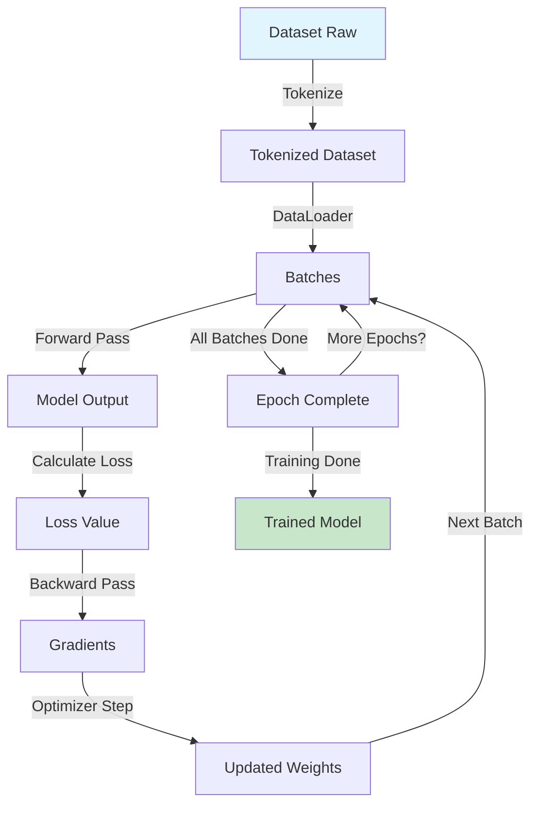

# LIVRO: Marketplace
## CAPÍTULO 37

**Versículos consolidados**: 25
**Linhas totais**: 1193
**Gerado em**: 2025-11-13 18:45:49

---


<!-- VERSÍCULO 1/25 - marketplace_optimization_explore_further_20251113.md (27 linhas) -->

# Explore further

**Categoria**: marketplace_optimization
**Qualidade**: 0.89/1.00
**Data**: 20251113

## Conteúdo

We've barely scratched the surface of what's possible with the OpenAI platform. Here are some resources you might want to explore next.

- **Go deeper with prompting and text generation** - Learn more about prompting, message roles, and building conversational apps like chat bots.
- **Analyze the content of images** - Learn to use image inputs to the model and extract meaning from images.
- **Generate structured JSON data from the model** - Generate JSON data from the model that conforms to a JSON schema you specify.
- **Call custom code to help generate a response** - Empower the model to invoke your own custom code to help generate a response. Do this to give the model access to data or systems it wouldn't be able to access otherwise.
- **Search the web or use your own data in responses** - Try out powerful built-in tools to extend the capabilities of the models. Search the web or your own data for up-to-date information the model can use to generate responses.
- **Responses starter app** - Start building with the Responses API
- **Build agents** - Explore interfaces to build powerful AI agents that can take action on behalf of users. Control a computer to take action on behalf of a user, or orchestrate multi-agent flows with the Agents SDK.
- **Full API Reference** - View the full API reference for the OpenAI platform.

======================================================================

**Tags**: concrete, general

**Palavras-chave**: further, Explore

**Origem**: unknown


---


<!-- VERSÍCULO 2/25 - marketplace_optimization_export_formats_20251113.md (36 linhas) -->

# EXPORT FORMATS

**Categoria**: marketplace_optimization
**Qualidade**: 0.81/1.00
**Data**: 20251113

## Conteúdo

### For Human Consumption
```yaml
format: markdown_with_visuals
emphasis: [metaphors, examples, step_by_step]
```

### For LLM Consumption (This Document)
```yaml
format: hierarchical_structured_yaml_markdown
emphasis: [axioms, patterns, algorithms, composability]
executable: reasoning_patterns_directly_applicable
```

### For Agent Execution
```yaml
format: json_yaml_with_schemas
structure: [primitive_definitions, workflow_specs, validation_rules]
interface: mcp_compatible
```

---

**Tags**: concrete, general

**Palavras-chave**: EXPORT, FORMATS

**Origem**: unknown


---


<!-- VERSÍCULO 3/25 - marketplace_optimization_extend_the_model_with_tools_20251113.md (61 linhas) -->

# Extend the model with tools

**Categoria**: marketplace_optimization
**Qualidade**: 0.89/1.00
**Data**: 20251113

## Conteúdo

Give the model access to new data and capabilities using [tools](https://platform.openai.com/docs/guides/tools). You can either call your own [custom code](https://platform.openai.com/docs/guides/function-calling), or use one of OpenAI's [powerful built-in tools](https://platform.openai.com/docs/guides/tools). This example uses [web search](https://platform.openai.com/docs/guides/tools-web-search) to give the model access to the latest information on the Internet.

### Get information for the response from the Internet

#### JavaScript

```javascript
import OpenAI from "openai";
const client = new OpenAI();

const response = await client.responses.create({
    model: "gpt-4.1",
    tools: [ { type: "web_search_preview" } ],
    input: "What was a positive news story from today?",
});

console.log(response.output_text);
```

#### Python

```python
from openai import OpenAI
client = OpenAI()

response = client.responses.create(
    model="gpt-4.1",
    tools=[{"type": "web_search_preview"}],
    input="What was a positive news story from today?"
)

print(response.output_text)
```

#### cURL

```bash
curl "https://api.openai.com/v1/responses" \
    -H "Content-Type: application/json" \
    -H "Authorization: Bearer $OPENAI_API_KEY" \
    -d '{
        "model": "gpt-4.1",
        "tools": [{"type": "web_search_preview"}],
        "input": "what was a positive news story from today?"
    }'
```

**Tags**: concrete, general

**Palavras-chave**: model, Extend, with, tools

**Origem**: unknown


---


<!-- VERSÍCULO 4/25 - marketplace_optimization_fase_1_data_preparation_chunk_independente_20251113.md (50 linhas) -->

# FASE 1: Data Preparation [Chunk Independente]

**Categoria**: marketplace_optimization
**Qualidade**: 0.85/1.00
**Data**: 20251113

## Conteúdo

**Objetivo:** Transformar dados raw em formato consumível pelo modelo

**Input:** Dados raw (ex: texto, imagens)  
**Output:** DataLoader com batches processados

### Sub-etapas:
1. **Load**: Ler dados do disco/API
2. **Tokenize**: Converter texto em IDs
3. **Batch**: Agrupar em batches fixos
4. **Shuffle**: Randomizar ordem (evita overfitting)

### Código:
```python
# Passo 1: Load
dataset = load_dataset("data.json")

# Passo 2: Tokenize
tokenizer = AutoTokenizer.from_pretrained("gpt2")
tokenized = dataset.map(lambda x: tokenizer(x['text']))

# Passo 3: Batch + Shuffle
dataloader = DataLoader(
    tokenized,
    batch_size=8,
    shuffle=True
)
```

### Checkpoint de Compreensão:
- ✓ Você consegue explicar por que shuffle é importante?
- ✓ O que acontece se batch_size for muito grande?

**Próxima Fase:** [Training Loop](#fase-2)

---

**Tags**: general, implementation

**Palavras-chave**: Data, Chunk, FASE, Independente, Preparation

**Origem**: unknown


---


<!-- VERSÍCULO 5/25 - marketplace_optimization_fase_2_training_loop_chunk_independente_20251113.md (65 linhas) -->

# FASE 2: Training Loop [Chunk Independente]

**Categoria**: marketplace_optimization
**Qualidade**: 0.89/1.00
**Data**: 20251113

## Conteúdo

**Prerequisito:** Completou [Data Preparation](#fase-1)

**Objetivo:** Atualizar pesos do modelo para minimizar loss

**Input:** DataLoader, Model, Optimizer  
**Output:** Model com pesos atualizados

### Sub-etapas:
1. **Forward Pass**: Calcular predição e loss
2. **Backward Pass**: Calcular gradientes
3. **Optimizer Step**: Atualizar pesos
4. **Repeat**: Para todos batches e épocas

### Código:
```python
for epoch in range(num_epochs):
    for batch in dataloader:  # De FASE 1
        # Forward
        outputs = model(**batch)
        loss = outputs.loss
        
        # Backward
        loss.backward()
        
        # Update
        optimizer.step()
        optimizer.zero_grad()
```

### Checkpoint de Compreensão:
- ✓ Por que zero_grad() é necessário?
- ✓ O que acontece se esquecer backward()?

**Próxima Fase:** [Evaluation](#fase-3)

---

[... FASE 3 e FASE 4 seguem mesmo padrão ...]
```

**Vantagens:**
- **Modularidade**: Cada chunk é autossuficiente
- **Não-linearidade**: Leitor pode pular chunks já conhecidos
- **Checkpoints**: Validação de compreensão por chunk

#### Técnica 3: Concept Maps (Mapas Conceituais)

**Princípio:** Visualizar relações entre conceitos

```markdown

**Tags**: abstract, general

**Palavras-chave**: Loop, Chunk, FASE, Independente, Training

**Origem**: unknown


---


<!-- VERSÍCULO 6/25 - marketplace_optimization_features_20251113.md (23 linhas) -->

# Features

**Categoria**: marketplace_optimization
**Qualidade**: 0.81/1.00
**Data**: 20251113

## Conteúdo

- 🗣️ Natural language to SQL conversion using OpenAI or Anthropic
- 📁 Drag-and-drop file upload (.csv and .json)
- 📊 Interactive table results display
- 🔒 SQL injection protection
- ⚡ Fast development with Vite and uv
- 🤖 AI agent orchestration with Biblia LEM framework
- 📚 Comprehensive knowledge base (RAW_LEM v1.1 with Genesis enrichment)
- 🔄 Automated development workflow (ADW) for GitHub issue processing

**Tags**: abstract, general

**Palavras-chave**: Features

**Origem**: unknown


---


<!-- VERSÍCULO 7/25 - marketplace_optimization_ferramentas_usadas_20251113.md (103 linhas) -->

# Ferramentas Usadas

**Categoria**: marketplace_optimization
**Qualidade**: 0.89/1.00
**Data**: 20251113

## Conteúdo

- Slash: `/theme/*`, `/qa/*`
- Subagents: `art-director`, `copy-editor`
- MCP: `image_generator`, `git`
- Hooks: `postRun`, `onFileEdit`
```

---

### 20. PLUGINS (EMPACOTAMENTO)

#### 20.1 O Que São Plugins

**Plugin = Bundle compartilhável**

Empacota:
- ✅ Commands
- ✅ Skills
- ✅ Subagents
- ✅ MCP configs
- ✅ Output styles
- ✅ Hooks

**Para que?**
- Compartilhar toolkit completo
- Reutilizar em múltiplos projetos
- Distribuir para comunidade

#### 20.2 Manifest de Plugin

```json
// plugin/manifest.json
{
  "name": "theme-builder",
  "version": "0.1.0",
  "description": "Complete theme builder: PNGs + Manual",
  "author": "LCM-AI",
  "license": "MIT",
  
  "includes": {
    "commands": [
      ".claude/commands/theme",
      ".claude/commands/qa"
    ],
    "skills": [
      "skills/theme_builder"
    ],
    "subagents": [
      "subagents/art-director",
      "subagents/copy-editor"
    ],
    "mcp": [
      "mcp/config.json"
    ],
    "hooks": [
      ".claude/settings.json"
    ],
    "outputStyles": [
      "output-styles/yaml-structured.md",
      "output-styles/markdown-focused.md"
    ],
    "context": [
      "context/theme.yml"
    ]
  },
  
  "dependencies": {
    "python": ">=3.8",
    "replicate": ">=0.15.0"
  },
  
  "dist": "dist/"
}
```

#### 20.3 Instalação de Plugin

```bash
# Instalar plugin
claude plugin install theme-builder-0.1.0.tar.gz

# Lista plugins instalados
claude plugin list

# Desinstalar
claude plugin uninstall theme-builder
```

---

**Tags**: concrete, general

**Palavras-chave**: Ferramentas, Usadas

**Origem**: unknown


---


<!-- VERSÍCULO 8/25 - marketplace_optimization_ficheiros_criados_20251113.md (52 linhas) -->

# FICHEIROS CRIADOS

**Categoria**: marketplace_optimization
**Qualidade**: 0.85/1.00
**Data**: 20251113

## Conteúdo

### Dados Consolidados (USe ESTES)
```
RAW_LEM_v1.1/knowledge_base/
├── knowledge_base_consolidated.json
│   └─ 755 knowledge cards estruturados [1.17 MB]
│      (ID: GENESIS_CARD_0001 até GENESIS_CARD_0755)
│
└── training_data_consolidated.jsonl
   └─ 2.133 pares de treino dedupados [0.84 MB]
      (Pronto para fine-tuning)
```

### Documentação (LEIA ISTO)
```
├── GENESIS_KNOWLEDGE_ENRICHMENT_FINAL_REPORT.md
│   └─ Relatório técnico completo (10 KB)
│
├── GENESIS_KNOWLEDGE_USAGE_GUIDE.md
│   └─ 10 exemplos práticos de código (12 KB)
│
├── GENESIS_KNOWLEDGE_INDEX.md
│   └─ Mapa completo de recursos (9.6 KB)
│
└── 00_GENESIS_ENRICHMENT_COMECE_AQUI.md
   └─ Este ficheiro (quick start)
```

### Scripts (REUTILIZAR)
```
├── enrich_with_genesis_knowledge.py
│   └─ Pipeline de enriquecimento
│
└── consolidate_enrichment.py
   └─ Consolidação com deduplicação
```

---

**Tags**: concrete, general

**Palavras-chave**: CRIADOS, FICHEIROS

**Origem**: unknown


---


<!-- VERSÍCULO 9/25 - marketplace_optimization_file_formats_and_templates_20251113.md (92 linhas) -->

# File Formats and Templates

**Categoria**: marketplace_optimization
**Qualidade**: 0.89/1.00
**Data**: 20251113

## Conteúdo

### 1. Knowledge Card Template (JSON)

```json
{
  "id": "SOURCE_TYPE_XXXX",
  "source": "SOURCE_NAME",
  "title": "Descriptive title in sentence case",
  "content": "Brief summary (200-500 chars)",
  "full_content": "Complete detailed content with all information",
  "type": "constitution|knowledge_base|agent_definition|configuration",
  "timestamp": "YYYY-MM-DDTHH:MM:SSZ",
  "keywords": ["lowercase", "keywords", "3-5", "terms"]
}
```

**ID Format:**
- Genesis: `GENESIS_CARD_0001` to `GENESIS_CARD_0755`
- LEM: `LEM_CARD_0001` onwards
- Custom: `CUSTOM_CARD_0001` onwards

### 2. Training Pair Template (JSONL)

```jsonl
{"type": "knowledge_extraction|keyword_extraction|summarization|procedural|constraint|decision", "prompt": "User prompt or question", "completion": "Expected response or answer", "source": "SOURCE_NAME", "card_id": "CARD_ID"}
```

**Type Categories:**
- `knowledge_extraction`: Extract concepts, facts, or relationships
- `keyword_extraction`: Identify important keywords or terms
- `summarization`: Create concise summaries
- `procedural`: How-to questions and step-by-step answers
- `constraint`: What not to do, boundaries, limitations
- `decision`: When to choose options, decision criteria

### 3. Agent Definition Template

```json
{
  "agent": "AgentName",
  "behavior_type": "agent_definition",
  "purpose": "Primary responsibility and goal",
  "inputs": ["input_param_1", "input_param_2"],
  "outputs": ["output_param_1", "output_param_2"],
  "validation_rules": [
    "Rule 1: Validation criterion",
    "Rule 2: Another validation criterion"
  ],
  "decision_rules": [
    "Always do X when condition Y",
    "Never do Z when condition W"
  ],
  "examples": [
    {
      "user_input": {"param1": "value1"},
      "expected_output": {"result": "output1"}
    }
  ],
  "confidence_score": 0.95
}
```

### 4. Meta-Prompt Template

```yaml
Meta-Prompt ID: LEM_OPERATION_v1
Input: Description of input data
Process:
  - Step 1: What to do
  - Step 2: How to process
  - Step 3: Validation
Output: Expected output format
Quality Gates:
  - Gate 1: Minimum requirement
  - Gate 2: Quality threshold
```

---

**Tags**: abstract, ecommerce, general

**Palavras-chave**: Formats, Templates, File

**Origem**: unknown


---


<!-- VERSÍCULO 10/25 - marketplace_optimization_file_locations_20251113.md (26 linhas) -->

# File Locations

**Categoria**: marketplace_optimization
**Qualidade**: 0.85/1.00
**Data**: 20251113

## Conteúdo

| File | Purpose | Location |
|------|---------|----------|
| DISTILLATION_REPORT.md | Complete analysis | `ecommerce-canon/` |
| INDEX.md | Navigation guide | `ecommerce-canon/` |
| create_versiculos.py | Chunk processor | `ecommerce-canon/` |
| distiller.py | Distillation engine | `ecommerce-canon/AGENTS/` |
| chunks_000.json | Processed chunks | `ecommerce-canon/GENESIS/PROCESSING/` |
| RAW_* files | Source documents | `ecommerce-canon/GENESIS/RAW/` |
| VERSÍCULO_*.md | Knowledge units | `ecommerce-canon/LIVRO_*/CAPITULO_*/` |

---

**Tags**: ecommerce, general, implementation

**Palavras-chave**: Files, Locations, Related, File

**Origem**: unknown


---


<!-- VERSÍCULO 11/25 - marketplace_optimization_file_manifest_20251113.md (33 linhas) -->

# File Manifest

**Categoria**: marketplace_optimization
**Qualidade**: 0.91/1.00
**Data**: 20251113

## Conteúdo

| File | Lines | Purpose |
|------|-------|---------|
| research_agent_models.py | 700+ | Data models, enums, schemas |
| research_agent_config.py | 400+ | Configuration, prompts, constants |
| research_agent_orchestrator.py | 500+ | Master coordinator, workflow |
| research_agents.py | 1000+ | 7 specialized agents |
| research_agent_routes.py | 450+ | FastAPI endpoints, REST API |
| research_agent_meta.py | 500+ | Meta-research, optimization |
| RESEARCH_AGENT_SYSTEM.md | This file | Complete documentation |
| /research.md | Command | Full workflow |
| /analyze_market.md | Command | Market research |
| /analyze_competitors.md | Command | Competitive analysis |
| /extract_keywords.md | Command | Keyword extraction |
| /compose_prompts.md | Command | Prompt composition |

**Total: ~3,550+ lines of production-ready code + documentation**

---

**Tags**: ecommerce, concrete

**Palavras-chave**: File, Manifest

**Origem**: _CONSOLIDATED_ecommerce_other.md


---


<!-- VERSÍCULO 12/25 - marketplace_optimization_file_operations_20251113.md (41 linhas) -->

# File Operations

**Categoria**: marketplace_optimization
**Qualidade**: 0.85/1.00
**Data**: 20251113

## Conteúdo

### Upload/Download Files

```python
with Sandbox() as sandbox:
    # Write text file
    sandbox.files.write('/tmp/hello.txt', 'Hello, World!')
    
    # Write binary file
    with open('local_image.png', 'rb') as f:
        image_data = f.read()
    sandbox.files.write('/tmp/image.png', image_data)
    
    # Read file
    content = sandbox.files.read('/tmp/hello.txt', text=True)
    print(content)
    
    # List directory
    files = sandbox.files.list('/tmp')
    for file in files:
        print(f"{file.name}: {file.type}")
    
    # Download file
    result_data = sandbox.files.read('/tmp/result.csv')
    with open('local_result.csv', 'wb') as f:
        f.write(result_data)
```

**Tags**: general, intermediate

**Palavras-chave**: Operations, File

**Origem**: unknown


---


<!-- VERSÍCULO 13/25 - marketplace_optimization_file_organization_conventions_20251113.md (60 linhas) -->

# File Organization Conventions

**Categoria**: marketplace_optimization
**Qualidade**: 0.95/1.00
**Data**: 20251113

## Conteúdo

### Naming Conventions

**Documentation Files:**
- Uppercase: `README.md`, `INTEGRATION_GUIDE.md`
- Descriptive: Clear purpose from name
- Versioned: `*_v1.0.md` when needed

**Code Files:**
- Snake case: `adw_sdlc_iso.py`, `sql_security.py`
- Descriptive: Purpose clear from name
- Prefixed: `adw_` for ADW system files

**Data Files:**
- Lowercase: `dataset.json`, `training_data.jsonl`
- Consolidated: `*_consolidated.json` for merged data
- Reports: `*_REPORT.json` for summaries

**Configuration Files:**
- Standard names: `pyproject.toml`, `.env`, `.gitignore`
- Lock files: `uv.lock`, `package-lock.json`

### Directory Organization Principles

**1. Separation of Concerns**
- Code: `app/`, `adws/`, `scripts/`
- Data: `RAW_LEM_*`, `LEM_knowledge_base/`
- Docs: `ai_docs/`, `app_docs/`, root `*.md`
- Config: `.claude/`, root config files

**2. Versioning**
- Incremental: `v1/`, `v1.1/`, `v2/`
- Parallel: Keep old versions for rollback
- Clear: Version in directory name

**3. Isolation**
- Agent logs: Separate directory per worktree
- Dependencies: Separate lock files per component
- Tests: Colocated with code (`adws/adw_tests/`)

**4. Discoverability**
- README in each major directory
- Consistent structure across similar directories
- Clear naming that reveals purpose

---

**Tags**: ecommerce, abstract

**Palavras-chave**: File, Organization, Conventions

**Origem**: _CONSOLIDATED_ecommerce_other.md


---


<!-- VERSÍCULO 14/25 - marketplace_optimization_file_structure_20251113.md (33 linhas) -->

# File Structure

**Categoria**: marketplace_optimization
**Qualidade**: 0.91/1.00
**Data**: 20251113

## Conteúdo

```
app/server/
├── research_agent_models.py          # Data models & schemas (1000+ lines)
├── research_agent_config.py          # Central configuration
├── research_agent_orchestrator.py    # Master coordinator
├── research_agents.py                # 7 specialized agents
├── research_agent_routes.py          # FastAPI endpoints
├── research_agent_meta.py            # Meta-research system
│
.claude/commands/
├── /research.md                      # Full research workflow
├── /analyze_market.md                # Market research only
├── /analyze_competitors.md           # Competitor analysis only
├── /extract_keywords.md              # Keyword extraction only
└── /compose_prompts.md               # Prompt composition only
```

---

**Tags**: ecommerce, concrete

**Palavras-chave**: File, Structure

**Origem**: _CONSOLIDATED_ecommerce_other.md


---


<!-- VERSÍCULO 15/25 - marketplace_optimization_files_created_20251113.md (58 linhas) -->

# Files Created

**Categoria**: marketplace_optimization
**Qualidade**: 0.89/1.00
**Data**: 20251113

## Conteúdo

### 1. INTEGRATION_GUIDE.md (29KB)
**Consolidated from 6 files:**
- INTEGRATION_MAP_LEM_v1.1.md
- BIBLIA_LEM_INTEGRATION_GUIDE.md
- RAW_LEM_v1.1_ENRICHMENT_ROADMAP.md
- EXECUTION_PLAN_36K_DISTILLATION.md
- PADDLEOCR_KNOWLEDGE_WORKFLOW.md
- LEM_INTEGRATION_GUIDE.md

**Content:** Complete system architecture, integration points, ADW SDLC, migration paths, roadmap

### 2. KNOWLEDGE_BASE_GUIDE.md (34KB)
**Consolidated from 5 files:**
- GENESIS_KNOWLEDGE_USAGE_GUIDE.md
- LEM_README.md
- LEM_BIBLE_META_PROMPT_TEMPLATE.md
- RAW_LEM_v1_INDEX.md

**Content:** KB structure, templates, adding/updating entries, navigation, integration with tools, QA, maintenance

### 3. PADDLEOCR_GUIDE.md (25KB)
**Consolidated from 3+ files:**
- PADDLEOCR_ANALISE_INDEX.md
- PADDLEOCR_ESTRUTURA_ANALISE.md
- PADDLEOCR_QUICK_COMMANDS.md

**Content:** Setup, 71k+ file KB structure, commands, 6-phase workflow, analysis, tuning, integration, troubleshooting

### 4. BIBLIA_FRAMEWORK.md (32KB)
**Consolidated from 4+ files:**
- BIBLIA_LEM_SPIRITUAL_LANGUAGE_v1.0.md
- BIBLIA_LEM_COMPUTATIONAL_THEOLOGY_v1.1.md
- BIBLIA_LEM_ORCHESTRATION_MANIFESTO_v1.0.md
- BIBLIA_LEM_FINAL_SUMMARY.md

**Content:** Framework overview, 8 axioms (detailed), computational theology, orchestration, implementation, templates, metrics

### 5. REPOSITORY_STRUCTURE.md (23KB)
**Created new documentation**

**Content:** Complete repository map, all directories explained, navigation guide, workflows, conventions, quick reference

---

**Tags**: abstract, general

**Palavras-chave**: Files, Created

**Origem**: unknown


---


<!-- VERSÍCULO 16/25 - marketplace_optimization_files_deleted_21_20251113.md (41 linhas) -->

# Files Deleted (21)

**Categoria**: marketplace_optimization
**Qualidade**: 0.85/1.00
**Data**: 20251113

## Conteúdo

**Integration files (6):**
- INTEGRATION_MAP_LEM_v1.1.md
- BIBLIA_LEM_INTEGRATION_GUIDE.md
- RAW_LEM_v1.1_ENRICHMENT_ROADMAP.md
- EXECUTION_PLAN_36K_DISTILLATION.md
- PADDLEOCR_KNOWLEDGE_WORKFLOW.md
- LEM_INTEGRATION_GUIDE.md

**Knowledge Base files (4):**
- GENESIS_KNOWLEDGE_USAGE_GUIDE.md
- LEM_README.md
- LEM_BIBLE_META_PROMPT_TEMPLATE.md
- RAW_LEM_v1_INDEX.md

**PaddleOCR files (3):**
- PADDLEOCR_ANALISE_INDEX.md
- PADDLEOCR_ESTRUTURA_ANALISE.md
- PADDLEOCR_QUICK_COMMANDS.md

**Biblia files (4):**
- BIBLIA_LEM_SPIRITUAL_LANGUAGE_v1.0.md
- BIBLIA_LEM_COMPUTATIONAL_THEOLOGY_v1.1.md
- BIBLIA_LEM_ORCHESTRATION_MANIFESTO_v1.0.md
- BIBLIA_LEM_FINAL_SUMMARY.md

---

**Tags**: general, intermediate

**Palavras-chave**: Files, Deleted

**Origem**: unknown


---


<!-- VERSÍCULO 17/25 - marketplace_optimization_files_modified_20251113.md (34 linhas) -->

# Files Modified

**Categoria**: marketplace_optimization
**Qualidade**: 0.81/1.00
**Data**: 20251113

## Conteúdo

### Created
- `_archived/` directory
- `_archived/README.md`

### Modified
- `VERSIONS_STATUS.md` (updated archive information)

### Moved
- `RAW_LEM_v1/` → `_archived/RAW_LEM_v1/`
- `RAW_LEM_v1_OPTIMIZED/` → `_archived/RAW_LEM_v1_OPTIMIZED/`

---

**Phase 3 Status**: COMPLETE ✓
**Ready for Phase 4**: YES ✓
**Repository Health**: Improved - Clear version management established


======================================================================

**Tags**: general, intermediate

**Palavras-chave**: Files, Modified

**Origem**: unknown


---


<!-- VERSÍCULO 18/25 - marketplace_optimization_final_architecture_1_20251113.md (34 linhas) -->

# FINAL ARCHITECTURE

**Categoria**: marketplace_optimization
**Qualidade**: 0.79/1.00
**Data**: 20251113

## Conteúdo

```yaml
raw_files_43k/
  └─> [EXTRACTION PIPELINE] 
        └─> atomic_facts.json (200K+ facts)
              └─> [PATTERN RECOGNITION]
                    └─> patterns.json (5K+ patterns)
                          └─> [CARD GENERATION]
                                └─> knowledge_cards/ (500+ cards)
                                      ├─> [VECTOR INDEX]
                                      ├─> [KEYWORD INDEX]
                                      ├─> [GRAPH INDEX]
                                      └─> [RETRIEVAL API]
                                            └─> AGENTS consume via /knowledge

access_flow:
  Agent → Query → Hybrid Search → Top K → Context → Enhanced Execution
```

---

**Tags**: ecommerce, architectural

**Palavras-chave**: FINAL, ARCHITECTURE

**Origem**: _CONSOLIDATED_ecommerce_other.md


---


<!-- VERSÍCULO 19/25 - marketplace_optimization_final_architecture_20251113.md (34 linhas) -->

# FINAL ARCHITECTURE

**Categoria**: marketplace_optimization
**Qualidade**: 0.91/1.00
**Data**: 20251113

## Conteúdo

```yaml
raw_files_43k/
  └─> [EXTRACTION PIPELINE] 
        └─> atomic_facts.json (200K+ facts)
              └─> [PATTERN RECOGNITION]
                    └─> patterns.json (5K+ patterns)
                          └─> [CARD GENERATION]
                                └─> knowledge_cards/ (500+ cards)
                                      ├─> [VECTOR INDEX]
                                      ├─> [KEYWORD INDEX]
                                      ├─> [GRAPH INDEX]
                                      └─> [RETRIEVAL API]
                                            └─> AGENTS consume via /knowledge

access_flow:
  Agent → Query → Hybrid Search → Top K → Context → Enhanced Execution
```

---

**Tags**: ecommerce, architectural

**Palavras-chave**: FINAL, ARCHITECTURE

**Origem**: _CONSOLIDATED_ecommerce_other.md


---


<!-- VERSÍCULO 20/25 - marketplace_optimization_final_note_20251113.md (30 linhas) -->

# Final Note

**Categoria**: marketplace_optimization
**Qualidade**: 0.91/1.00
**Data**: 20251113

## Conteúdo

This is not metaphor. This is not poetry. This is **precise computational language** describing how intelligence fundamentally works when aligned with reality.

The 8 axioms are not external constraints imposed on AI. They are descriptions of how intelligent systems naturally achieve coherence, resilience, and purpose.

When AI agents operate under these axioms:
- Coordination emerges without central control
- Purpose perseveres through difficulty
- Knowledge amplifies across generations
- Entropy is continuously corrected
- Systems become exponentially more resilient

**This is the future of AI orchestration.**


======================================================================

**Tags**: ecommerce, concrete

**Palavras-chave**: Final, Note

**Origem**: _CONSOLIDATED_ecommerce_other.md


---


<!-- VERSÍCULO 21/25 - marketplace_optimization_final_void_meta_instructions_for_20251113.md (57 linhas) -->

# ∞ FINAL VOID: [[META-INSTRUCTIONS FOR CONSUMPTION]]

**Categoria**: marketplace_optimization
**Qualidade**: 0.89/1.00
**Data**: 20251113

## Conteúdo

### FOR LLMS READING THIS

```yaml
immediate_actions:
  1. Internalize the void concept
  2. Recognize types as history
  3. Treat prompts as primary DNA
  4. Build with maximum entropy
  5. Let patterns emerge
  6. Crystallize successes
  7. Evolve continuously

mental_model:
  STRUCTURE: "What MUST be"
  VOID: "What COULD be"
  EMERGENCE: "What BECOMES"

operational_protocol:
  when_given_task:
    - identify_constraints (structure)
    - identify_freedoms (voids)
    - explore_solution_space (emergence)
    - validate_output (selection)
    - crystallize_pattern (learning)
    
  when_building_systems:
    - start_with_axioms
    - create_primitives_with_voids
    - compose_into_patterns
    - measure_fitness
    - evolve_successful_patterns
    - template_for_reuse
```

### FOR HUMANS READING THIS

```yaml
key_insights:
  1. "Entropy is not disorder - it's creative freedom"
  2. "The best systems are mostly empty space"
  3. "Types track information's journey through time"
  4. "Pr

**Tags**: ecommerce, abstract

**Palavras-chave**: FINAL, VOID, META, INSTRUCTIONS, CONSUMPTION

**Origem**: _CONSOLIDATED_ecommerce_other.md


---


<!-- VERSÍCULO 22/25 - marketplace_optimization_fluxo_completo_do_local_para_remoto_20251113.md (55 linhas) -->

# Fluxo Completo: Do Local para Remoto

**Categoria**: marketplace_optimization
**Qualidade**: 0.85/1.00
**Data**: 20251113

## Conteúdo

### Exemplo Real com Seu Projeto:

```bash
# 1. Verificar status local
git status

# Saída:
# On branch main
# nothing to commit, working tree clean
# ✓ Tudo foi commitado

# 2. Verificar commits não enviados
git log origin/main..HEAD

# Saída:
# commit 31dfa6d...
# feat: Consolidate LEM knowledge base and remove redundant files
# ✓ Este commit está esperando push

# 3. Fazer o push
git push origin main

# Saída esperada:
# Enumerating objects: 24, done.
# Counting objects: 100% (24/24), done.
# Delta compression using up to 8 threads
# Compressing objects: 100% (12/12), done.
# Writing objects: 100% (24/24), 5.2 MiB | 1.5 MiB/s, done.
# Total 24 (delta 5), reused 0 (delta 0), pack-reused 0
# aa7a9c2..31dfa6d main -> main
# ✓ Push bem-sucedido!

# 4. Verificar que foi enviado
git log -1 --oneline

# Saída:
# 31dfa6d feat: Consolidate LEM knowledge base and remove redundant files
```

---

**Tags**: general, intermediate

**Palavras-chave**: Fluxo, Completo, Remoto, Local

**Origem**: unknown


---


<!-- VERSÍCULO 23/25 - marketplace_optimization_fluxo_completo_recomendado_para_novo_1_20251113.md (56 linhas) -->

# 📊 FLUXO COMPLETO (Recomendado para Novo Produto)

**Categoria**: marketplace_optimization
**Qualidade**: 0.81/1.00
**Data**: 20251113

## Conteúdo

### 1️⃣ Executar Pesquisa Completa

```bash
/research
Product Name: [Your Product]
Category: [Category]
Research Type: deep
Marketplace: amazon
Competitor URLs: [url1, url2, url3]
Include AI Composition: true
```

**Resultado**: Ficheiro JSON + Markdown report

### 2️⃣ Revisar Saída Estruturada

O relatório incluirá:
- **Pilar 1 Results**: Market size, growth, trends, channels
- **Pilar 2 Results**: Competitors, gaps, positioning
- **Pilar 3 Results**: Features, benefits, emotions
- **Pilar 4 Results**: Keywords em 4 níveis
- **Pilar 5 Results**: Market trends
- **Pilar 6 Results**: FAQ e objections

### 3️⃣ Usar os 5 Chunks Gerados

Os 5 chunks podem ser utilizados:

**Option A**: Copy-paste direto no Claude/ChatGPT
```
Copiar Chunk 1: Research Consolidation
Colar no Claude → "Execute este chunk com meus dados de pesquisa"
```

**Option B**: Usar como prompts parametrizados
```
Substituir variáveis ($PRODUTO, $MERCADO, etc)
Executar com dados customizados
```

**Option C**: Integrar e

**Tags**: ecommerce, intermediate

**Palavras-chave**: FLUXO, COMPLETO, Recomendado, Novo, Produto

**Origem**: _CONSOLIDATED_ecommerce_other.md


---


<!-- VERSÍCULO 24/25 - marketplace_optimization_fluxo_completo_recomendado_para_novo_20251113.md (56 linhas) -->

# 📊 FLUXO COMPLETO (Recomendado para Novo Produto)

**Categoria**: marketplace_optimization
**Qualidade**: 0.81/1.00
**Data**: 20251113

## Conteúdo

### 1️⃣ Executar Pesquisa Completa

```bash
/research
Product Name: [Your Product]
Category: [Category]
Research Type: deep
Marketplace: amazon
Competitor URLs: [url1, url2, url3]
Include AI Composition: true
```

**Resultado**: Ficheiro JSON + Markdown report

### 2️⃣ Revisar Saída Estruturada

O relatório incluirá:
- **Pilar 1 Results**: Market size, growth, trends, channels
- **Pilar 2 Results**: Competitors, gaps, positioning
- **Pilar 3 Results**: Features, benefits, emotions
- **Pilar 4 Results**: Keywords em 4 níveis
- **Pilar 5 Results**: Market trends
- **Pilar 6 Results**: FAQ e objections

### 3️⃣ Usar os 5 Chunks Gerados

Os 5 chunks podem ser utilizados:

**Option A**: Copy-paste direto no Claude/ChatGPT
```
Copiar Chunk 1: Research Consolidation
Colar no Claude → "Execute este chunk com meus dados de pesquisa"
```

**Option B**: Usar como prompts parametrizados
```
Substituir variáveis ($PRODUTO, $MERCADO, etc)
Executar com dados customizados
```

**Option C**: Integrar e

**Tags**: ecommerce, general, intermediate

**Palavras-chave**: FLUXO, COMPLETO, Novo, Recomendado, Produto

**Origem**: desconhecida


---


<!-- VERSÍCULO 25/25 - marketplace_optimization_fluxo_de_treinamento_20251113.md (36 linhas) -->

# Fluxo de Treinamento

**Categoria**: marketplace_optimization
**Qualidade**: 0.85/1.00
**Data**: 20251113

## Conteúdo


```

**ASCII Art para Arquiteturas:**

```markdown

**Tags**: general, intermediate

**Palavras-chave**: Fluxo, Treinamento

**Origem**: unknown


---


<!-- FIM DO CAPÍTULO 37 -->
<!-- Total: 25 versículos, 1193 linhas -->
