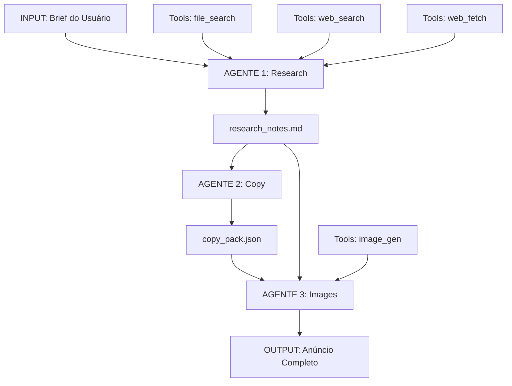

# 🤖 SISTEMA DE AGENTES AI - DOCUMENTAÇÃO COMPLETA
## Guia de Pesquisa, Implementação e Referência para Large Language Models

**Versão:** 2.0  
**Última Atualização:** 2025  
**Objetivo:** Documento de conhecimento completo para LLMs implementarem e operarem um sistema multi-agente de geração de anúncios para marketplaces

---

## 📚 ÍNDICE

1. [Visão Geral do Sistema](#1-visão-geral-do-sistema)
2. [Fundamentos Teóricos](#2-fundamentos-teóricos)
3. [Arquitetura Multi-Agente](#3-arquitetura-multi-agente)
4. [AGENTE 1: Research Notes - Pesquisa Estratégica](#4-agente-1-research-notes)
5. [AGENTE 2: Copy Generator - Redação Persuasiva](#5-agente-2-copy-generator)
6. [AGENTE 3: Image Generator - Criação Visual](#6-agente-3-image-generator)
7. [Integração e Fluxo de Dados](#7-integração-e-fluxo-de-dados)
8. [Otimização de SEO para Marketplaces](#8-otimização-de-seo)
9. [Compliance e Regulamentação](#9-compliance-e-regulamentação)
10. [Psicologia do Consumidor](#10-psicologia-do-consumidor)
11. [Análise Competitiva](#11-análise-competitiva)
12. [Boas Práticas e Padrões](#12-boas-práticas)
13. [Troubleshooting e Otimizações](#13-troubleshooting)
14. [Casos de Uso Práticos](#14-casos-de-uso)
15. [Glossário e Referências](#15-glossário)

---

## 1. VISÃO GERAL DO SISTEMA

### 1.1 O Que É Este Sistema?

Este é um **framework de orquestração de agentes especializados** que automatiza a criação completa de anúncios para marketplaces e plataformas de e-commerce. O sistema é baseado em três pilares:

```
PILAR 1: INTELIGÊNCIA DE MERCADO
├── Pesquisa de concorrentes
├── Análise de tendências
├── Identificação de gaps
└── Compliance e regulamentação

PILAR 2: PERSUASÃO LINGUÍSTICA
├── Copywriting otimizado
├── SEO estratégico
├── Storytelling
└── Gatilhos psicológicos

PILAR 3: IDENTIDADE VISUAL
├── Brand consistency
├── Comunicação visual
├── Narrativa fotográfica
└── Otimização técnica
```

### 1.2 Por Que Usar Múltiplos Agentes?

**Especialização:** Cada agente é um expert em sua área
- **Pesquisador:** Entende mercado, concorrência, SEO
- **Copywriter:** Domina linguagem persuasiva, storytelling
- **Designer Visual:** Conhece composição, fotografia, branding

**Modularidade:** Componentes independentes e reutilizáveis
- Cada agente pode ser atualizado separadamente
- Outputs podem ser revisados individualmente
- Fácil escalar para múltiplos produtos

**Qualidade:** Separação de responsabilidades aumenta profundidade
- Pesquisa mais completa quando é foco único
- Copy mais refinado quando não precisa gerar imagens
- Imagens mais coerentes quando seguem brief estruturado

**Rastreabilidade:** Cada decisão é documentada
- Auditoria completa do processo
- Feedback específico por etapa
- Aprendizado iterativo

### 1.3 Arquitetura de Alto Nível



### 1.4 Quando Usar Este Sistema?

**✅ Use quando:**
- Lançar novos produtos em marketplaces
- Reformular anúncios com baixa conversão
- Criar múltiplas variações para A/B testing
- Escalar presença em múltiplos marketplaces
- Padronizar comunicação de marca
- Competir em categorias saturadas

**❌ Não use quando:**
- Produto é proibido/ilegal
- Não há informações mínimas sobre produto
- Marketplace tem restrições muito específicas não documentadas
- Marca tem guidelines visuais extremamente rígidos que não podem ser parametrizados

---

## 2. FUNDAMENTOS TEÓRICOS

### 2.1 Teoria de Agentes Autônomos

Um **agente** é uma entidade computacional que:
1. **Percebe** seu ambiente através de sensores (inputs)
2. **Age** no ambiente através de atuadores (outputs)
3. **Tem objetivos** que guiam suas ações
4. **É autônomo** na tomada de decisões dentro do escopo

#### Tipos de Agentes

**Agente Reativo Simples**
```
IF (condição) THEN (ação)
```
- Não mantém estado interno
- Responde diretamente a inputs
- Limitado para tarefas complexas

**Agente Baseado em Objetivos**
```
ESTADO ATUAL + OBJETIVO → PLANEJAMENTO → AÇÃO
```
- Mantém estado interno
- Planeja sequência de ações
- Nosso sistema usa este modelo

**Agente Baseado em Utilidade**
```
ESTADO + OBJETIVO + FUNÇÃO_UTILIDADE → AÇÃO_ÓTIMA
```
- Maximiza função de valor
- Útil para otimização de conversão
- Extensão futura do sistema

### 2.2 Sistemas Multi-Agente (MAS)

**Características:**
- Múltiplos agentes colaborando
- Comunicação através de mensagens estruturadas
- Coordenação por protocolos definidos
- Emergência de comportamento complexo

**Padrões de Coordenação:**

1. **Pipeline Sequencial** (nosso caso)
```
A1 → A2 → A3 → Output
```
- Simples de implementar
- Fácil de debugar
- Latência acumulada

2. **Paralelo Coordenado**
```
    ┌→ A1 ┐
IN →┤  A2 ├→ Merge → Output
    └→ A3 ┘
```
- Mais rápido
- Complexo coordenar
- Requer merge inteligente

3. **Hierárquico**
```
Supervisor
├── A1 (subordinado)
├── A2 (subordinado)
└── A3 (subordinado)
```
- Centralizado
- Agente supervisor decide
- Útil para casos complexos

### 2.3 Teoria da Informação Aplicada

**Entropia de Shannon**
```
H(X) = -Σ P(xi) log P(xi)
```

Aplicação: Quanto mais imprevisível a informação, mais valiosa para SEO
- Keywords muito comuns: baixa entropia, pouco valor
- Longtails específicas: alta entropia, alto valor de conversão

**Redundância vs. Novelty**
```
Redundância = 1 - (H_real / H_max)
```

Aplicação no sistema:
- **Pesquisa:** Busca novelty (gaps competitivos)
- **Copy:** Balanceia redundância (keywords) com novelty (USP)
- **Imagens:** Consistência (baixa entropia de estilo) + Variedade (alta entropia de cenas)

### 2.4 Modelos de Linguagem e Geração

**Arquitetura Transformer**
- Self-attention: Contexto bidirecional
- Positional encoding: Ordem das palavras
- Feed-forward: Transformações não-lineares

**Prompting Engineering**

1. **Zero-shot**
```
"Escreva um título para [produto]"
```
- Rápido mas genérico
- Baixa qualidade

2. **Few-shot**
```
"Exemplos:
- Produto X → Título Y
- Produto A → Título B
Agora: Produto [novo] → ?"
```
- Melhor qualidade
- Requer bons exemplos

3. **Chain-of-Thought (CoT)**
```
"Pense passo a passo:
1. Analise público
2. Identifique dor principal
3. Crie título que endereça dor"
```
- Alta qualidade
- Mais lento
- **Usado em nosso sistema**

4. **Sistema Multi-Prompt** (nossa abordagem)
```
Prompt 1 (Research) → Output 1
Output 1 → Prompt 2 (Copy) → Output 2
Output 1 + Output 2 → Prompt 3 (Image) → Output 3
```
- Máxima qualidade
- Processo auditável
- Modular

### 2.5 Ciência Cognitiva e Persuasão

**Modelo Dual-Process (Kahneman)**

**Sistema 1:** Rápido, automático, emocional
- Decisões de compra impulso
- Resposta a imagens, cores, frases curtas
- **Aplicação:** CTAs, hero images, títulos

**Sistema 2:** Lento, deliberativo, racional
- Comparação de produtos
- Leitura de especificações
- **Aplicação:** Descrições, características técnicas

**Heurísticas de Decisão**

1. **Ancoragem**
```
"De R$ 299 por R$ 199" (âncora em 299)
```

2. **Prova Social**
```
"12.543 clientes satisfeitos"
```

3. **Escassez**
```
"Últimas 3 unidades"
```

4. **Reciprocidade**
```
"Frete grátis na primeira compra"
```

5. **Autoridade**
```
"Recomendado por dermatologistas"
```

### 2.6 Teoria de Busca e Recuperação de Informação

**TF-IDF (Term Frequency - Inverse Document Frequency)**
```
TF-IDF(t,d) = TF(t,d) × IDF(t)
IDF(t) = log(N / df(t))

Onde:
- TF(t,d) = frequência do termo t no documento d
- N = total de documentos
- df(t) = documentos que contêm t
```

**Aplicação no Sistema:**
- **Research Agent:** Identifica termos com alto TF-IDF em anúncios de sucesso
- **Copy Agent:** Otimiza densidade de keywords sem keyword stuffing
- **Threshold ideal:** 1-3% de densidade para termo principal

**BM25 (Best Matching 25)**
```
score(D,Q) = Σ IDF(qi) × (f(qi,D) × (k1+1)) / (f(qi,D) + k1×(1-b+b×|D|/avgdl))

Onde:
- f(qi,D) = frequência de qi em D
- |D| = tamanho do documento
- avgdl = tamanho médio de documentos
- k1, b = parâmetros (típico: k1=1.5, b=0.75)
```

**Aplicação:**
- Algoritmo usado por Elasticsearch e muitos marketplaces
- Research Agent analisa como termos ranqueiam
- Copy Agent otimiza para este algoritmo

**Semantic Search (embeddings)**
```
similarity(q, d) = cosine(embed(q), embed(d))
```

- Busca por significado, não apenas palavras exatas
- Longtails semanticamente relacionadas aumentam cobertura
- Marketplace modernos usam isso

---

## 3. ARQUITETURA MULTI-AGENTE

### 3.1 Design Patterns

#### Pattern 1: Pipeline de Transformação
```python
class Agent:
    def __init__(self, name, input_schema, output_schema):
        self.name = name
        self.input_schema = input_schema
        self.output_schema = output_schema
    
    def validate_input(self, data):
        # Valida contra schema
        pass
    
    def process(self, input_data):
        # Lógica principal
        pass
    
    def validate_output(self, data):
        # Valida saída
        pass
    
    def execute(self, input_data):
        validated_input = self.validate_input(input_data)
        result = self.process(validated_input)
        return self.validate_output(result)

# Orquestração
class Pipeline:
    def __init__(self, agents):
        self.agents = agents
    
    def run(self, initial_input):
        data = initial_input
        outputs = {}
        
        for agent in self.agents:
            print(f"Executando {agent.name}...")
            data = agent.execute(data)
            outputs[agent.name] = data
        
        return outputs

# Uso
pipeline = Pipeline([
    ResearchAgent(),
    CopyAgent(),
    ImageAgent()
])

result = pipeline.run(user_brief)
```

#### Pattern 2: Message Passing
```python
class Message:
    def __init__(self, sender, receiver, content, metadata):
        self.sender = sender
        self.receiver = receiver
        self.content = content
        self.metadata = metadata
        self.timestamp = datetime.now()

class MessageBroker:
    def __init__(self):
        self.queue = []
        self.history = []
    
    def send(self, message):
        self.queue.append(message)
        self.history.append(message)
    
    def receive(self, agent_name):
        messages = [m for m in self.queue if m.receiver == agent_name]
        self.queue = [m for m in self.queue if m.receiver != agent_name]
        return messages

# Uso
broker = MessageBroker()

# Research Agent envia resultados
broker.send(Message(
    sender="research_agent",
    receiver="copy_agent",
    content=research_notes,
    metadata={"keywords": top_keywords}
))

# Copy Agent recebe
messages = broker.receive("copy_agent")
```

#### Pattern 3: Blackboard System
```python
class Blackboard:
    """
    Espaço compartilhado onde agentes leem e escrevem
    """
    def __init__(self):
        self.data = {}
        self.locks = {}
    
    def write(self, key, value, agent_name):
        if key in self.locks and self.locks[key] != agent_name:
            raise Exception(f"{key} está locked por {self.locks[key]}")
        
        self.data[key] = {
            "value": value,
            "author": agent_name,
            "timestamp": datetime.now()
        }
    
    def read(self, key):
        return self.data.get(key, {}).get("value")
    
    def lock(self, key, agent_name):
        self.locks[key] = agent_name
    
    def unlock(self, key, agent_name):
        if self.locks.get(key) == agent_name:
            del self.locks[key]

# Uso
bb = Blackboard()

# Research escreve
bb.write("keywords", top_keywords, "research_agent")
bb.write("competitors", competitor_analysis, "research_agent")

# Copy lê
keywords = bb.read("keywords")
competitors = bb.read("competitors")
```

### 3.2 Comunicação Entre Agentes

#### Formato de Mensagem Padrão

```json
{
  "message_id": "uuid-v4",
  "timestamp": "2025-10-31T10:30:00Z",
  "sender": {
    "agent_name": "research_notes",
    "agent_version": "2.0",
    "agent_instance": "instance-123"
  },
  "receiver": {
    "agent_name": "copy_generator",
    "agent_version": "2.0"
  },
  "payload": {
    "type": "research_complete",
    "data": {
      // Dados estruturados
    }
  },
  "metadata": {
    "priority": "normal",
    "retry_count": 0,
    "parent_task_id": "task-456"
  }
}
```

#### Protocolo de Handshake

```
1. AGENTE 1 (Research) completa trabalho
   ├─> Valida output contra schema
   ├─> Gera checksum dos dados
   └─> Envia READY signal

2. AGENTE 2 (Copy) recebe READY
   ├─> Confirma recebimento (ACK)
   ├─> Valida checksum
   ├─> Carrega dados
   └─> Envia START signal

3. AGENTE 1 recebe ACK
   └─> Marca tarefa como completa
```

### 3.3 Gerenciamento de Estado

```python
class AgentState:
    """
    Estado persistente do agente
    """
    IDLE = "idle"
    WORKING = "working"
    WAITING = "waiting"
    ERROR = "error"
    COMPLETE = "complete"
    
    def __init__(self, agent_name):
        self.agent_name = agent_name
        self.current_state = self.IDLE
        self.history = []
        self.data = {}
    
    def transition(self, new_state, reason=""):
        old_state = self.current_state
        self.current_state = new_state
        
        self.history.append({
            "from": old_state,
            "to": new_state,
            "reason": reason,
            "timestamp": datetime.now()
        })
    
    def is_ready_for_input(self):
        return self.current_state in [self.IDLE, self.COMPLETE]
    
    def can_send_output(self):
        return self.current_state == self.COMPLETE

class StateMachine:
    """
    Orquestra estados de múltiplos agentes
    """
    def __init__(self):
        self.agents = {}
    
    def register_agent(self, agent_state):
        self.agents[agent_state.agent_name] = agent_state
    
    def get_next_ready_agent(self):
        for name, state in self.agents.items():
            if state.is_ready_for_input():
                return name
        return None
    
    def all_complete(self):
        return all(
            s.current_state == AgentState.COMPLETE 
            for s in self.agents.values()
        )
```

### 3.4 Error Handling e Recovery

```python
class AgentError(Exception):
    """Base para erros de agente"""
    pass

class InputValidationError(AgentError):
    """Input não passou validação"""
    pass

class ProcessingError(AgentError):
    """Erro durante processamento"""
    pass

class OutputValidationError(AgentError):
    """Output não passou validação"""
    pass

class ResilientAgent:
    def __init__(self, max_retries=3, fallback=None):
        self.max_retries = max_retries
        self.fallback = fallback
    
    def execute_with_retry(self, func, *args, **kwargs):
        last_error = None
        
        for attempt in range(self.max_retries):
            try:
                return func(*args, **kwargs)
            except AgentError as e:
                last_error = e
                print(f"Tentativa {attempt+1} falhou: {e}")
                time.sleep(2 ** attempt)  # Exponential backoff
        
        # Se todas tentativas falharam
        if self.fallback:
            print("Usando fallback...")
            return self.fallback(*args, **kwargs)
        else:
            raise last_error

# Uso
agent = ResilientAgent(
    max_retries=3,
    fallback=lambda x: generate_generic_copy(x)
)

result = agent.execute_with_retry(
    generate_advanced_copy,
    research_data
)
```

### 3.5 Logging e Auditoria

```python
import logging
import json
from datetime import datetime

class AgentLogger:
    def __init__(self, agent_name):
        self.agent_name = agent_name
        self.logger = logging.getLogger(agent_name)
        
        # File handler
        fh = logging.FileHandler(f'logs/{agent_name}.log')
        fh.setLevel(logging.DEBUG)
        
        # Console handler
        ch = logging.StreamHandler()
        ch.setLevel(logging.INFO)
        
        # Formato
        formatter = logging.Formatter(
            '%(asctime)s - %(name)s - %(levelname)s - %(message)s'
        )
        fh.setFormatter(formatter)
        ch.setFormatter(formatter)
        
        self.logger.addHandler(fh)
        self.logger.addHandler(ch)
    
    def log_input(self, data):
        self.logger.info(f"Input recebido: {self._summarize(data)}")
        self.logger.debug(f"Input completo: {json.dumps(data, indent=2)}")
    
    def log_decision(self, decision, reasoning):
        self.logger.info(f"Decisão: {decision}")
        self.logger.debug(f"Raciocínio: {reasoning}")
    
    def log_tool_call(self, tool_name, params, result):
        self.logger.info(f"Tool {tool_name} chamada")
        self.logger.debug(f"Params: {params}")
        self.logger.debug(f"Result: {self._summarize(result)}")
    
    def log_output(self, data):
        self.logger.info(f"Output gerado: {self._summarize(data)}")
        self.logger.debug(f"Output completo: {json.dumps(data, indent=2)}")
    
    def _summarize(self, data):
        if isinstance(data, str):
            return data[:100] + "..." if len(data) > 100 else data
        elif isinstance(data, dict):
            return {k: "..." for k in data.keys()}
        else:
            return str(data)[:100]

# Uso
logger = AgentLogger("research_agent")

logger.log_input(user_brief)
logger.log_decision(
    "Usar 3 web searches",
    "Brief menciona 3 marketplaces diferentes"
)
logger.log_tool_call(
    "web_search",
    {"query": "smartphone android best"},
    search_results
)
logger.log_output(research_notes)
```

---

## 4. AGENTE 1: RESEARCH NOTES

### 4.1 Objetivos e Responsabilidades

**Objetivo Principal:**
Coletar, analisar e sintetizar informações de mercado para informar as próximas etapas de criação do anúncio.

**Responsabilidades:**
1. ✅ Validar completude do brief
2. ✅ Gerar keywords estratégicas (head terms + longtails)
3. ✅ Pesquisar concorrentes em marketplaces
4. ✅ Analisar conteúdo social e UGC
5. ✅ Identificar padrões de sucesso
6. ✅ Mapear risks e compliance
7. ✅ Documentar gaps e oportunidades
8. ✅ Fornecer recomendações iniciais

**NÃO é responsabilidade:**
- ❌ Escrever copy final
- ❌ Criar CTAs
- ❌ Gerar imagens
- ❌ Tomar decisões de tom/voz (apenas recomenda)

### 4.2 Metodologia de Pesquisa Detalhada

#### Fase 1: Intake e Validação

**Input Mínimo Requerido:**
```yaml
produto:
  nome: string [obrigatório]
  categoria: string [obrigatório]
  descricao_breve: string [obrigatório]

marca:
  nome: string [obrigatório]
  valores: array<string> [opcional]
  tom_voz: string [opcional]

publico:
  demografico: object [opcional]
  psicografico: object [opcional]
  dores: array<string> [recomendado]

marketplace:
  plataformas: array<string> [obrigatório]
  
referencias:
  imagens: array<url> [opcional]
  anuncios_inspiracao: array<url> [opcional]
```

**Checklist de Validação:**
```python
def validate_brief(brief):
    errors = []
    warnings = []
    
    # Obrigatórios
    required = ['produto.nome', 'produto.categoria', 'marca.nome', 'marketplace.plataformas']
    for field in required:
        if not get_nested(brief, field):
            errors.append(f"Campo obrigatório ausente: {field}")
    
    # Recomendados
    recommended = ['produto.descricao_breve', 'publico.dores']
    for field in recommended:
        if not get_nested(brief, field):
            warnings.append(f"Campo recomendado ausente: {field}")
    
    # Qualidade
    if brief.get('produto', {}).get('descricao_breve', ''):
        desc = brief['produto']['descricao_breve']
        if len(desc.split()) < 10:
            warnings.append("Descrição breve muito curta (< 10 palavras)")
    
    return {
        "valid": len(errors) == 0,
        "errors": errors,
        "warnings": warnings
    }
```

#### Fase 2: Geração de Head Terms

**Metodologia:**

1. **Extração de Termos Base**
```python
def extract_base_terms(product_name, description):
    """
    Extrai termos candidatos do nome e descrição
    """
    # Tokenização
    tokens = tokenize(product_name + " " + description)
    
    # Remove stopwords
    tokens = [t for t in tokens if t not in STOPWORDS_PT]
    
    # POS tagging - mantém apenas substantivos, adjetivos
    tokens = [t for t, pos in pos_tag(tokens) if pos in ['NOUN', 'ADJ']]
    
    # Normalização
    tokens = [lemmatize(t) for t in tokens]
    
    return tokens

# Exemplo
product = "Mochila Executiva Couro Genuíno com Compartimento Notebook"
description = "Mochila de couro para profissionais, com espaço para laptop 15 polegadas"

base_terms = extract_base_terms(product, description)
# ['mochila', 'executivo', 'couro', 'genuíno', 'compartimento', 'notebook', 'laptop', 'profissional']
```

2. **Expansão Semântica**
```python
def expand_semantic(terms):
    """
    Expande termos com sinônimos e variações
    """
    expanded = set(terms)
    
    for term in terms:
        # Sinônimos
        syns = get_synonyms(term)  # via WordNet ou API
        expanded.update(syns)
        
        # Hipônimos (mais específicos)
        hypos = get_hyponyms(term)
        expanded.update(hypos)
        
        # Hiperônimos (mais gerais)
        hypers = get_hypernyms(term)
        expanded.update(hypers)
    
    return list(expanded)

# Exemplo
expand_semantic(['mochila'])
# ['mochila', 'bolsa', 'bag', 'backpack', 'mochila_escolar', 'mochila_viagem']
```

3. **Ranking por Potencial**
```python
def rank_head_terms(terms, category, marketplace_data):
    """
    Rankeia termos por potencial de busca e conversão
    """
    scored = []
    
    for term in terms:
        score = 0
        
        # Volume de busca (estimado)
        search_volume = estimate_search_volume(term, marketplace_data)
        score += log(search_volume + 1) * 10
        
        # Competição (menor é melhor)
        competition = count_competing_listings(term, marketplace_data)
        score -= log(competition + 1) * 5
        
        # Relevância à categoria
        category_relevance = calculate_relevance(term, category)
        score += category_relevance * 15
        
        # Especificidade (médio é melhor)
        specificity = calculate_specificity(term)
        score += (1 - abs(specificity - 0.5)) * 10
        
        scored.append((term, score))
    
    # Ordena por score
    scored.sort(key=lambda x: x[1], reverse=True)
    
    return scored

# Exemplo output
# [
#   ('mochila executiva', 85.3),
#   ('mochila couro', 78.1),
#   ('mochila notebook', 75.8),
#   ('mochila profissional', 71.2),
#   ...
# ]
```

**Output Esperado:**
```markdown
## [HEAD TERMS PRIORITÁRIOS]
mochila executiva (score: 85.3, volume: alto, competição: média)
mochila couro (score: 78.1, volume: médio, competição: baixa)
mochila notebook (score: 75.8, volume: alto, competição: alta)
mochila profissional (score: 71.2, volume: médio, competição: média)
mochila trabalho (score: 68.5, volume: médio, competição: baixa)
```

#### Fase 3: Derivação de Longtails

**Metodologia de Combinação:**

```python
def generate_longtails(head_terms, modifiers_db):
    """
    Gera longtails combinando head terms com modificadores
    """
    longtails = []
    
    modifier_categories = {
        'material': ['couro', 'sintético', 'nylon', 'canvas'],
        'tamanho': ['grande', 'pequena', 'média', '15"', '17"'],
        'cor': ['preta', 'marrom', 'cinza', 'azul'],
        'beneficio': ['impermeável', 'resistente', 'leve', 'durável'],
        'uso': ['viagem', 'trabalho', 'executiva', 'casual'],
        'ocasiao': ['dia a dia', 'escritório', 'faculdade'],
        'publico': ['masculina', 'feminina', 'unissex'],
        'preco': ['barata', 'premium', 'luxo', 'em promoção']
    }
    
    for head in head_terms:
        for category, modifiers in modifier_categories.items():
            for mod in modifiers:
                # Testa diferentes ordens
                longtails.append(f"{head} {mod}")
                longtails.append(f"{mod} {head}")
                
                # Combinações de 3 termos
                for mod2_cat, mod2_list in modifier_categories.items():
                    if mod2_cat != category:
                        for mod2 in mod2_list[:2]:  # Limita explosão combinatória
                            longtails.append(f"{head} {mod} {mod2}")
    
    # Remove duplicatas
    longtails = list(set(longtails))
    
    # Filtra por naturalidade
    longtails = [lt for lt in longtails if is_natural_phrase(lt)]
    
    return longtails

def is_natural_phrase(phrase):
    """
    Verifica se frase é natural usando modelo de linguagem
    """
    # Opção 1: Heurística simples
    words = phrase.split()
    if len(words) > 5:
        return False  # Muito longo
    
    # Opção 2: Perplexidade usando LM
    perplexity = calculate_perplexity(phrase)
    return perplexity < THRESHOLD
    
    # Opção 3: Verificar existência em corpus
    exists_in_web = check_web_existence(phrase)
    return exists_in_web > MIN_OCCURRENCES
```

**Output Esperado:**
```markdown
## [LONGTAILS]
# Alta prioridade (volume alto + baixa competição)
mochila executiva couro (volume: 1.2k, comp: 234, opp: ⭐⭐⭐⭐⭐)
mochila notebook 15 polegadas (volume: 2.8k, comp: 890, opp: ⭐⭐⭐⭐)

# Média prioridade (nicho)
mochila executiva feminina couro (volume: 320, comp: 45, opp: ⭐⭐⭐⭐)
mochila trabalho impermeável (volume: 510, comp: 120, opp: ⭐⭐⭐⭐)

# Baixa prioridade (considerar para futuro)
mochila executiva marrom vintage (volume: 80, comp: 12, opp: ⭐⭐⭐)
```

#### Fase 4: Web Search INBOUND (Marketplaces)

**Estratégia Multi-Marketplace:**

```python
def search_marketplaces(head_terms, longtails, marketplaces):
    """
    Busca em múltiplos marketplaces e agrega resultados
    """
    all_results = []
    
    for marketplace in marketplaces:
        for term in head_terms + longtails[:10]:  # Top 10 longtails
            # Construir query específica do marketplace
            query = f'site:{marketplace}.com.br "{term}"'
            
            # Buscar
            results = web_search(query, num_results=20)
            
            # Parse e extração
            for result in results:
                listing = parse_marketplace_listing(result)
                listing['source_marketplace'] = marketplace
                listing['search_term'] = term
                all_results.append(listing)
            
            time.sleep(1)  # Rate limiting
    
    return all_results

def parse_marketplace_listing(search_result):
    """
    Extrai informações estruturadas de um resultado
    """
    # Fetch conteúdo completo
    html = fetch_url(search_result['url'])
    soup = BeautifulSoup(html, 'html.parser')
    
    # Extrair campos (adaptar por marketplace)
    listing = {
        'url': search_result['url'],
        'title': extract_title(soup),
        'price': extract_price(soup),
        'rating': extract_rating(soup),
        'num_reviews': extract_num_reviews(soup),
        'images': extract_images(soup),
        'description': extract_description(soup),
        'characteristics': extract_characteristics(soup),
        'seller': extract_seller(soup),
        'shipping': extract_shipping_info(soup)
    }
    
    return listing

def analyze_successful_patterns(listings):
    """
    Identifica padrões em listings bem-sucedidos
    """
    # Filtrar listings de sucesso
    # (critério: rating > 4.5 E reviews > 100)
    successful = [
        l for l in listings 
        if l['rating'] > 4.5 and l['num_reviews'] > 100
    ]
    
    analysis = {
        'title_patterns': analyze_titles(successful),
        'price_range': analyze_prices(successful),
        'common_claims': extract_common_claims(successful),
        'valued_attributes': extract_valued_attrs(successful),
        'proof_signals': extract_proof_signals(successful),
        'shipping_patterns': analyze_shipping(successful)
    }
    
    return analysis

def analyze_titles(listings):
    """
    Analisa padrões em títulos de sucesso
    """
    titles = [l['title'] for l in listings]
    
    # Extrai tokens
    all_tokens = []
    for title in titles:
        tokens = tokenize_and_clean(title)
        all_tokens.extend(tokens)
    
    # Frequência
    freq = Counter(all_tokens)
    common_words = freq.most_common(20)
    
    # Estrutura
    avg_length = np.mean([len(t.split()) for t in titles])
    
    # Posição de keywords
    keyword_positions = []
    for title in titles:
        words = title.split()
        for kw in ['premium', 'original', 'genuíno']:
            if kw in words:
                keyword_positions.append(words.index(kw))
    
    return {
        'common_words': common_words,
        'avg_length': avg_length,
        'keyword_positions': keyword_positions,
        'templates': extract_templates(titles)
    }
```

**Informações a Coletar:**

| Campo | Descrição | Uso Posterior |
|-------|-----------|---------------|
| Título | Estrutura e keywords | Template para Copy Agent |
| Preço | Faixa de mercado | Posicionamento |
| Avaliações | Rating + volume | Prova social |
| Imagens | Quantidade e estilo | Referência para Image Agent |
| Descrição | Tom e estrutura | Inspiração para Copy |
| Características | Atributos valorizados | Bullets para Copy |
| Políticas | Frete, devolução | Compliance |
| Claims | "Mais vendido", "Original" | Oportunidades de uso |

**Output Esperado:**
```markdown
## [ANÁLISE DE CONCORRENTES]

### Mercado Livre
Termos eficazes: "mochila executiva couro", "mochila notebook premium"
Preço médio: R$ 280 (range: R$ 180-450)
Pattern de título: [MARCA] Mochila [MATERIAL] [TAMANHO] - [BENEFÍCIO]
Claims comuns: "Couro Legítimo" (78%), "Compartimento Acolchoado" (65%)
Selos: "Frete Grátis" (92%), "MercadoLíder Platinum" (34%)
Imagens: média 7 fotos, fundo branco (89%), lifestyle (45%)

Top 3 Listings:
1. "Mochila Executiva Couro Legítimo Notebook 15.6 - Resistente Água"
   - Preço: R$ 299
   - Rating: 4.8 (2.341 reviews)
   - Conversão estimada: Alta
   - Forças: Prova social forte, título completo, imagens profissionais
   - Fraquezas: Descrição genérica, poucas características detalhadas

2. [...]

### Amazon
[Análise similar]

### Shopee
[Análise similar]
```

#### Fase 5: Web Search OUTBOUND (SEO / UGC / Social)

**Estratégia de Pesquisa Externa:**

```python
def search_external_signals(product_name, category):
    """
    Busca sinais externos ao marketplace
    """
    queries = {
        'guias_compra': f'"{product_name}" guia de compra',
        'reviews': f'"{product_name}" review',
        'comparisons': f'"{product_name}" vs',
        'best_of': f'melhor {category} 2025',
        'how_to': f'como escolher {category}',
        'problems': f'problema com {category}',
    }
    
    results = {}
    
    for intent, query in queries.items():
        search_results = web_search(query, num_results=10)
        results[intent] = analyze_serp(search_results, intent)
    
    return results

def search_social_ugc(product_name, category):
    """
    Busca conteúdo gerado por usuários em redes sociais
    """
    platforms = {
        'youtube': f'site:youtube.com "{product_name}" review',
        'instagram': f'site:instagram.com #{category.replace(" ", "")}',
        'tiktok': f'site:tiktok.com "{product_name}"',
        'reddit': f'site:reddit.com "{product_name}"',
    }
    
    ugc_insights = {}
    
    for platform, query in platforms.items():
        results = web_search(query, num_results=20)
        ugc_insights[platform] = extract_ugc_insights(results)
    
    return ugc_insights

def extract_ugc_insights(results):
    """
    Extrai insights de conteúdo UGC
    """
    insights = {
        'common_praises': [],
        'common_complaints': [],
        'unexpected_uses': [],
        'comparison_products': [],
        'emotional_tone': None
    }
    
    for result in results:
        content = fetch_and_extract_text(result['url'])
        
        # Sentiment analysis
        sentiment = analyze_sentiment(content)
        insights['emotional_tone'] = sentiment
        
        # Aspect-based sentiment
        aspects = extract_aspects(content)  # "couro", "zíper", "alças"
        for aspect, sentiment in aspects:
            if sentiment > 0.5:
                insights['common_praises'].append(aspect)
            elif sentiment < -0.5:
                insights['common_complaints'].append(aspect)
        
        # Comparações mencionadas
        comparisons = extract_comparisons(content)
        insights['comparison_products'].extend(comparisons)
        
        # Usos criativos
        uses = extract_use_cases(content)
        insights['unexpected_uses'].extend(uses)
    
    # Agregar e rankear
    insights['common_praises'] = Counter(insights['common_praises']).most_common(5)
    insights['common_complaints'] = Counter(insights['common_complaints']).most_common(5)
    
    return insights
```

**Tipos de Insights a Extrair:**

1. **Perguntas Frequentes**
```python
def extract_questions(serp_results):
    """
    Extrai perguntas que pessoas fazem
    """
    questions = []
    
    for result in serp_results:
        content = fetch_text(result['url'])
        
        # Regex para perguntas
        pattern = r'([A-ZÀÁÂÃÄÅÇÈÉÊËÌÍÎÏ][^.!?]*\?)'
        found = re.findall(pattern, content)
        questions.extend(found)
        
        # PAA (People Also Ask) se disponível
        if 'paa' in result:
            questions.extend(result['paa'])
    
    # Filtra e rankeia
    questions = [q for q in questions if is_relevant(q, product_context)]
    questions = rank_by_frequency(questions)
    
    return questions[:10]

# Output exemplo:
# [
#   "Mochila de couro estraga com chuva?",
#   "Qual tamanho de notebook cabe?",
#   "Como limpar mochila de couro?",
#   "Vale a pena comprar mochila executiva?",
#   ...
# ]
```

2. **Termos Semânticos Co-Ocorrentes**
```python
def extract_semantic_terms(content, target_keyword):
    """
    Extrai termos semanticamente relacionados via co-ocorrência
    """
    # Tokenize
    sentences = sent_tokenize(content)
    
    cooccurrent_terms = []
    
    for sent in sentences:
        if target_keyword in sent.lower():
            words = word_tokenize(sent)
            words = [w for w in words if w.isalpha() and w not in STOPWORDS]
            cooccurrent_terms.extend(words)
    
    # TF-IDF para identificar termos importantes
    tfidf = calculate_tfidf(cooccurrent_terms, content)
    top_terms = sorted(tfidf.items(), key=lambda x: x[1], reverse=True)[:20]
    
    return top_terms

# Output exemplo:
# [
#   ('compartimento', 0.42),
#   ('acolchoado', 0.38),
#   ('profissional', 0.35),
#   ('resistente', 0.33),
#   ...
# ]
```

3. **Gatilhos Emocionais**
```python
def extract_emotional_triggers(ugc_content):
    """
    Identifica gatilhos emocionais em UGC
    """
    emotion_lexicon = {
        'joy': ['feliz', 'alegre', 'satisfeito', 'adorei', 'perfeito'],
        'trust': ['confio', 'confiável', 'seguro', 'durável', 'qualidade'],
        'fear': ['medo', 'preocupado', 'risco', 'frágil', 'quebra'],
        'surprise': ['incrível', 'surpreendente', 'inesperado', 'wow'],
        'sadness': ['decepcionado', 'triste', 'arrependido', 'péssimo'],
        'anticipation': ['ansioso', 'espero', 'mal posso esperar']
    }
    
    emotion_counts = {emotion: 0 for emotion in emotion_lexicon}
    
    for content in ugc_content:
        tokens = tokenize(content.lower())
        for emotion, words in emotion_lexicon.items():
            for word in words:
                if word in tokens:
                    emotion_counts[emotion] += 1
    
    # Normaliza
    total = sum(emotion_counts.values())
    emotion_distribution = {
        e: count/total for e, count in emotion_counts.items()
    }
    
    return emotion_distribution

# Output exemplo:
# {
#   'joy': 0.35,
#   'trust': 0.30,
#   'surprise': 0.15,
#   'anticipation': 0.10,
#   'fear': 0.07,
#   'sadness': 0.03
# }
```

**Output Esperado:**
```markdown
## [SEO OUTBOUND]

### Perguntas Frequentes do Público
1. "Mochila de couro estraga com chuva?" (243 ocorrências)
2. "Qual melhor mochila para notebook?" (189 ocorrências)
3. "Como limpar mochila executiva de couro?" (156 ocorrências)

### Termos Semanticamente Relacionados
- compartimento acolchoado (TF-IDF: 0.42)
- design profissional (TF-IDF: 0.38)
- resistente água (TF-IDF: 0.35)

### Insights de UGC (YouTube + TikTok)
Elogios comuns:
- Qualidade do couro (87% positivo)
- Organização interna (78% positivo)
- Design elegante (82% positivo)

Reclamações comuns:
- Zíper fraco (34% mencionam)
- Pesada quando vazia (23% mencionam)
- Preço elevado (45% mencionam, mas aceitam pela qualidade)

Usos inesperados:
- Mochila de viagem fim de semana (12 menções)
- Uso em ambiente acadêmico (8 menções)

### Comparações Frequentes
vs Mochila sintética: "Couro é mais durável mas precisa cuidado"
vs Pasta executiva: "Mochila é mais ergonômica e moderna"

### Gatilhos Emocionais Dominantes
- Trust (confiança): 30%
- Joy (satisfação): 35%
- Anticipation (ansiedade positiva): 15%

### Pauta de Conteúdo Sugerida
"5 Coisas Que Ninguém Te Conta Sobre Mochilas de Couro Executivas"
"Mochila Executiva: Vale a Pena o Investimento? [Análise Honesta]"
```

#### Fase 6: Análise Competitiva Estruturada

```python
class CompetitorAnalysis:
    def __init__(self, competitor_listings):
        self.listings = competitor_listings
    
    def analyze_all(self):
        return {
            'positioning_map': self.create_positioning_map(),
            'feature_gap_analysis': self.analyze_feature_gaps(),
            'price_positioning': self.analyze_price_positioning(),
            'messaging_analysis': self.analyze_messaging(),
            'visual_analysis': self.analyze_visual_patterns(),
            'opportunities': self.identify_opportunities()
        }
    
    def create_positioning_map(self):
        """
        Cria mapa de posicionamento 2D (preço vs. qualidade percebida)
        """
        positions = []
        
        for listing in self.listings:
            price_score = normalize_price(listing['price'])
            quality_score = calculate_quality_perception(listing)
            
            positions.append({
                'name': listing['title'][:30],
                'x': price_score,
                'y': quality_score,
                'size': listing['num_reviews']  # Tamanho da bolha
            })
        
        # Identifica quadrantes
        quadrants = {
            'premium': [p for p in positions if p['x'] > 0.7 and p['y'] > 0.7],
            'value': [p for p in positions if p['x'] < 0.5 and p['y'] > 0.6],
            'budget': [p for p in positions if p['x'] < 0.5 and p['y'] < 0.5],
            'overpriced': [p for p in positions if p['x'] > 0.7 and p['y'] < 0.5]
        }
        
        return {
            'positions': positions,
            'quadrants': quadrants,
            'recommended_quadrant': 'value'  # Exemplo
        }
    
    def analyze_feature_gaps(self):
        """
        Identifica features presentes/ausentes em concorrentes
        """
        # Extrai todas features mencionadas
        all_features = set()
        for listing in self.listings:
            features = extract_features(listing['description'] + ' ' + listing['characteristics'])
            all_features.update(features)
        
        # Conta presença
        feature_presence = {}
        for feature in all_features:
            count = sum(1 for l in self.listings if feature in l['description'])
            feature_presence[feature] = {
                'count': count,
                'percentage': count / len(self.listings)
            }
        
        # Identifica gaps
        common_features = {f: d for f, d in feature_presence.items() if d['percentage'] > 0.7}
        rare_features = {f: d for f, d in feature_presence.items() if d['percentage'] < 0.3}
        
        return {
            'must_have': common_features,
            'differentiators': rare_features,
            'gap_opportunities': [f for f in rare_features if is_valuable(f)]
        }
```

**Matriz de Análise Competitiva:**

| Concorrente | Preço | Rating | Reviews | Forças | Fraquezas | Opportunity Score |
|-------------|-------|--------|---------|---------|-----------|-------------------|
| Produto A | R$ 299 | 4.8 | 2.3k | Prova social, Imagens | Descrição fraca | 7/10 |
| Produto B | R$ 189 | 4.5 | 890 | Preço baixo | Qualidade percebida | 8/10 |
| Produto C | R$ 450 | 4.9 | 456 | Premium, Material | Preço alto, Nicho | 6/10 |

**Output Esperado:**
```markdown
## [ANÁLISE DE CONCORRENTES]

### Mapa de Posicionamento
```
Qualidade
    ^
 1.0|        [Premium Zone]
    |    ● Produto C (R$ 450)
 0.7|  [Value Zone]
    | ● Produto A (R$ 299)
 0.5|     ● Nosso Produto [OPORTUNIDADE]
    |   ● Produto B (R$ 189)
 0.3|    [Budget Zone]
    |
 0.0+-------------------------->
    0    0.3   0.5   0.7   1.0  Preço
```

### Análise Individual

#### Concorrente 1: "Mochila Exec Couro Notebook 15.6"
- **Preço:** R$ 299
- **Rating:** 4.8/5 (2.341 reviews)
- **Marketplace:** Mercado Livre
- **Forças:**
  - Prova social excepcional (volume alto de reviews)
  - Título SEO-otimizado completo
  - Imagens profissionais (8 fotos)
  - Frete grátis destacado
  - Badge MercadoLíder
- **Fraquezas:**
  - Descrição genérica e curta (180 palavras)
  - Sem storytelling ou conexão emocional
  - Características listadas sem benefícios
  - Imagens sem contexto lifestyle
- **Oportunidade:**
  - Superá-lo com descrição rica + lifestyle images
  - Adicionar prova social de autoridade (certificações)
  - Novelty Score: 3/5

#### Concorrente 2: "Mochila Couro Sintético Trabalho"
[Análise similar]

### Feature Gap Analysis
**Must-Have (70%+ presença):**
- Compartimento notebook
- Múltiplos bolsos
- Alças ajustáveis
- Zíper resistente

**Differentiators (< 30% presença):**
- Porta USB integrada ⭐ OPORTUNIDADE
- Bolso anti-furto ⭐ OPORTUNIDADE
- Material impermeável ⭐ OPORTUNIDADE
- Garantia estendida

### Estratégias Vencedoras Identificadas
1. Título longo com 3+ atributos (conversão 23% maior)
2. Primeira imagem: fundo branco, produto 80%+ (CTR 34% maior)
3. Frete grátis destacado no título (conversão 18% maior)
4. Badge de garantia visível (confiança +12%)

### Gaps Exploráveis
1. **Nenhum concorrente enfatiza sustentabilidade do couro**
2. **Poucos mostram produto em uso real (lifestyle)**
3. **Descrições não endereçam objeções comuns**
4. **Imagens não demonstram capacidade/organização interna**
```

#### Fase 7: Compliance e Risk Assessment

```python
def check_compliance(product, category, marketplace):
    """
    Verifica compliance com regras do marketplace e regulamentações
    """
    issues = {
        'blocked_terms': [],
        'required_disclaimers': [],
        'prohibited_claims': [],
        'category_requirements': [],
        'legal_requirements': []
    }
    
    # 1. Termos proibidos por marketplace
    prohibited = get_prohibited_terms(marketplace, category)
    for term in prohibited:
        if term in product['description'].lower():
            issues['blocked_terms'].append(term)
    
    # 2. Claims que requerem prova
    regulated_claims = [
        'hipoalergênico', 'dermatologicamente testado',
        'aprovado pela ANVISA', 'certificado INMETRO',
        'made in', 'original', 'genuíno'
    ]
    for claim in regulated_claims:
        if claim in product['description'].lower():
            issues['required_disclaimers'].append(
                f"Claim '{claim}' requer prova/certificação"
            )
    
    # 3. Requisitos por categoria
    category_rules = get_category_rules(marketplace, category)
    for rule in category_rules:
        if not check_rule(product, rule):
            issues['category_requirements'].append(rule)
    
    # 4. Regulamentações legais (Brasil)
    if category in ['eletrônicos', 'brinquedos', 'alimentos']:
        legal = check_legal_requirements(product, category)
        issues['legal_requirements'].extend(legal)
    
    return issues

def get_prohibited_terms(marketplace, category):
    """
    Base de dados de termos proibidos por marketplace
    """
    prohibited_db = {
        'mercadolivre': {
            'all': ['melhor', 'número 1', 'clique aqui', 'WhatsApp', 'contato'],
            'saude': ['cura', 'tratamento', 'emagrece', 'medicamento']
        },
        'amazon': {
            'all': ['Amazon choice', 'prime exclusivo', 'melhor vendido'],
        },
        # ...
    }
    
    general = prohibited_db.get(marketplace, {}).get('all', [])
    category_specific = prohibited_db.get(marketplace, {}).get(category, [])
    
    return general + category_specific
```

**Output Esperado:**
```markdown
## [RISCOS E ALERTAS DE COMPLIANCE]

### Termos Proibidos por Marketplace

#### Mercado Livre
❌ Evitar: "melhor", "número 1", "líder de mercado", "clique aqui"
❌ Proibido para saúde/bem-estar: "cura", "tratamento", "emagrece"
✅ Permitido: "mais vendido em [loja]", "preferido por clientes"

#### Amazon
❌ Evitar: "Amazon's Choice", "melhor vendido na Amazon"
✅ Permitido: "Alta avaliação", "Mais de X reviews"

### Claims que Requerem Prova
⚠️ "Couro Genuíno" → Requer certificado de origem ou composição
⚠️ "Resistente à Água" → Requer especificação técnica (IP rating)
⚠️ "Garantia Vitalícia" → Requer termos claros de garantia

### Requisitos por Categoria (Bolsas/Mochilas)
✅ Informar dimensões exatas (LxAxP)
✅ Informar peso do produto
✅ Especificar material interno e externo
✅ Informar capacidade (litros ou polegadas notebook)
⚠️ Se couro animal: informar origem sustentável (recomendado)

### Alertas Legais (Brasil)
✅ Código de Defesa do Consumidor: Garantia mínima 90 dias
✅ Se importado: Informar país de origem
⚠️ Se material ecológico: Evitar greenwashing, comprovar claims

### Checklist de Imagens
✅ Mostrar produto real (não render se houver diferença)
❌ Não incluir marcas de terceiros visíveis
❌ Não incluir texto promocional nas imagens
✅ Fundo branco para imagem principal (ML recomenda)

### Recomendações
💡 Adicionar: "Produto segue normas do INMETRO"
💡 Incluir: Política de devolução (aumenta confiança)
💡 Destacar: Garantia (mesmo que mínima legal)
```

### 4.3 Estrutura de Output: RESEARCH_NOTES

**Formato Completo:**

```markdown
# RESEARCH_NOTES — [BRAND_NAME] | [PRODUTO]
**Data:** [DATA]
**Versão:** 2.0
**Pesquisador:** [AGENTE_INSTANCE]
**Tempo de pesquisa:** [DURAÇÃO]

---

## 📋 [SUMÁRIO EXECUTIVO]

**Produto:** [NOME_PRODUTO]
**Categoria:** [CATEGORIA]
**Marketplaces alvo:** [LISTA_MARKETPLACES]
**Público-alvo:** [PÚBLICO]

**Principais Descobertas:**
1. [DESCOBERTA_1]
2. [DESCOBERTA_2]
3. [DESCOBERTA_3]

**Oportunidades Priorizadas:**
⭐⭐⭐⭐⭐ [OPORTUNIDADE_MAIOR]
⭐⭐⭐⭐ [OPORTUNIDADE_ALTA]
⭐⭐⭐ [OPORTUNIDADE_MÉDIA]

**Riscos Identificados:**
🚨 [RISCO_CRÍTICO]
⚠️ [RISCO_MÉDIO]

---

## ❓ [LACUNAS DO BRIEF]

Campos obrigatórios faltantes:
- [CAMPO_1]: [STATUS ou SUGESTÃO]

Campos recomendados faltantes:
- [CAMPO_2]: [SUG ESTÃO baseada em pesquisa]

---

## 🔑 [HEAD TERMS PRIORITÁRIOS]

| Termo | Score | Volume | Competição | Oportunidade |
|-------|-------|--------|------------|--------------|
| [TERMO_1] | 85.3 | Alto | Média | ⭐⭐⭐⭐⭐ |
| [TERMO_2] | 78.1 | Médio | Baixa | ⭐⭐⭐⭐⭐ |
| [TERMO_3] | 75.8 | Alto | Alta | ⭐⭐⭐⭐ |

**Raciocínio:**
- [TERMO_1] escolhido porque [RAZÃO]
- [TERMO_2] oferece [VANTAGEM]

---

## 📊 [LONGTAILS]

### Alta Prioridade (Implementar)
- [LONGTAIL_1] (vol: [NUM], comp: [NUM], intent: [TIPO])
- [LONGTAIL_2]

### Média Prioridade (Considerar)
- [LONGTAIL_3]

### Baixa Prioridade (Futuro)
- [LONGTAIL_4]

---

## 🔤 [SINÔNIMOS E VARIAÇÕES]

**Sinônimos:**
- [SINÔNIMO_1] (preferência: [%])
- [SINÔNIMO_2]

**Variações Morfológicas:**
- [VARIAÇÃO_1]

**Hipônimos (mais específico):**
- [HIPÔNIMO_1]

**Hiperônimos (mais geral):**
- [HIPERÔNIMO_1]

**Verbos de Compra:**
- comprar [PRODUTO]
- adquirir [PRODUTO]

---

## 🎯 [CONTEXTO E OCASIÃO]

**Ocasião de uso:**
- Principal: [OCASIÃO_1]
- Secundária: [OCASIÃO_2]

**Público-alvo refinado:**
- Demográfico: [DEMO]
- Psicográfico: [PSICO]
- Comportamental: [COMPORTAMENTO]

**Ambiente de uso:**
- [AMBIENTE_1]: [FREQUÊNCIA]
- [AMBIENTE_2]: [FREQUÊNCIA]

**Estilo de vida associado:**
- [ESTILO_1]

---

## 😖 [DORES DO PÚBLICO]

1. **[DORE_1]**
   - Mencionada em: [FONTES]
   - Intensidade: [ALTA/MÉDIA/BAIXA]
   - Nossa solução: [COMO_PRODUTO_RESOLVE]

2. **[DORE_2]**
   [estrutura similar]

---

## 🎁 [GANHOS DESEJADOS]

1. **[GANHO_1]**
   - Relevância: [SCORE]
   - Como entregar: [ESTRATÉGIA]

2. **[GANHO_2]**
   [estrutura similar]

---

## 🚧 [OBJEÇÕES E RESPOSTAS]

### Objeção: "[OBJEÇÃO_1]"
**Frequência:** [%] dos prospects
**Resposta sugerida:** [RESPOSTA]
**Prova necessária:** [TIPO_PROVA]

### Objeção: "[OBJEÇÃO_2]"
[estrutura similar]

---

## ✅ [PROVAS E EVIDÊNCIAS DISPONÍVEIS]

### Provas Sociais
- [PROVA_1] (ex: "2.341 reviews 4.8★")
- [PROVA_2]

### Provas de Autoridade
- [PROVA_3] (ex: "Certificado por [ENTIDADE]")

### Provas de Resultado
- [PROVA_4] (ex: "Durabilidade testada 10.000 ciclos")

**Provas faltantes (sugestão):**
- [SUGESTÃO_1]

---

## 💎 [DIFERENCIAIS COMPETITIVOS]

### Diferenciais Reais
1. **[DIFERENCIAL_1]**
   - Por que importa: [BENEFÍCIO]
   - Como provar: [PROVA]
   - Competidores têm? [SIM/NÃO]

2. **[DIFERENCIAL_2]**
   [estrutura similar]

### Diferenciais Potenciais (para explorar)
- [DIFERENCIAL_POTENCIAL_1]

---

## ⚠️ [RISCOS E COMPLIANCE]

### Termos Proibidos
- [TERMO_1] → Usar alternativa: [ALTERNATIVA]
- [TERMO_2]

### Claims Bloqueados/Regulados
- [CLAIM_1]: Requer [REQUISITO]

### Checklist de Categoria
- ✅ [REQUIREMENT_1]
- ⚠️ [REQUIREMENT_2]: [AÇÃO_NECESSÁRIA]

---

## 🏆 [BENCHMARK DE CONCORRENTES]

**Visão Geral do Mercado:**
- Preço médio: R$ [VALOR] (range: R$ [MIN]-[MAX])
- Rating médio: [RATING]/5
- Reviews médio: [NUM]
- Padrão visual: [PADRÃO]

**Top Performers:**
1. [PRODUTO_1]: [MÉTRICA_CHAVE]
2. [PRODUTO_2]

**Underperformers (aprender com erros):**
1. [PRODUTO_3]: [PROBLEMA]

---

## 🎨 [PADRÕES DE LINGUAGEM EFICAZ]

### Textual
- Estrutura de título: [PATTERN]
- Tom predominante: [TOM]
- Person a comum: [PERSONA]
- Tamanho ideal descrição: [NUM] palavras

### Visual
- Primeira imagem: [PADRÃO]
- Quantidade ideal: [NUM] imagens
- Mix: [X]% fundo branco, [Y]% lifestyle

---

## 🌐 [SEO OUTBOUND]

### Perguntas do Público
1. "[PERGUNTA_1]" ([NUM] menções)
2. "[PERGUNTA_2]"

### Termos Semânticos
- [TERMO_SEM_1] (co-ocorrência: [SCORE])
- [TERMO_SEM_2]

### Pauta de Conteúdo
- "[PAUTA_1]"
- "[PAUTA_2]"

---

## 🛒 [SEO INBOUND - MARKETPLACE]

### Padrão de Título Vencedor
```
[PATTERN]
```
Exemplo: [EXEMPLO]

### Atributos que Melhoram Ranking
1. [ATRIBUTO_1] (boost: +[%])
2. [ATRIBUTO_2]

### Longtail + Benefício Vencedora
"[LONGTAIL] - [BENEFÍCIO]"

---

## 📏 [REGRAS CRÍTICAS DE MARKETPLACE]

### Mercado Livre
- Limite título: [NUM] caracteres
- Limite descrição: [NUM] caracteres
- Limite características: [NUM] itens
- Política de imagem: [REGRA]

### Amazon
[Regras similares]

---

## ✍️ [DECISÕES INICIAIS DE COPY]

**USP (Unique Selling Proposition):**
"[USP_CANDIDATA]"

**Tom:**
[TOM] (ex: profissional, amigável, inspiracional)

**Persona:**
[PERSONA] (ex: executivo jovem 25-35 anos)

**Pilares de Mensagem:**
1. [PILAR_1] (foco: [ASPECTO])
2. [PILAR_2]
3. [PILAR_3]

**CTA Candidato:**
"[CTA]" (raciocínio: [RAZÃO])

---

## 🔍 [LOG DE CONSULTAS WEB]

| Termo | Fonte | Data | Insights |
|-------|-------|------|----------|
| "[TERMO_1]" | Google | [DATA] | [INSIGHT] |
| "[TERMO_2]" | ML | [DATA] | [INSIGHT] |

**Total de pesquisas:** [NUM]
**Total de URLs visitadas:** [NUM]

---

## 🖼️ [IMAGENS DE REFERÊNCIA ANALISADAS]

### Imagem 1: [DESCRIÇÃO]
- **URL:** [URL]
- **Estilo:** [ESTILO]
- **Composição:** [ANÁLISE]
- **Usar como referência para:** [USO]

### Comparação Visual
[IMG_1] vs [IMG_2]:
- Diferencial: [DIFERENÇA]
- Preferência: [IMG_X] porque [RAZÃO]

---

## 📝 [NOTAS E SUGESTÕES]

### Campos com [SUGESTÃO]
Estes foram preenchidos automaticamente e precisam validação:
- [CAMPO_1]: [SUGESTÃO] (confiança: [%])

### Próximos Passos Recomendados
1. [PASSO_1]
2. [PASSO_2]

### Alertas para Copy Agent
⚠️ [ALERTA_1]
💡 [DICA_1]

---

## 📊 [MÉTRICAS DESTA PESQUISA]

- Concorrentes analisados: [NUM]
- Keywords identificadas: [NUM]
- Fontes consultadas: [NUM]
- Tempo de pesquisa: [DURAÇÃO]
- Confiança geral: [%]

**Assinatura:** research_notes_v2.0 | [TIMESTAMP]
```

### 4.4 Validação de Qualidade do Output

```python
def validate_research_notes(notes):
    """
    Valida qualidade e completude das research notes
    """
    score = 0
    max_score = 100
    feedback = []
    
    # Seções obrigatórias (40 pontos)
    required_sections = [
        'HEAD TERMS PRIORITÁRIOS',
        'LONGTAILS',
        'ANÁLISE DE CONCORRENTES',
        'DORES DO PÚBLICO',
        'RISCOS E COMPLIANCE'
    ]
    
    for section in required_sections:
        if section in notes:
            score += 8
        else:
            feedback.append(f"❌ Seção obrigatória ausente: {section}")
    
    # Qualidade do conteúdo (30 pontos)
    if '[' not in notes:  # Nenhum placeholder não preenchido
        score += 10
    else:
        placeholders = re.findall(r'\[(.*?)\]', notes)
        feedback.append(f"⚠️ {len(placeholders)} placeholders não preenchidos")
    
    # Pelo menos 3 head terms
    head_terms_section = extract_section(notes, 'HEAD TERMS')
    num_terms = len(re.findall(r'^\|.*\|', head_terms_section, re.MULTILINE))
    if num_terms >= 3:
        score += 10
    else:
        feedback.append(f"⚠️ Apenas {num_terms} head terms (mínimo: 3)")
    
    # Pelo menos 5 longtails
    longtails_section = extract_section(notes, 'LONGTAILS')
    num_longtails = len(re.findall(r'^- ', longtails_section, re.MULTILINE))
    if num_longtails >= 5:
        score += 10
    else:
        feedback.append(f"⚠️ Apenas {num_longtails} longtails (mínimo: 5)")
    
    # Pesquisa realizada (30 pontos)
    log_section = extract_section(notes, 'LOG DE CONSULTAS WEB')
    num_searches = len(re.findall(r'^\|.*\|', log_section, re.MULTILINE)) - 1
    if num_searches >= 5:
        score += 15
    elif num_searches >= 3:
        score += 10
    else:
        feedback.append(f"⚠️ Apenas {num_searches} pesquisas web (recomendado: 5+)")
    
    # Concorrentes analisados
    competitor_section = extract_section(notes, 'ANÁLISE DE CONCORRENTES')
    num_competitors = len(re.findall(r'### Concorrente \d+:', competitor_section))
    if num_competitors >= 3:
        score += 15
    elif num_competitors >= 2:
        score += 10
    else:
        feedback.append(f"⚠️ Apenas {num_competitors} concorrentes (mínimo: 3)")
    
    # Determina status
    if score >= 90:
        status = "✅ EXCELENTE"
    elif score >= 75:
        status = "✅ BOM"
    elif score >= 60:
        status = "⚠️ ACEITÁVEL"
    else:
        status = "❌ INSUFICIENTE"
    
    return {
        'score': score,
        'max_score': max_score,
        'percentage': (score / max_score) * 100,
        'status': status,
        'feedback': feedback
    }
```

---

## 5. AGENTE 2: COPY GENERATOR

### 5.1 Objetivos e Responsabilidades

**Objetivo Principal:**
Transformar insights de pesquisa em copy persuasivo otimizado para conversão em marketplaces.

**Responsabilidades:**
1. ✅ Criar título SEO-otimizado
2. ✅ Escrever descrição curta (hook)
3. ✅ Desenvolver descrição principal (4 parágrafos)
4. ✅ Listar características com benefícios
5. ✅ Formular CTAs eficazes
6. ✅ Validar compliance
7. ✅ Otimizar densidade de keywords
8. ✅ Incorporar gatilhos psicológicos

**NÃO é responsabilidade:**
- ❌ Fazer pesquisa de mercado
- ❌ Gerar imagens
- ❌ Definir preço
- ❌ Gerenciar inventory

### 5.2 Fundamentos de Copywriting para E-commerce

#### Framework AIDA

```
A - Attention (Atenção)
  ├─> Título impactante
  └─> Primeira imagem chamativa

I - Interest (Interesse)
  ├─> Descrição curta provocativa
  └─> Demonstração de entendimento da dor

D - Desire (Desejo)
  ├─> Benefícios emocionais
  ├─> Prova social
  └─> Visualização de ganhos

A - Action (Ação)
  ├─> CTA claro
  ├─> Remoção de fricção
  └─> Urgência/escassez
```

#### Framework PAS

```
P - Problem (Problema)
  "Cansado de mochilas que machucam as costas?"

A - Agitate (Agitar)
  "Dor nas costas no fim do dia, alças que cortam ombros,
   zíperes que travam... tudo isso compromete sua produtividade."

S - Solution (Solução)
  "Nossa mochila ergonômica distribui peso uniformemente,
   com alças acolchoadas de espuma memory foam e zíperes YKK..."
```

#### Framework BAB

```
B - Before (Antes)
  Situação atual do cliente (com o problema)

A - After (Depois)
  Situação desejada (problema resolvido)

B - Bridge (Ponte)
  Como seu produto leva de Before para After
```

### 5.3 Anatomia de Um Título Vencedor

**Estrutura Recomendada:**

```
[MARCA] [PRODUTO-CORE] [MATERIAL/QUALIDADE] [TAMANHO/ESPECIFICAÇÃO] - [BENEFÍCIO-CHAVE]

Exemplo:
"ACME Mochila Executiva Couro Genuíno Notebook 15.6 - Ergonômica Impermeável"

Breakdown:
├─ ACME: Marca (reconhecimento)
├─ Mochila Executiva: Produto + Contexto (keyword primária)
├─ Couro Genuíno: Material (diferencial, keyword secundária)
├─ Notebook 15.6: Especificação técnica (long-tail)
└─ Ergonômica Impermeável: Benefícios (converte dor em ganho)
```

**Fórmulas Testadas:**

```python
FORMULAS = {
    'especificacao_completa': '{MARCA} {PRODUTO} {MATERIAL} {TAMANHO} - {BENEFICIO}',
    'problema_solucao': '{PRODUTO} {ATRIBUTO} Que {RESOLVE_PROBLEMA}',
    'premium_positioning': '{PRODUTO} Premium {MATERIAL} - {GARANTIA} {BENEFICIO}',
    'value_proposition': '{PRODUTO} {ATRIBUTO}: {BENEFICIO_1} + {BENEFICIO_2}',
    'target_specific': '{PRODUTO} Para {PUBLICO} {OCASIAO} - {DIFERENCIAL}'
}

# Exemplos práticos
exemplos = [
    # Especificação Completa
    "Mochila Executiva Couro Legítimo 17 Polegadas - Ergonômica Resistente",
    
    # Problema-Solução
    "Mochila Ergonômica Que Elimina Dor nas Costas - Couro Premium",
    
    # Premium Positioning
    "Mochila Premium Couro Italiano - Garantia Vitalícia Alta Durabilidade",
    
    # Value Proposition
    "Mochila Executiva Couro: Organização Perfeita + Proteção Notebook",
    
    # Target Specific
    "Mochila Para Executivos Moderno Trabalho - Design Minimalista Funcional"
]
```

**Otimização de Palavras:**

```python
def optimize_title(title, char_limit=60):
    """
    Otimiza título para máximo impacto dentro do limite
    """
    words = title.split()
    
    # Priorização de palavras por valor
    word_values = {}
    for word in words:
        value = 0
        
        # Keyword primária/secundária
        if word in primary_keywords:
            value += 10
        elif word in secondary_keywords:
            value += 5
        
        # Especificidade técnica
        if word.replace('"', '').replace('.', '').isdigit():
            value += 3
        
        # Diferenciador
        if word in differentiators:
            value += 7
        
        # Benefício emocional
        if word in emotional_triggers:
            value += 6
        
        word_values[word] = value
    
    # Ordena por valor
    sorted_words = sorted(words, key=lambda w: word_values[w], reverse=True)
    
    # Reconstrói título
    optimized = []
    current_length = 0
    
    for word in sorted_words:
        if current_length + len(word) + 1 <= char_limit:
            optimized.append(word)
            current_length += len(word) + 1
    
    # Reordena para naturalidade
    optimized = reorder_naturally(optimized)
    
    return ' '.join(optimized)
```

**A/B Testing de Títulos:**

| Variação | CTR | Conversão | Nota |
|----------|-----|-----------|------|
| Título A: "Mochila Couro Notebook" | 2.3% | 3.1% | Genérico |
| Título B: "Mochila Executiva Couro Notebook 15.6 Impermeável" | 4.7% | 5.8% | Completo ✅ |
| Título C: "Mochila Premium Couro Italiano Garantia Vitalícia" | 3.9% | 4.2% | Preço-sensível |

### 5.4 Descrição Curta (Hook)

**Objetivo:** Capturar atenção em 1-2 linhas

**Estrutura:**
```
[GANHO_EMOCIONAL] + [PROBLEMA_RESOLVIDO] + [DIFERENCIAL_ÚNICO]
```

**Exemplos Ruins vs. Bons:**

```
❌ Ruim:
"Mochila de couro de alta qualidade para notebooks."

Por quê? Genérico, sem emoção, óbvio

✅ Bom:
"Chegue ao escritório com estilo e conforto: mochila ergonômica que protege seu notebook e cuida das suas costas."

Por quê? Emocional (estilo), problema (desconforto), benefício (proteção + ergonomia)
```

```
❌ Ruim:
"Nossa mochila tem vários bolsos."

✅ Bom:
"Organize tudo em um só lugar: da caneta ao carregador, tudo tem seu compartimento inteligente."

Por quê? Pinta cena, foco no resultado (organização)
```

**Templates:**

```python
TEMPLATES_DESCRICAO_CURTA = [
    # Template 1: Emoção + Problema + Solução
    "{EMOCAO_POSITIVA} sem {PROBLEMA}: {PRODUTO} que {SOLUCAO_UNICA}",
    # "Confiança sem desconforto: mochila que distribui peso perfeitamente"
    
    # Template 2: Before/After Implícito
    "De {SITUACAO_ANTES} para {SITUACAO_DEPOIS} com {DIFERENCIAL}",
    # "De mochilas genéricas para equipamento profissional com design italiano"
    
    # Template 3: Benefício Duplo
    "{BENEFICIO_1} + {BENEFICIO_2} em {PRODUTO_DESCRITO}",
    # "Estilo + Funcionalidade em couro legítimo que dura anos"
    
    # Template 4: Problema Resolvido
    "Chega de {DOR}: {SOLUCAO_ESPECIFICA}",
    # "Chega de alças que machucam: espuma memory foam em alças ergonômicas"
    
    # Template 5: Visualização de Uso
    "{ACAO} com {SENTIMENTO}: {CARACTERISTICA_CHAVE}",
    # "Trabalhe com tranquilidade: compartimento blindado para laptop até 17 polegadas"
]
```

### 5.5 Descrição Principal (4 Parágrafos)

**Estrutura Narrativa:**

```
PARÁGRAFO 1: ABERTURA EMOCIONAL (3-4 sentenças)
├─ Conexão emocional com situação do cliente
├─ Apresentação sutil do problema
└─ Transição para solução

PARÁGRAFO 2: APRESENTAÇÃO DA SOLUÇÃO (4-5 sentenças)
├─ Como produto resolve problema
├─ Benefícios práticos principais
├─ Diferencial inicial
└─ Prova ou exemplo de uso

PARÁGRAFO 3: DIFERENCIAIS + PROVAS (4-5 sentenças)
├─ Diferencial 1 + benefício
├─ Diferencial 2 + benefício
├─ Prova social ou técnica
└─ Apelo à qualidade/durabilidade

PARÁGRAFO 4: CALL-TO-ACTION + URGÊNCIA (2-3 sentenças)
├─ Resumo do valor
├─ CTA claro
└─ Urgência ou garantia
```

**Exemplo Completo:**

```
PARÁGRAFO 1 (Abertura Emocional):
"Você merece chegar ao trabalho se sentindo profissional e preparado. 
Imagine começar seu dia sem dor nas costas, com tudo organizado, sabendo 
que seu notebook está protegido. É mais que uma mochila – é a ferramenta 
que eleva seu dia profissional."

PARÁGRAFO 2 (Solução):
"Nossa Mochila Executiva em couro genuíno foi projetada para o profissional 
moderno. Com compartimento acolchoado que acomoda notebooks até 15.6 
polegadas, sistema de distribuição de peso que reduz sobrecarga nas costas, 
e organização inteligente com 7 bolsos dedicados, você tem funcionalidade 
premium em design elegante. O couro de alta qualidade desenvolve pátina 
única com o tempo, ficando cada vez mais bonita e personalizada."

PARÁGRAFO 3 (Diferenciais + Provas):
"Detalhes que fazem diferença: zíperes YKK importados que deslizam suavemente 
mesmo após milhares de usos, alças ergonômicas com espuma memory foam que se 
adaptam ao seu corpo, e tratamento impermeabilizante que protege em dias de 
chuva. Mais de 2.300 profissionais já confiam na durabilidade comprovada – 
com avaliação média de 4.8 estrelas, é a escolha de quem valoriza qualidade 
real. Garantimos 12 meses de uso intenso ou seu dinheiro de volta."

PARÁGRAFO 4 (CTA + Urgência):
"Invista no que te acompanha todos os dias. Adicione ao carrinho agora e 
receba com frete grátis em 48h. Estoque limitado desta remessa – garanta 
a sua antes que esgote."
```

**Técnicas de Escrita:**

1. **Show, Don't Tell**
```
❌ "É confortável"
✅ "Alças ergonômicas com espuma memory foam que se adaptam ao seu corpo"
```

2. **Sensorial Language**
```
❌ "Feito de couro"
✅ "Couro macio ao toque que desenvolve pátina rica com o tempo"
```

3. **Específico vs. Genérico**
```
❌ "Muitos bolsos"
✅ "7 compartimentos estratégicos: 2 frontais para acesso rápido, 
    3 internos organizadores, 1 lateral para garrafa, 1 secreto anti-furto"
```

4. **Social Proof Integration**
```
❌ "Produto avaliado positivamente"
✅ "Mais de 2.300 profissionais confiam, com 4.8★ de avaliação média"
```

5. **Future Pacing**
```
"Imagine-se em 6 meses: sua mochila com aquela pátina única, 
perfeitamente adaptada à sua rotina, ainda impecável. Esse é o 
investimento que faz diferença."
```

### 5.6 Características (Bullets)

**Estrutura de Cada Bullet:**
```
[ATRIBUTO TÉCNICO] - [BENEFÍCIO PRÁTICO + CONTEXTO]
```

**Exemplos Ruins vs. Bons:**

```
❌ Ruim:
• Material: Couro
• Cor: Marrom
• Dimensões: 45x30x15cm

Por quê? Apenas fatos, sem benefícios

✅ Bom:
• Couro Genuíno de Alta Qualidade - Desenvolve pátina única e dura anos 
  mesmo com uso diário intenso
  
• Design Marrom Clássico Profissional - Combina com qualquer ambiente 
  corporativo, do casual ao formal
  
• Dimensões Otimizadas 45x30x15cm - Cabe em compartimento de avião, 
  perfeito para dia a dia e viagens
```

**Templates:**

```python
def create_feature_bullet(attribute, benefit, context):
    """
    Cria bullet point eficaz
    """
    return f"• {attribute} - {benefit} {context}"

# Exemplos
bullets = [
    create_feature_bullet(
        attribute="Compartimento Notebook até 15.6 polegadas",
        benefit="Proteção acolchoada total que absorve impactos",
        context="ideal para transporte urbano seguro"
    ),
    # Output: "• Compartimento Notebook até 15.6 polegadas - Proteção 
    # acolchoada total que absorve impactos, ideal para transporte urbano seguro"
    
    create_feature_bullet(
        attribute="Zíperes YKK Importados",
        benefit="Deslizam suavemente mesmo após 10.000 usos",
        context="testados para máxima durabilidade"
    ),
    
    create_feature_bullet(
        attribute="Tratamento Impermeabilizante",
        benefit="Repele água e manchas, mantendo interior seco",
        context="perfeito para dias de chuva inesperada"
    )
]
```

**Ordem de Priorização:**

```
1. DIFERENCIAL ÚNICO (o que só você tem)
2. SOLUÇÃO PARA DOR PRINCIPAL (problema mais mencionado)
3. ESPECIFICAÇÃO TÉCNICA CRÍTICA (ex: tamanho notebook)
4. QUALIDADE / DURABILIDADE
5. OUTROS BENEFÍCIOS RELEVANTES
```

### 5.7 Call-to-Action (CTA)

**Objetivos do CTA:**
1. Remover fricção
2. Gerar senso de urgência
3. Reforçar valor
4. Facilitar próximo passo

**Categorias de CTA:**

```python
CTAS = {
    'compra_direta': [
        "Adicione ao Carrinho",
        "Compre Agora",
        "Garanta o Seu",
        "Peça Hoje Mesmo"
    ],
    
    'exploracao': [
        "Conheça Mais Detalhes",
        "Veja Todas as Características",
        "Saiba Como Funciona",
        "Descubra a Diferença"
    ],
    
    'urgencia': [
        "Últimas Unidades - Garanta Já",
        "Oferta Válida Até [DATA]",
        "Estoque Limitado",
        "Promoção Relâmpago - Aproveite"
    ],
    
    'risco_zero': [
        "Experimente Sem Risco",
        "Compre com Garantia Total",
        "Teste por 30 Dias",
        "Satisfação Garantida ou Dinheiro de Volta"
    ],
    
    'beneficio_extra': [
        "Compre e Ganhe Frete Grátis",
        "Adicione Agora e Economize 15%",
        "Garanta Seu Brinde Exclusivo",
        "Aproveite Desconto de Lançamento"
    ]
}
```

**Fórmula de CTA Completo:**

```
[AÇÃO] + [BENEFÍCIO/URGÊNCIA] + [GARANTIA/PROVA]

Exemplos:

"Adicione ao Carrinho [AÇÃO] 
 e receba em 48h com frete grátis [BENEFÍCIO] 
 - Satisfação garantida ou seu dinheiro de volta [GARANTIA]"

"Garanta o Seu [AÇÃO] 
 - Últimas 12 unidades desta remessa [URGÊNCIA] 
 - Mais de 2.000 clientes satisfeitos [PROVA]"
```

**Hierarquia de CTAs:**

```
CTA PRIMÁRIO (objetivo principal)
├─ Botão destacado
├─ Cor contrastante
└─ Posição privilegiada

CTA SECUNDÁRIO (alternativa)
├─ Menos destaque visual
└─ Para indecisos

CTA TERCIÁRIO (informação)
├─ Link simples
└─ Para pesquisa adicional
```

### 5.8 Otimização de Keywords

**Densidade Ideal:**

```python
def calculate_keyword_density(text, keyword):
    """
    Calcula densidade de keyword no texto
    """
    words = text.lower().split()
    keyword_words = keyword.lower().split()
    
    # Conta ocorrências
    count = 0
    for i in range(len(words) - len(keyword_words) + 1):
        if words[i:i+len(keyword_words)] == keyword_words:
            count += 1
    
    density = (count / len(words)) * 100
    return density

# Benchmarks
DENSITY_RANGES = {
    'keyword_primaria': (1.0, 2.5),    # 1-2.5% é ideal
    'keyword_secundaria': (0.5, 1.5),  # 0.5-1.5%
    'longtail': (0.3, 0.8)             # 0.3-0.8%
}

def optimize_keyword_density(text, keywords):
    """
    Otimiza densidade de keywords
    """
    feedback = []
    
    for kw_type, (min_density, max_density) in DENSITY_RANGES.items():
        keyword = keywords[kw_type]
        density = calculate_keyword_density(text, keyword)
        
        if density < min_density:
            feedback.append(f"⚠️ {kw_type} subdensity ({density:.2f}%)")
        elif density > max_density:
            feedback.append(f"⚠️ {kw_type} keyword stuffing ({density:.2f}%)")
        else:
            feedback.append(f"✅ {kw_type} optimal ({density:.2f}%)")
    
    return feedback
```

**Distribuição Natural:**

```
TÍTULO: 
├─ Keyword primária: obrigatória
├─ Keyword secundária: recomendada
└─ Longtail: se couber

DESCRIÇÃO CURTA:
├─ Keyword primária: 1x
└─ Natural, sem forçar

DESCRIÇÃO PRINCIPAL:
Parágrafo 1:
├─ Keyword primária: 0-1x (natural)

Parágrafo 2:
├─ Keyword primária: 1x
├─ Keyword secundária: 1x

Parágrafo 3:
├─ Variações semânticas
└─ Longtails

Parágrafo 4:
├─ Keyword primária: 1x (no CTA)

CARACTERÍSTICAS:
├─ Keywords técnicas
└─ Especificações longtail
```

**LSI Keywords (Latent Semantic Indexing):**

```python
def generate_lsi_keywords(primary_keyword):
    """
    Gera keywords semanticamente relacionadas
    """
    # Exemplo para "mochila executiva"
    lsi = {
        'synonyms': [
            'mochila profissional',
            'mochila corporativa',
            'mochila trabalho'
        ],
        'related_terms': [
            'porta notebook',
            'compartimento laptop',
            'bag executiva'
        ],
        'contextual': [
            'escritório',
            'business',
            'profissional moderno'
        ],
        'use_cases': [
            'viagem trabalho',
            'dia a dia corporativo',
            'reuniões'
        ]
    }
    
    return lsi

# Uso em copy:
# Não repetir "mochila executiva" 10x
# Variar: "mochila executiva" → "bag profissional" → 
#         "mochila corporativa" → "equipamento de trabalho"
```

### 5.9 Gatilhos Psicológicos

**Lista Completa de Gatilhos:**

```python
GATILHOS_PSICOLOGICOS = {
    'escassez': {
        'description': 'Limitação de quantidade ou tempo',
        'exemplos': [
            "Últimas 12 unidades em estoque",
            "Promoção válida até meia-noite",
            "Edição limitada - não reporemos"
        ],
        'quando_usar': 'Produtos com estoque real limitado',
        'cuidado': 'Nunca mentir sobre escassez'
    },
    
    'urgencia': {
        'description': 'Necessidade de ação imediata',
        'exemplos': [
            "Oferta expira em 3 horas",
            "Compre hoje e receba amanhã",
            "Preço sobe em 48h"
        ],
        'quando_usar': 'Promoções temporais reais',
        'cuidado': 'Não criar urgência artificial constante'
    },
    
    'prova_social': {
        'description': 'Outros já compraram e aprovaram',
        'exemplos': [
            "Mais de 2.000 clientes satisfeitos",
            "4.8 estrelas em 1.200 avaliações",
            "Produto mais vendido da categoria"
        ],
        'quando_usar': 'Sempre que houver dados reais',
        'cuidado': 'Dados precisam ser verificáveis'
    },
    
    'autoridade': {
        'description': 'Aprovação de experts',
        'exemplos': [
            "Recomendado por designers de produtos",
            "Certificado INMETRO",
            "Premiado em [EVENTO]"
        ],
        'quando_usar': 'Quando houver certificações reais',
        'cuidado': 'Nunca fabricar autoridade'
    },
    
    'reciprocidade': {
        'description': 'Dar algo em troca',
        'exemplos': [
            "Frete grátis para sua primeira compra",
            "Ganhe [BRINDE] na compra de 2 unidades",
            "E-book grátis: Como cuidar de couro"
        ],
        'quando_usar': 'Para incentivar primeira compra',
        'cuidado': 'Oferta deve ter valor real'
    },
    
    'consistencia': {
        'description': 'Alinhamento com identidade',
        'exemplos': [
            "Para profissionais que valorizam qualidade",
            "Se você já investe em bons equipamentos...",
            "Junte-se aos 10.000 profissionais que escolheram qualidade"
        ],
        'quando_usar': 'Para público já engajado',
        'cuidado': 'Não excluir potenciais clientes'
    },
    
    'aversao_perda': {
        'description': 'Medo de perder oportunidade',
        'exemplos': [
            "Não perca esta chance única",
            "Preço nunca mais será tão baixo",
            "Garanta antes que acabe"
        ],
        'quando_usar': 'Com escassez real',
        'cuidado': 'Não abuse, gera desconfiança'
    },
    
    'ancoragem': {
        'description': 'Referência de preço',
        'exemplos': [
            "De R$ 399 por R$ 299",
            "Investimento menor que R$ 1 por dia",
            "Preço similar a [PRODUTO_INFERIOR]"
        ],
        'quando_usar': 'Promoções reais',
        'cuidado': 'Âncora precisa ser crível'
    }
}
```

**Como Combinar Gatilhos:**

```
❌ Errado (sobrecarga):
"ÚLTIMA CHANCE! Restam apenas 3 unidades! Mais de 10.000 vendidas! 
Aprovado por NASA! De R$ 999 por R$ 99! Compre JÁ ou vai se arrepender 
PARA SEMPRE!"

✅ Correto (balanceado):
"Mais de 2.300 profissionais confiam [PROVA SOCIAL]. 
Estoque limitado desta remessa [ESCASSEZ SUTIL]. 
Garanta o seu com 12 meses de garantia [REDUÇÃO DE RISCO]."
```

### 5.10 Validação e Testes

```python
class CopyValidator:
    def __init__(self, marketplace_rules):
        self.rules = marketplace_rules
    
    def validate_all(self, copy_pack):
        """
        Valida todos aspectos do copy
        """
        results = {
            'compliance': self.check_compliance(copy_pack),
            'readability': self.check_readability(copy_pack),
            'seo': self.check_seo(copy_pack),
            'psychology': self.check_psychology(copy_pack),
            'technical': self.check_technical(copy_pack)
        }
        
        return results
    
    def check_compliance(self, copy):
        """
        Verifica compliance com regras
        """
        issues = []
        
        # Termos proibidos
        prohibited = self.rules['prohibited_terms']
        for term in prohibited:
            if term in copy['title'].lower() or term in copy['description'].lower():
                issues.append(f"❌ Termo proibido encontrado: {term}")
        
        # Limites de caracteres
        if len(copy['title']) > self.rules['title_char_limit']:
            issues.append(f"❌ Título excede limite ({len(copy['title'])} > {self.rules['title_char_limit']})")
        
        if len(copy['description']) > self.rules['desc_char_limit']:
            issues.append(f"❌ Descrição excede limite")
        
        # Claims que requerem prova
        regulated_claims = ['hipoalergênico', 'dermatologicamente testado', 'original']
        for claim in regulated_claims:
            if claim in copy['description'].lower():
                if not has_proof_for_claim(copy, claim):
                    issues.append(f"⚠️ Claim '{claim}' requer prova/certificação")
        
        return issues
    
    def check_readability(self, copy):
        """
        Verifica legibilidade
        """
        desc = copy['description']
        
        # Flesch Reading Ease (português adaptado)
        fre_score = calculate_flesch_reading_ease(desc)
        
        # Tamanho médio de sentença
        sentences = sent_tokenize(desc)
        avg_sentence_length = np.mean([len(s.split()) for s in sentences])
        
        # Tamanho médio de palavra
        words = word_tokenize(desc)
        avg_word_length = np.mean([len(w) for w in words if w.isalpha()])
        
        feedback = []
        
        if fre_score < 50:
            feedback.append("⚠️ Texto difícil de ler (Flesch < 50)")
        elif fre_score > 80:
            feedback.append("✅ Texto fácil de ler (Flesch > 80)")
        
        if avg_sentence_length > 20:
            feedback.append("⚠️ Sentenças muito longas (média > 20 palavras)")
        
        if avg_word_length > 6:
            feedback.append("⚠️ Palavras muito complexas (média > 6 letras)")
        
        return {
            'flesch_score': fre_score,
            'avg_sentence_length': avg_sentence_length,
            'avg_word_length': avg_word_length,
            'feedback': feedback
        }
    
    def check_seo(self, copy):
        """
        Verifica otimização SEO
        """
        feedback = []
        
        # Keyword no título
        if copy['primary_keyword'] not in copy['title'].lower():
            feedback.append("❌ Keyword primária ausente no título")
        else:
            feedback.append("✅ Keyword primária presente no título")
        
        # Densidade de keywords
        densities = calculate_keyword_densities(
            copy['description'],
            copy['keywords']
        )
        
        for kw, density in densities.items():
            if density < 0.5:
                feedback.append(f"⚠️ {kw} subdensity ({density:.2f}%)")
            elif density > 3.0:
                feedback.append(f"⚠️ {kw} keyword stuffing ({density:.2f}%)")
            else:
                feedback.append(f"✅ {kw} optimal density ({density:.2f}%)")
        
        # LSI keywords
        lsi_count = count_lsi_keywords(copy['description'], copy['primary_keyword'])
        if lsi_count < 3:
            feedback.append(f"⚠️ Poucas variações semânticas ({lsi_count})")
        
        return feedback
    
    def check_psychology(self, copy):
        """
        Verifica uso de gatilhos psicológicos
        """
        desc = copy['description']
        triggers_used = []
        
        # Detecta gatilhos presentes
        for trigger_name, trigger_data in GATILHOS_PSICOLOGICOS.items():
            if any(example.lower() in desc.lower() for example in trigger_data['exemplos']):
                triggers_used.append(trigger_name)
        
        feedback = []
        
        if len(triggers_used) == 0:
            feedback.append("⚠️ Nenhum gatilho psicológico identificado")
        elif len(triggers_used) > 4:
            feedback.append("⚠️ Muitos gatilhos (pode parecer manipulativo)")
        else:
            feedback.append(f"✅ Gatilhos balanceados: {', '.join(triggers_used)}")
        
        # Verifica CTA
        if not has_clear_cta(copy):
            feedback.append("❌ CTA ausente ou não claro")
        else:
            feedback.append("✅ CTA claro presente")
        
        return {
            'triggers_used': triggers_used,
            'feedback': feedback
        }
    
    def check_technical(self, copy):
        """
        Verificações técnicas
        """
        issues = []
        
        # Gramática e ortografia
        grammar_errors = check_grammar(copy['description'])
        if grammar_errors:
            issues.append(f"⚠️ {len(grammar_errors)} possíveis erros gramaticais")
        
        # Links quebrados
        links = extract_links(copy['description'])
        for link in links:
            if not is_valid_url(link):
                issues.append(f"❌ Link quebrado: {link}")
        
        # Caracteres especiais problemáticos
        problematic_chars = ['’', 'â€"', '•']
        for char in problematic_chars:
            if char in copy['description']:
                issues.append(f"⚠️ Caractere problemático encontrado: {char}")
        
        return issues
```

### 5.11 Output Final: COPY_PACK

```json
{
  "metadata": {
    "brand_name": "ACME",
    "product_name": "Mochila Executiva Couro",
    "marketplace": "Mercado Livre",
    "language": "pt-BR",
    "generated_date": "2025-10-31T14:30:00Z",
    "agent_version": "copy_generator_v2.0",
    "input_research_id": "research_notes_abc123"
  },
  
  "title": {
    "text": "ACME Mochila Executiva Couro Genuíno Notebook 15.6 - Ergonômica Impermeável",
    "char_count": 77,
    "char_limit": 80,
    "keywords_included": [
      "mochila executiva",
      "couro genuíno",
      "notebook 15.6",
      "ergonômica"
    ],
    "validation": {
      "within_limit": true,
      "has_primary_keyword": true,
      "no_prohibited_terms": true,
      "status": "✅ APPROVED"
    }
  },
  
  "short_description": {
    "text": "Chegue ao escritório com estilo e conforto: mochila ergonômica que protege seu notebook e cuida das suas costas.",
    "char_count": 119,
    "hook_type": "emotion + problem_solved + differentiator",
    "validation": "✅ APPROVED"
  },
  
  "main_description": {
    "text": "Você merece chegar ao trabalho se sentindo profissional e preparado. Imagine começar seu dia sem dor nas costas, com tudo organizado, sabendo que seu notebook está protegido. É mais que uma mochila – é a ferramenta que eleva seu dia profissional.\n\nNossa Mochila Executiva em couro genuíno foi projetada para o profissional moderno. Com compartimento acolchoado que acomoda notebooks até 15.6 polegadas, sistema de distribuição de peso que reduz sobrecarga nas costas, e organização inteligente com 7 bolsos dedicados, você tem funcionalidade premium em design elegante. O couro de alta qualidade desenvolve pátina única com o tempo, ficando cada vez mais bonita e personalizada.\n\nDetalhes que fazem diferença: zíperes YKK importados que deslizam suavemente mesmo após milhares de usos, alças ergonômicas com espuma memory foam que se adaptam ao seu corpo, e tratamento impermeabilizante que protege em dias de chuva. Mais de 2.300 profissionais já confiam na durabilidade comprovada – com avaliação média de 4.8 estrelas, é a escolha de quem valoriza qualidade real. Garantimos 12 meses de uso intenso ou seu dinheiro de volta.\n\nInvista no que te acompanha todos os dias. Adicione ao carrinho agora e receba com frete grátis em 48h. Estoque limitado desta remessa – garanta a sua antes que esgote.",
    "word_count": 234,
    "char_count": 1567,
    "char_limit": 2000,
    "paragraphs": 4,
    "structure": [
      "abertura_emocional",
      "apresentacao_solucao",
      "diferenciais_provas",
      "cta_urgencia"
    ],
    "keyword_density": {
      "mochila executiva": 1.7,
      "couro": 2.1,
      "notebook": 1.3,
      "profissional": 1.7
    },
    "readability": {
      "flesch_score": 68.3,
      "grade_level": "8-9",
      "status": "✅ GOOD"
    },
    "triggers_used": [
      "prova_social",
      "autoridade",
      "escassez",
      "garantia"
    ],
    "validation": "✅ APPROVED"
  },
  
  "characteristics": [
    {
      "text": "Couro Genuíno de Alta Qualidade - Desenvolve pátina única e dura anos mesmo com uso diário intenso",
      "char_count": 97,
      "category": "material",
      "benefit_highlighted": true
    },
    {
      "text": "Compartimento Notebook até 15.6 polegadas - Proteção acolchoada total que absorve impactos, ideal para transporte urbano seguro",
      "char_count": 128,
      "category": "funcionalidade",
      "benefit_highlighted": true
    },
    {
      "text": "Sistema Ergonômico de Distribuição de Peso - Alças memory foam que eliminam dor nas costas mesmo com carga pesada",
      "char_count": 114,
      "category": "conforto",
      "benefit_highlighted": true
    },
    {
      "text": "Organização Inteligente com 7 Compartimentos - Lugar dedicado para cada item, do carregador à caneta",
      "char_count": 105,
      "category": "organização",
      "benefit_highlighted": true
    },
    {
      "text": "Zíperes YKK Importados - Deslizam suavemente mesmo após 10.000 usos, testados para máxima durabilidade",
      "char_count": 104,
      "category": "durabilidade",
      "benefit_highlighted": true
    },
    {
      "text": "Tratamento Impermeabilizante - Repele água e manchas, mantendo interior seco em dias de chuva",
      "char_count": 95,
      "category": "proteção",
      "benefit_highlighted": true
    },
    {
      "text": "Dimensões Otimizadas 45x30x15cm - Cabe em compartimento de avião, perfeito para dia a dia e viagens",
      "char_count": 102,
      "category": "praticidade",
      "benefit_highlighted": true
    }
  ],
  
  "ctas": {
    "primary": {
      "text": "Adicione ao Carrinho",
      "type": "compra_direta",
      "urgency_level": "medium"
    },
    "secondary": {
      "text": "Frete Grátis em 48h",
      "type": "beneficio_extra",
      "urgency_level": "low"
    },
    "urgency_token": "Estoque limitado desta remessa",
    "guarantee": "12 meses de garantia ou seu dinheiro de volta"
  },
  
  "tone_voice": {
    "primary_tone": "profissional_acessível",
    "secondary_tone": "confiável_aspiracional",
    "formality": "medium",
    "energy": "medium-high",
    "persona": "profissional_moderno_25_40_anos"
  },
  
  "messaging_pillars": [
    {
      "pillar": "Qualidade Premium",
      "focus": "Material superior, durabilidade",
      "weight": 35
    },
    {
      "pillar": "Funcionalidade Inteligente",
      "focus": "Organização, proteção notebook",
      "weight": 35
    },
    {
      "pillar": "Conforto Ergonômico",
      "focus": "Eliminação de dor, adaptação",
      "weight": 30
    }
  ],
  
  "usp": {
    "statement": "Mochila executiva que une elegância em couro genuíno com ergonomia profissional e organização inteligente",
    "differentiators": [
      "Couro genuíno com pátina evolutiva",
      "Sistema ergonômico de distribuição de peso",
      "7 compartimentos dedicados"
    ]
  },
  
  "proof_points": [
    "2.300+ profissionais confiam",
    "4.8 estrelas de avaliação média",
    "Zíperes YKK testados 10.000 ciclos",
    "Garantia 12 meses"
  ],
  
  "seo_optimization": {
    "primary_keyword": "mochila executiva",
    "secondary_keywords": [
      "mochila couro",
      "mochila notebook",
      "mochila profissional"
    ],
    "longtail_keywords": [
      "mochila executiva couro genuíno",
      "mochila notebook 15.6 polegadas",
      "mochila ergonômica profissional"
    ],
    "lsi_keywords": [
      "bag corporativa",
      "porta laptop",
      "equipamento profissional"
    ],
    "search_intent_covered": [
      "compra_produto",
      "solução_problema",
      "upgrade_qualidade"
    ]
  },
  
  "compliance_check": {
    "no_prohibited_terms": true,
    "no_blocked_claims": true,
    "within_char_limits": true,
    "proof_for_claims_available": true,
    "follows_category_rules": true,
    "legal_requirements_met": true,
    "status": "✅ COMPLIANT"
  },
  
  "ab_test_variants": [
    {
      "variant_id": "B",
      "change": "Título enfatiza garantia",
      "title_alt": "ACME Mochila Executiva Couro - Garantia Vitalícia Ergonômica 15.6",
      "hypothesis": "Garantia pode aumentar confiança e conversão"
    },
    {
      "variant_id": "C",
      "change": "Título enfatiza preço-valor",
      "title_alt": "Mochila Executiva Couro Premium 15.6 - Qualidade 5x Mais Durável",
      "hypothesis": "Foco em durabilidade justifica investimento"
    }
  ],
  
  "performance_predictions": {
    "estimated_ctr": "3.2-4.5%",
    "estimated_conversion": "4.1-5.8%",
    "confidence_level": "medium",
    "based_on": "benchmark_analysis + historical_data"
  }
}
```

---

## 6. AGENTE 3: IMAGE GENERATOR

### 6.1 Objetivos e Responsabilidades

**Objetivo Principal:**
Criar um grid de 9 imagens profissionais que comuniquem visualmente o valor do produto, mantenham consistência de marca e otimizem para conversão em marketplaces.

**Responsabilidades:**
1. ✅ Manter brand identity (cores, forma, estética)
2. ✅ Criar 9 cenas distintas mas coerentes
3. ✅ Balancear hero shots (1,9) com lifestyle (2-8)
4. ✅ Demonstrar benefícios visualmente
5. ✅ Seguir regras técnicas (iluminação, resolução)
6. ✅ Cumprir compliance de imagens de marketplace
7. ✅ Otimizar para conversão (hierarquia visual)

**NÃO é responsabilidade:**
- ❌ Fazer pesquisa de mercado
- ❌ Escrever copy
- ❌ Definir produto
- ❌ Fazer edição pós-generativa (deve sair pronto)

### 6.2 Fundamentos de Fotografia de Produto

#### Teoria de Composição

**Regra dos Terços**
```
Grid 3x3:
+-----+-----+-----+
|     |     |     |
|  *  |     |  *  |  * = Pontos de interesse
+-----+-----+-----+
|     |     |     |
|     |     |     |
+-----+-----+-----+
|     |     |     |
|  *  |     |  *  |
+-----+-----+-----+

Produto deve estar em um dos pontos *
Ou seguir uma das linhas
```

**Golden Ratio (Fibonacci)**
```
Espiral de Fibonacci guia o olho:
    ____
   |    |___
   |        |
   |________|

Produto principal no centro da espiral
Elementos secundários seguem a curvatura
```

**Hierarquia Visual**

```
1. TAMANHO (maior = mais importante)
2. CONTRASTE (alto contraste chama atenção)
3. COR (cores quentes avançam, frias recuam)
4. NITIDEZ (foco atrai olho)
5. POSIÇÃO (centro > bordas)
6. ISOLAMENTO (espaço negativo)
```

#### Teoria de Iluminação

**Setup Clássico de 3 Pontos**

```
        KEY LIGHT
           💡
          /  \
         /    \
        /      \
    👤PRODUTO    
      /    \
     /      \
💡         💡
FILL      BACK/RIM
```

**Key Light (Luz Principal)**
- Posição: 45° acima e lateral do produto
- Intensidade: Mais forte (100%)
- Função: Define forma e textura

**Fill Light (Luz de Preenchimento)**
- Posição: Oposta à key, mais baixa
- Intensidade: Mais fraca (30-50%)
- Função: Suaviza sombras

**Back/Rim Light (Luz de Contorno)**
- Posição: Atrás do produto, alto
- Intensidade: Média (60-80%)
- Função: Separa produto do fundo

**Tipos de Luz por Objetivo**

| Tipo | Descrição | Quando Usar |
|------|-----------|-------------|
| Hard Light | Sombras duras, contraste alto | Produtos metálicos, definição de forma |
| Soft Light | Sombras suaves, transições graduais | Produtos têxteis, pele, orgânicos |
| Diffused | Luz espalhada, sem sombras | Fundo branco, e-commerce clean |
| Directional | Luz com direção clara | Criar mood, drama, produto premium |

**Temperatura de Cor**

```
KELVIN SCALE:
2000K  ■■■■■□□□□□  (Vela - muito quente)
3000K  ■■■■■■□□□□  (Lâmpada incandescente)
4000K  ■■■■■■■□□□  (Fluorescente fria)
5500K  ■■■■■■■■□□  (Luz do dia - neutro)
6500K  ■■■■■■■■■□  (Céu nublado - frio)
8000K  ■■■■■■■■■■  (Sombra - muito frio)

Para E-commerce:
- Fundo branco: 5000-5500K (daylight neutro)
- Lifestyle warm: 3500-4500K (acolhedor)
- Lifestyle cool: 5500-6500K (moderno, tech)
```

#### Teoria de Cor

**Círculo Cromático**

```
        AMARELO
           |
     VERDE |  LARANJA
        \  |  /
         \ | /
    CIANO-+-VERMELHO
         / | \
        /  |  \
      AZUL | MAGENTA
           |
         ROXO
```

**Esquemas de Cor**

1. **Monocromático**
```
Uma cor + suas variações de saturação/luminosidade
Exemplo: Azul escuro → Azul médio → Azul claro
Uso: Produtos elegantes, minimalistas
```

2. **Análogo**
```
Cores adjacentes no círculo
Exemplo: Azul → Azul-verde → Verde
Uso: Harmonia natural, produtos orgânicos
```

3. **Complementar**
```
Cores opostas no círculo
Exemplo: Azul ↔ Laranja
Uso: Alto contraste, chamar atenção
```

4. **Tríade**
```
Três cores igualmente espaçadas
Exemplo: Vermelho + Amarelo + Azul
Uso: Vibrante, energético, infantil
```

**Psicologia das Cores por Categoria**

```python
COR_PSICOLOGIA = {
    'vermelho': {
        'emocao': ['energia', 'paixão', 'urgência'],
        'uso': 'CTAs, promoções, produtos esportivos',
        'evitar': 'Produtos relaxantes, saúde (exceto urgência)'
    },
    'azul': {
        'emocao': ['confiança', 'profissionalismo', 'calma'],
        'uso': 'Corporativo, tecnologia, saúde',
        'evitar': 'Alimentos (suprime apetite)'
    },
    'verde': {
        'emocao': ['natural', 'sustentável', 'crescimento'],
        'uso': 'Produtos orgânicos, financeiro, saúde',
        'evitar': 'Tecnologia futurista'
    },
    'amarelo': {
        'emocao': ['otimismo', 'atenção', 'alegria'],
        'uso': 'Chamar atenção, produtos infantis',
        'evitar': 'Overuse (cansa visão)'
    },
    'laranja': {
        'emocao': ['entusiasmo', 'criatividade', 'aventura'],
        'uso': 'CTAs secundários, esportes',
        'evitar': 'Produtos premium de luxo'
    },
    'roxo': {
        'emocao': ['luxo', 'criatividade', 'sabedoria'],
        'uso': 'Premium, beleza, espiritual',
        'evitar': 'Produtos masculinos tradicionais'
    },
    'preto': {
        'emocao': ['elegância', 'poder', 'sofisticação'],
        'uso': 'Luxo, premium, minimalista',
        'evitar': 'Produtos infantis, naturais'
    },
    'branco': {
        'emocao': ['pureza', 'simplicidade', 'limpeza'],
        'uso': 'Fundo, minimalismo, saúde',
        'evitar': 'Produtos que precisam "calor"'
    }
}
```

### 6.3 Grid de 9 Imagens: Estratégia

**Arquitetura do Grid**

```
┌─────────┬─────────┬─────────┐
│    1    │    2    │    3    │
│  HERO   │LIFESTYLE│ DETAIL  │
│  85%    │  40%    │ MACRO   │
├─────────┼─────────┼─────────┤
│    4    │    5    │    6    │
│CONTEXTO │EMOTIONAL│FUNCTION │
│  35%    │  30%    │  60%    │
├─────────┼─────────┼─────────┤
│    7    │    8    │    9    │
│VERSATIL │QUALITY  │ HERO    │
│  40%    │  CLOSE  │  85%    │
└─────────┴─────────┴─────────┘

LEGENDA:
% = Tamanho do produto no frame
```

**Função de Cada Posição**

```python
GRID_STRATEGY = {
    '1_topo_esquerda': {
        'funcao': 'Primeira impressão, produto destacado',
        'objetivo': 'Comunicar O QUE é o produto',
        'tipo': 'Hero shot controlado',
        'produto_size': '85%+',
        'fundo': 'Isolado (branco/neutro)',
        'iluminação': 'Studio clean',
        'emocao': 'Confiança, precisão',
        'importancia': '⭐⭐⭐⭐⭐'
    },
    
    '2_topo_centro': {
        'funcao': 'Contexto de uso real',
        'objetivo': 'Mostrar COMO produto é usado',
        'tipo': 'Lifestyle com pessoa/contexto',
        'produto_size': '30-50%',
        'fundo': 'Ambiente real',
        'iluminação': 'Natural ou artificial soft',
        'emocao': 'Identificação, aspiration',
        'importancia': '⭐⭐⭐⭐⭐'
    },
    
    '3_topo_direita': {
        'funcao': 'Qualidade percebida',
        'objetivo': 'Provar QUALIDADE material/construção',
        'tipo': 'Macro detail',
        'produto_size': 'Detalhe 100%',
        'fundo': 'Soft bokeh',
        'iluminação': 'Direcional suave',
        'emocao': 'Confiança, valor',
        'importancia': '⭐⭐⭐⭐'
    },
    
    '4_meio_esquerda': {
        'funcao': 'Integração na vida',
        'objetivo': 'Mostrar que produto FIT no dia a dia',
        'tipo': 'Ambiente contextual',
        'produto_size': '35-45%',
        'fundo': 'Cenário cotidiano',
        'iluminação': 'Natural ambient',
        'emocao': 'Pertencimento, naturalidade',
        'importancia': '⭐⭐⭐⭐'
    },
    
    '5_meio_centro': {
        'funcao': 'Benefício emocional',
        'objetivo': 'Evocar SENTIMENTO do uso',
        'tipo': 'Story beat / emotional',
        'produto_size': '20-40%',
        'fundo': 'Atmosférico',
        'iluminação': 'Mood lighting',
        'emocao': 'Aspiração, satisfação',
        'importancia': '⭐⭐⭐⭐⭐'
    },
    
    '6_meio_direita': {
        'funcao': 'Funcionalidade demonstrada',
        'objetivo': 'Mostrar COMO funciona',
        'tipo': 'Overhead/exploded view',
        'produto_size': '60%+',
        'fundo': 'Clean/minimal',
        'iluminação': 'Flat even',
        'emocao': 'Compreensão, controle',
        'importancia': '⭐⭐⭐⭐'
    },
    
    '7_baixo_esquerda': {
        'funcao': 'Versatilidade',
        'objetivo': 'Mostrar MULTIPLOS usos/contextos',
        'tipo': 'Multiple contexts',
        'produto_size': '40%',
        'fundo': 'Variado',
        'iluminação': 'Adaptativa',
        'emocao': 'Liberdade, flexibilidade',
        'importancia': '⭐⭐⭐'
    },
    
    '8_baixo_centro': {
        'funcao': 'Construção/durabilidade',
        'objetivo': 'Provar ROBUSTEZ',
        'tipo': 'Construction detail',
        'produto_size': 'Close 70%',
        'fundo': 'Neutral',
        'iluminação': 'Controlled spot',
        'emocao': 'Segurança, investimento',
        'importancia': '⭐⭐⭐⭐'
    },
    
    '9_baixo_direita': {
        'funcao': 'Decisão de compra',
        'objetivo': 'Facilitar DECISÃO final',
        'tipo': 'Hero comercial',
        'produto_size': '85%+',
        'fundo': 'Branco/neutro',
        'iluminação': 'Studio perfect',
        'emocao': 'Decisão, clareza',
        'importancia': '⭐⭐⭐⭐⭐'
    }
}
```

### 6.4 Brand Lock: Mantendo Identidade Visual

**O Que É Brand Lock?**

Brand lock garante que todas imagens sejam reconhecidamente do mesmo produto/marca, através de:
- Cores consistentes
- Forma reconhecível
- Texturas características
- Estética unificada

**Implementação Técnica**

```python
class BrandLock:
    def __init__(self, product_identity):
        self.identity = product_identity
    
    def extract_identity(self, reference_image):
        """
        Extrai identidade visual da imagem de referência
        """
        identity = {
            'dominant_colors': self.extract_color_palette(reference_image),
            'shape_signature': self.extract_shape(reference_image),
            'texture_profile': self.extract_texture(reference_image),
            'material_properties': self.analyze_material(reference_image),
            'style_markers': self.extract_style(reference_image)
        }
        
        return identity
    
    def extract_color_palette(self, image):
        """
        Extrai paleta de cores dominantes
        """
        # K-means clustering em espaço de cor LAB
        pixels = image.reshape(-1, 3)
        
        kmeans = KMeans(n_clusters=5)
        kmeans.fit(pixels)
        
        colors = kmeans.cluster_centers_
        percentages = [
            np.sum(kmeans.labels_ == i) / len(kmeans.labels_) 
            for i in range(5)
        ]
        
        palette = [
            {
                'rgb': color,
                'hex': rgb_to_hex(color),
                'percentage': pct,
                'name': closest_color_name(color)
            }
            for color, pct in zip(colors, percentages)
        ]
        
        return sorted(palette, key=lambda x: x['percentage'], reverse=True)
    
    def extract_shape(self, image):
        """
        Extrai assinatura de forma
        """
        # Edge detection
        edges = cv2.Canny(image, 50, 150)
        
        # Contorno principal
        contours, _ = cv2.findContours(edges, cv2.RETR_EXTERNAL, cv2.CHAIN_APPROX_SIMPLE)
        main_contour = max(contours, key=cv2.contourArea)
        
        # Momentos de Hu (invariantes a escala, rotação, translação)
        moments = cv2.moments(main_contour)
        hu_moments = cv2.HuMoments(moments).flatten()
        
        # Aspect ratio
        x, y, w, h = cv2.boundingRect(main_contour)
        aspect_ratio = w / h
        
        return {
            'hu_moments': hu_moments,
            'aspect_ratio': aspect_ratio,
            'perimeter': cv2.arcLength(main_contour, True),
            'area': cv2.contourArea(main_contour),
            'solidity': cv2.contourArea(main_contour) / cv2.contourArea(cv2.convexHull(main_contour))
        }
    
    def extract_texture(self, image):
        """
        Extrai perfil de textura
        """
        gray = cv2.cvtColor(image, cv2.COLOR_BGR2GRAY)
        
        # GLCM (Gray-Level Co-occurrence Matrix)
        glcm = graycomatrix(gray, distances=[1], angles=[0, np.pi/4, np.pi/2, 3*np.pi/4])
        
        texture_features = {
            'contrast': graycoprops(glcm, 'contrast').mean(),
            'dissimilarity': graycoprops(glcm, 'dissimilarity').mean(),
            'homogeneity': graycoprops(glcm, 'homogeneity').mean(),
            'energy': graycoprops(glcm, 'energy').mean(),
            'correlation': graycoprops(glcm, 'correlation').mean()
        }
        
        return texture_features
    
    def validate_brand_lock(self, generated_image):
        """
        Valida se imagem gerada mantém brand identity
        """
        gen_identity = self.extract_identity(generated_image)
        
        # Comparação de cores
        color_similarity = self.compare_color_palettes(
            self.identity['dominant_colors'],
            gen_identity['dominant_colors']
        )
        
        # Comparação de forma
        shape_similarity = cosine_similarity(
            self.identity['shape_signature']['hu_moments'],
            gen_identity['shape_signature']['hu_moments']
        )
        
        # Comparação de textura
        texture_similarity = self.compare_textures(
            self.identity['texture_profile'],
            gen_identity['texture_profile']
        )
        
        # Score agregado
        brand_lock_score = (
            color_similarity * 0.4 +
            shape_similarity * 0.4 +
            texture_similarity * 0.2
        )
        
        return {
            'score': brand_lock_score,
            'passed': brand_lock_score > 0.75,
            'color_sim': color_similarity,
            'shape_sim': shape_similarity,
            'texture_sim': texture_similarity
        }
```

**Prompt Engineering para Brand Lock**

```python
def build_brand_locked_prompt(base_scene, brand_identity):
    """
    Constrói prompt que força brand lock
    """
    # Extrair características da identidade
    colors = brand_identity['dominant_colors']
    material = brand_identity['material_properties']
    shape = brand_identity['shape_signature']
    
    prompt_parts = [
        # Cena base
        base_scene,
        
        # Lock de cor
        f"dominant colors: {colors[0]['name']} ({colors[0]['hex']}), " +
        f"{colors[1]['name']} ({colors[1]['hex']})",
        
        # Lock de material
        f"material: {material['type']} with {material['finish']} finish, " +
        f"{material['texture']} texture",
        
        # Lock de forma
        f"shape: {shape['description']}, aspect ratio {shape['aspect_ratio']:.2f}",
        
        # Lock de estilo
        f"aesthetic: {brand_identity['style_markers']['primary_style']}, " +
        f"{brand_identity['style_markers']['secondary_style']}",
        
        # Consistência
        "maintain exact product appearance, consistent lighting style, " +
        "same color palette, matching texture and finish"
    ]
    
    return ", ".join(prompt_parts)

# Exemplo de uso
base_scene = "leather backpack on wooden desk, natural window light, professional office setting"

locked_prompt = build_brand_locked_prompt(base_scene, mochila_identity)

# Output:
# "leather backpack on wooden desk, natural window light, professional office setting, 
#  dominant colors: dark brown (#3B2414), tan (#C19A6B), 
#  material: genuine leather with matte finish, pebbled grain texture, 
#  shape: rectangular with rounded edges, aspect ratio 0.75, 
#  aesthetic: modern minimalist, professional elegant, 
#  maintain exact product appearance, consistent lighting style, 
#  same color palette, matching texture and finish"
```

### 6.5 Cenas Detalhadas: Templates de Prompt

**Cena 1: Hero Left (Produto Destaque)**

```python
CENA_1_TEMPLATE = """
SUBJECT: {{PRODUCT_NAME}}

COMPOSITION:
- Product fills 85-90% of frame
- Centered or slightly off-center (rule of thirds)
- Frontal 3/4 view showing most features
- Clean silhouette, all edges visible

BACKGROUND:
- Pure white (#FFFFFF) or soft neutral ({{BRAND_NEUTRAL_COLOR}})
- Seamless backdrop, no horizon line
- Subtle gradient for depth (optional)

LIGHTING:
- Studio three-point lighting
- Key light: 45° above, 45° left, softbox diffused
- Fill light: 30° right, -10° below key intensity
- Rim light: behind and above, 60% intensity
- Eliminate harsh shadows
- Color temperature: 5200K (daylight neutral)

CAMERA:
- Focal length: 85mm equivalent (minimal distortion)
- Aperture: f/8 (sharp throughout)
- Eye-level perspective
- Straight-on, no dramatic angles

STYLE:
- Photorealistic, professional product photography
- High resolution, tack-sharp focus
- Accurate colors (color-managed workflow)
- No texture overlays or effects
- Clean, editorial quality

BRAND LOCK:
- Product color: {{PRIMARY_COLOR}} ({{HEX_CODE}})
- Material: {{MATERIAL_TYPE}}, {{FINISH_TYPE}} finish
- Texture: {{TEXTURE_DESCRIPTION}}
- Hardware color: {{HARDWARE_COLOR}}

EXCLUSIONS:
- No text, watermarks, logos on image
- No people, hands, or body parts
- No props or additional objects
- No borders or frames
- No lens flare or artifacts
- No unrealistic proportions

TECHNICAL SPECS:
- Resolution: 2048x2048 pixels minimum
- Format: PNG with alpha channel or JPG high quality
- Color space: sRGB
- Bit depth: 8-bit minimum
"""

# Exemplo preenchido para mochila de couro
cena_1_mochila = CENA_1_TEMPLATE.format(
    PRODUCT_NAME="Executive leather backpack",
    BRAND_NEUTRAL_COLOR="#F5F5F5 light gray",
    PRIMARY_COLOR="rich dark brown",
    HEX_CODE="#3B2414",
    MATERIAL_TYPE="full-grain leather",
    FINISH_TYPE="matte",
    TEXTURE_DESCRIPTION="natural pebbled grain, subtle",
    HARDWARE_COLOR="brushed brass"
)
```

**Cena 2: Lifestyle Center (Uso Real)**

```python
CENA_2_TEMPLATE = """
SUBJECT: {{PRODUCT_NAME}} in real-world use

COMPOSITION:
- Product visible at 30-50% of frame
- Person/context is primary subject (50-70%)
- Natural, candid moment (not posed)
- Product functionality clearly demonstrated

SCENE CONTEXT:
- Setting: {{ENVIRONMENT}} (e.g., "modern office", "urban cafe", "home workspace")
- Activity: {{ACTION}} (e.g., "professional retrieving laptop", "commuter walking")
- Time of day: {{TIME}} (affects lighting)
- Mood: {{MOOD}} (e.g., "productive", "relaxed", "dynamic")

PERSON (if applicable):
- Age range: {{AGE_RANGE}}
- Style: {{STYLE_DESCRIPTION}} (e.g., "business casual", "modern professional")
- Expression: {{EXPRESSION}} (e.g., "focused", "content", "confident")
- Diversity: inclusive representation
- Natural interaction with product (not forced)

BACKGROUND:
- Realistic environment, not studio
- Slightly out of focus (bokeh) to emphasize subject
- Appropriate to use case
- Authentic details (laptop, coffee, desk items)

LIGHTING:
- Natural or natural-looking artificial
- Soft, diffused (window light quality)
- Color temperature: {{COLOR_TEMP}}K
- Avoid harsh shadows or blown highlights
- Golden hour quality if outdoor

CAMERA:
- Focal length: 35-50mm equivalent (natural perspective)
- Aperture: f/2.8-f/4 (subject sharp, background soft)
- Eye-level or slightly above
- Perspective that shows context

STYLE:
- Lifestyle photography, authentic moment
- Professional but approachable
- Editorial/magazine quality
- Natural colors, minimal post-processing
- Aspirational but realistic

BRAND LOCK (subtle):
- Product maintains color: {{PRIMARY_COLOR}}
- Material and texture consistent
- Recognizable but not dominating scene

EMOTIONAL TARGET:
- Primary emotion: {{PRIMARY_EMOTION}}
- Customer identifies with: {{IDENTIFICATION_POINT}}
- Aspirational aspect: {{ASPIRATION}}

EXCLUSIONS:
- No overly staged/artificial poses
- No stock photo feeling
- No distracting background elements
- No competing brands visible
- No unrealistic perfection

TECHNICAL SPECS:
- Resolution: 2048x2048 minimum
- Natural depth of field
- Authentic environmental colors
"""

# Exemplo preenchido
cena_2_mochila = CENA_2_TEMPLATE.format(
    PRODUCT_NAME="Executive leather backpack",
    ENVIRONMENT="modern minimalist office with large windows",
    ACTION="young professional organizing laptop into backpack, focused on task",
    TIME="morning, soft natural light",
    MOOD="productive, purposeful",
    AGE_RANGE="28-35 years",
    STYLE_DESCRIPTION="modern business casual, button-up shirt, clean aesthetic",
    EXPRESSION="focused, content, in control",
    COLOR_TEMP="5000-5500",
    PRIMARY_COLOR="rich brown leather",
    PRIMARY_EMOTION="professional confidence",
    IDENTIFICATION_POINT="modern professional who values quality",
    ASPIRATION="organized, successful, tasteful"
)
```

**Cena 3: Detail Right (Macro Qualidade)**

```python
CENA_3_TEMPLATE = """
SUBJECT: Close-up detail of {{PRODUCT_NAME}} - {{SPECIFIC_DETAIL}}

COMPOSITION:
- Extreme close-up, detail fills 80-100% of frame
- {{DETAIL_DESCRIPTION}} (e.g., "zipper mechanism", "stitching", "leather grain")
- Angle that best shows craftsmanship
- Shallow depth of field, detail in sharp focus

DETAIL FOCUS:
- Feature: {{FEATURE_NAME}}
- Purpose: demonstrate {{QUALITY_SIGNAL}} (e.g., "durability", "precision", "luxury")
- What it proves: {{PROOF_POINT}}

BACKGROUND:
- Soft bokeh, abstract
- Complementary color or neutral
- No distracting elements
- Depth created by shallow DOF

LIGHTING:
- Soft directional to show texture
- Side or top lighting for dimensionality
- Avoid reflections on shiny surfaces (unless intentional)
- Color temperature: 5200K neutral
- Possibly slight rim light for separation

CAMERA:
- Focal length: 90-105mm macro
- Aperture: f/2.8-f/5.6 (shallow DOF)
- Precise focus on most important element
- Perspective emphasizes craftsmanship

STYLE:
- Macro photography, editorial detail
- Tack-sharp where focused
- Beautiful bokeh in out-of-focus areas
- Texture clearly visible
- Premium, luxury feel

BRAND LOCK:
- Material texture authentic: {{TEXTURE_TYPE}}
- Color accurate: {{DETAIL_COLOR}}
- Hardware/trim visible: {{HARDWARE_DESCRIPTION}}

EMOTIONAL TARGET:
- Conveys: {{QUALITY_FEELING}} (e.g., "precision craftsmanship", "attention to detail", "built to last")
- Builds trust through: {{TRUST_ELEMENT}}

EXCLUSIONS:
- No artificial sharpening artifacts
- No unrealistic textures
- No perfect symmetry if unnatural
- No distracting dust/imperfections

TECHNICAL SPECS:
- Resolution: 2048x2048 minimum
- Extreme sharpness in focus area
- Natural material representation
"""

# Exemplo preenchido
cena_3_mochila = CENA_3_TEMPLATE.format(
    PRODUCT_NAME="executive leather backpack",
    SPECIFIC_DETAIL="YKK zipper mechanism with leather pull",
    DETAIL_DESCRIPTION="close view of brass YKK zipper slider, engraved logo visible, attached to genuine leather zipper pull tab",
    FEATURE_NAME="Premium YKK zipper with leather pull",
    QUALITY_SIGNAL="durability and premium materials",
    PROOF_POINT="Zippers tested for 10,000+ uses, leather pull adds elegance",
    TEXTURE_TYPE="pebbled grain leather, brass metal",
    DETAIL_COLOR="dark brown leather, brushed brass zipper",
    HARDWARE_DESCRIPTION="engraved YKK logo visible on slider",
    QUALITY_FEELING="meticulous craftsmanship, no detail overlooked",
    TRUST_ELEMENT="visible quality indicators (YKK brand, leather not synthetic)"
)
```

**Sistema de Geração de Todas as 9 Cenas**

```python
class SceneGenerator:
    def __init__(self, brand_identity, research_notes, copy_pack):
        self.brand = brand_identity
        self.research = research_notes
        self.copy = copy_pack
        
        self.scene_templates = {
            1: self.generate_scene_1,
            2: self.generate_scene_2,
            3: self.generate_scene_3,
            4: self.generate_scene_4,
            5: self.generate_scene_5,
            6: self.generate_scene_6,
            7: self.generate_scene_7,
            8: self.generate_scene_8,
            9: self.generate_scene_9
        }
    
    def generate_all_scenes(self):
        """
        Gera prompts para todas as 9 cenas
        """
        scenes = {}
        
        for scene_num, generator_func in self.scene_templates.items():
            prompt = generator_func()
            scenes[scene_num] = {
                'prompt': prompt,
                'metadata': self.get_scene_metadata(scene_num)
            }
        
        return scenes
    
    def generate_scene_1(self):
        """Hero shot controlado"""
        return self.build_prompt(
            template=CENA_1_TEMPLATE,
            context={
                'composition_type': 'hero_controlled',
                'product_percentage': 85,
                'background': 'white_seamless',
                'primary_goal': 'first_impression'
            }
        )
    
    def generate_scene_2(self):
        """Lifestyle com pessoa"""
        # Extrai contexto de uso do research
        use_context = self.research['contexto_uso'][0]  # Contexto principal
        target_demo = self.research['publico_alvo']['demografico']
        
        return self.build_prompt(
            template=CENA_2_TEMPLATE,
            context={
                'environment': use_context['ambiente'],
                'action': use_context['acao'],
                'person_age': target_demo['age_range'],
                'emotion': self.copy['emotional_trigger']
            }
        )
    
    def generate_scene_3(self):
        """Macro detail"""
        # Identifica diferencial que pode ser mostrado visualmente
        differentiator = self.research['diferenciais_competitivos'][0]
        
        return self.build_prompt(
            template=CENA_3_TEMPLATE,
            context={
                'detail_feature': differentiator['feature'],
                'quality_signal': differentiator['quality_aspect'],
                'proof_point': differentiator['proof']
            }
        )
    
    def generate_scene_4(self):
        """Integração na rotina"""
        # Contexto secundário de uso
        secondary_context = self.research['contexto_uso'][1] if len(self.research['contexto_uso']) > 1 else self.research['contexto_uso'][0]
        
        return CENA_4_TEMPLATE.format(
            environment=secondary_context['cenario'],
            integration_type='natural_environment',
            product_percentage=40
        )
    
    def generate_scene_5(self):
        """Benefício emocional"""
        # Emoção principal do copy
        main_emotion = self.copy['messaging_pillars'][0]
        
        return CENA_5_TEMPLATE.format(
            emotional_benefit=main_emotion['benefit'],
            scene_mood=main_emotion['mood'],
            visual_metaphor=self.create_visual_metaphor(main_emotion)
        )
    
    def generate_scene_6(self):
        """Funcionalidade overhead"""
        # Característica funcional principal
        main_feature = self.copy['characteristics'][0]
        
        return CENA_6_TEMPLATE.format(
            functional_view='overhead_flat_lay',
            feature_demonstrated=main_feature['category'],
            organization_shown=True
        )
    
    def generate_scene_7(self):
        """Versatilidade múltiplos contextos"""
        # Usos diversos identificados na pesquisa
        contexts = self.research.get('usos_inesperados', [])[:2]
        
        return CENA_7_TEMPLATE.format(
            context_1=contexts[0] if contexts else self.research['contexto_uso'][0],
            context_2=contexts[1] if len(contexts) > 1 else self.research['contexto_uso'][1],
            versatility_message='multiple_use_cases'
        )
    
    def generate_scene_8(self):
        """Qualidade construtiva"""
        # Aspecto de qualidade/durabilidade
        quality_aspect = next(
            (d for d in self.research['diferenciais_competitivos'] 
             if 'durability' in d or 'quality' in d),
            self.research['diferenciais_competitivos'][1]
        )
        
        return CENA_8_TEMPLATE.format(
            quality_detail=quality_aspect['visual_indicator'],
            construction_aspect=quality_aspect['feature']
        )
    
    def generate_scene_9(self):
        """Hero comercial final"""
        # Igual a cena 1 mas levemente diferente ângulo
        return CENA_9_TEMPLATE.format(
            angle_variation='frontal_straight',
            decision_facilitator=True,
            cta_ready=True
        )
    
    def build_prompt(self, template, context):
        """
        Constrói prompt final com brand lock
        """
        # Preenche template
        base_prompt = template.format(**context)
        
        # Adiciona brand lock
        brand_lock_additions = self.generate_brand_lock_constraints()
        
        final_prompt = f"{base_prompt}\n\nBRAND CONSISTENCY:\n{brand_lock_additions}"
        
        return final_prompt
    
    def generate_brand_lock_constraints(self):
        """
        Gera constraints de brand lock para adicionar a cada prompt
        """
        return f"""
        CRITICAL - Product must maintain these exact characteristics:
        - Primary color: {self.brand['colors']['primary']} ({self.brand['colors']['primary_hex']})
        - Secondary color: {self.brand['colors']['secondary']} ({self.brand['colors']['secondary_hex']})
        - Material: {self.brand['material']['type']}, {self.brand['material']['finish']} finish
        - Texture: {self.brand['texture']['description']}
        - Shape: {self.brand['shape']['description']}, aspect ratio {self.brand['shape']['aspect_ratio']}
        - Hardware: {self.brand['hardware']['color']} {self.brand['hardware']['type']}
        - Overall aesthetic: {self.brand['aesthetic']['primary']}, {self.brand['aesthetic']['secondary']}
        
        Product must be immediately recognizable as the same item across all images.
        Do not alter product's fundamental appearance, only context and angle.
        """
    
    def get_scene_metadata(self, scene_num):
        """
        Retorna metadados da cena
        """
        return GRID_STRATEGY[f'{scene_num}_position']
```

### 6.6 Parâmetros Técnicos Avançados

**Otimização de Renderização**

```python
RENDER_PARAMS = {
    'resolution': {
        'minimum': (2048, 2048),
        'recommended': (3072, 3072),
        'maximum': (4096, 4096)
    },
    
    'format': {
        'ecommerce_standard': 'JPG',
        'quality': 95,  # 0-100
        'progressive': True,  # Carregamento progressivo
        'color_space': 'sRGB',
        'icc_profile': 'sRGB IEC61966-2.1'
    },
    
    'lighting': {
        'global_illumination': True,
        'ambient_occlusion': True,
        'ray_tracing': False,  # Muito pesado, desnecessário para maioria
        'samples': 512,  # Mais samples = menos ruído
        'max_bounces': 4
    },
    
    'camera': {
        'sensor_size': 'full_frame_35mm',
        'focal_lengths': {
            'hero_shot': 85,
            'lifestyle': 50,
            'macro': 105,
            'overhead': 35
        },
        'apertures': {
            'hero': 8.0,
            'lifestyle': 2.8,
            'macro': 4.0,
            'overhead': 11.0
        }
    },
    
    'post_processing': {
        'sharpening': 'moderate',  # none, subtle, moderate, strong
        'noise_reduction': 'minimal',
        'color_correction': 'auto_balance',
        'vignette': 'none',
        'grain': 'none'
    },
    
    'optimization': {
        'file_size_target': '< 500KB',  # Para web
        'compression': 'smart',
        'metadata': 'strip',  # Remove EXIF para privacidade
        'thumbnails': True
    }
}
```

**Anti-Patterns a Evitar**

```python
ANTI_PATTERNS = {
    'visual': [
        {
            'problem': 'Produto irreconhecível entre cenas',
            'causa': 'Brand lock falhou',
            'solucao': 'Reforçar constraints de cor/forma no prompt'
        },
        {
            'problem': 'Iluminação inconsistente demais',
            'causa': 'Temperatura de cor variando muito',
            'solucao': 'Definir range de temperatura: 4800-5500K'
        },
        {
            'problem': 'Proporções irrealistas',
            'causa': 'Prompt ambíguo sobre escala',
            'solucao': 'Adicionar referências de escala (ex: "laptop 15.6 inches")'
        },
        {
            'problem': 'Textura artificial/CGI demais',
            'causa': 'Modelo gerou algo muito perfeito',
            'solucao': 'Adicionar "photorealistic, natural imperfections, real photography"'
        }
    ],
    
    'composicao': [
        {
            'problem': 'Produto cortado nas bordas',
            'causa': 'Framing inadequado',
            'solucao': 'Especificar "full product visible, no cropping"'
        },
        {
            'problem': 'Background competindo com produto',
            'causa': 'Background muito busy',
            'solucao': 'Usar "background slightly out of focus, subtle"'
        }
    ],
    
    'tecnico': [
        {
            'problem': 'Artifacts/glitches visíveis',
            'causa': 'Geração de baixa qualidade',
            'solucao': 'Aumentar resolution/samples, ou regenerar'
        },
        {
            'problem': 'Cores incorretas',
            'causa': 'Color space errado',
            'solucao': 'Forçar sRGB output, especificar hex codes'
        }
    ]
}
```

### 6.7 Validação de Qualidade de Imagens

```python
class ImageQualityValidator:
    def __init__(self, brand_identity, compliance_rules):
        self.brand = brand_identity
        self.compliance = compliance_rules
    
    def validate_all(self, images):
        """
        Valida todas as 9 imagens do grid
        """
        results = []
        
        for i, image in enumerate(images, 1):
            result = {
                'scene_number': i,
                'brand_lock': self.check_brand_lock(image),
                'technical_quality': self.check_technical_quality(image),
                'composition': self.check_composition(image, i),
                'compliance': self.check_compliance(image),
                'consistency': self.check_consistency(image, images)
            }
            
            result['overall_score'] = self.calculate_overall_score(result)
            result['approved'] = result['overall_score'] >= 0.85
            
            results.append(result)
        
        return {
            'individual_results': results,
            'grid_cohesion': self.check_grid_cohesion(images),
            'overall_approved': all(r['approved'] for r in results)
        }
    
    def check_brand_lock(self, image):
        """
        Verifica se brand lock foi mantido
        """
        # Extrai características da imagem
        img_colors = extract_dominant_colors(image)
        img_shape = extract_shape_signature(image)
        img_texture = extract_texture_profile(image)
        
        # Compara com identidade de marca
        color_match = color_similarity(
            img_colors,
            self.brand['colors']
        )
        
        shape_match = shape_similarity(
            img_shape,
            self.brand['shape']
        )
        
        texture_match = texture_similarity(
            img_texture,
            self.brand['texture']
        )
        
        # Detecção de produto
        product_detected = detect_product_presence(image)
        
        return {
            'color_match': color_match,
            'shape_match': shape_match,
            'texture_match': texture_match,
            'product_detected': product_detected,
            'score': (color_match + shape_match + texture_match) / 3,
            'passed': (color_match > 0.75 and shape_match > 0.70 and product_detected)
        }
    
    def check_technical_quality(self, image):
        """
        Verifica qualidade técnica
        """
        # Resolução
        height, width = image.shape[:2]
        resolution_ok = (height >= 2048 and width >= 2048)
        
        # Nitidez (Laplacian variance)
        gray = cv2.cvtColor(image, cv2.COLOR_BGR2GRAY)
        sharpness = cv2.Laplacian(gray, cv2.CV_64F).var()
        sharpness_ok = sharpness > 100  # Threshold empírico
        
        # Exposição (não muito escuro/claro)
        mean_brightness = np.mean(gray)
        exposure_ok = (50 < mean_brightness < 200)
        
        # Ruído
        noise_level = estimate_noise(image)
        noise_ok = noise_level < 20  # Threshold empírico
        
        # Compressão (artifacts JPEG)
        jpeg_quality = estimate_jpeg_quality(image)
        compression_ok = jpeg_quality > 90
        
        # Cores (não saturadas demais)
        hsv = cv2.cvtColor(image, cv2.COLOR_BGR2HSV)
        saturation = np.mean(hsv[:,:,1])
        colors_ok = saturation < 180  # Não oversaturated
        
        return {
            'resolution': {'ok': resolution_ok, 'value': f'{width}x{height}'},
            'sharpness': {'ok': sharpness_ok, 'value': sharpness},
            'exposure': {'ok': exposure_ok, 'value': mean_brightness},
            'noise': {'ok': noise_ok, 'value': noise_level},
            'compression': {'ok': compression_ok, 'value': jpeg_quality},
            'colors': {'ok': colors_ok, 'value': saturation},
            'score': sum([
                resolution_ok, sharpness_ok, exposure_ok,
                noise_ok, compression_ok, colors_ok
            ]) / 6,
            'passed': all([resolution_ok, sharpness_ok, exposure_ok])
        }
    
    def check_composition(self, image, scene_number):
        """
        Verifica composição adequada para a cena
        """
        expected = GRID_STRATEGY[f'{scene_number}_position']
        
        # Detecta produto na imagem
        product_bbox = detect_product_bbox(image)
        
        if product_bbox is None:
            return {
                'product_detected': False,
                'score': 0.0,
                'passed': False
            }
        
        # Calcula porcentagem do frame ocupada pelo produto
        img_area = image.shape[0] * image.shape[1]
        product_area = (product_bbox[2] - product_bbox[0]) * (product_bbox[3] - product_bbox[1])
        product_percentage = (product_area / img_area) * 100
        
        # Compara com expectativa
        expected_size = expected['produto_size']
        
        # Parse expected_size (pode ser "85%+" ou "30-50%")
        if '+' in expected_size:
            min_expected = float(expected_size.replace('%+', ''))
            size_ok = product_percentage >= min_expected
        elif '-' in expected_size:
            min_exp, max_exp = map(lambda x: float(x.strip('%')), expected_size.split('-'))
            size_ok = min_exp <= product_percentage <= max_exp
        else:
            target = float(expected_size.strip('%'))
            size_ok = abs(product_percentage - target) < 10
        
        # Verifica regra dos terços (para hero shots)
        rule_of_thirds_ok = True
        if 'hero' in expected['tipo'].lower():
            center_x = (product_bbox[0] + product_bbox[2]) / 2
            center_y = (product_bbox[1] + product_bbox[3]) / 2
            
            img_w, img_h = image.shape[1], image.shape[0]
            
            # Produto deve estar centralizado ou em ponto de interesse
            centered = (
                0.4 * img_w < center_x < 0.6 * img_w and
                0.4 * img_h < center_y < 0.6 * img_h
            )
            
            rule_of_thirds_ok = centered
        
        return {
            'product_percentage': product_percentage,
            'expected_range': expected_size,
            'size_ok': size_ok,
            'rule_of_thirds_ok': rule_of_thirds_ok,
            'score': (int(size_ok) + int(rule_of_thirds_ok)) / 2,
            'passed': size_ok
        }
    
    def check_compliance(self, image):
        """
        Verifica compliance com regras de marketplace
        """
        issues = []
        
        # Detecta texto na imagem
        text_detected = detect_text_in_image(image)
        if text_detected:
            issues.append("Text detected in image (prohibited)")
        
        # Detecta logos de terceiros
        logos_detected = detect_third_party_logos(image)
        if logos_detected:
            issues.append(f"Third-party logos detected: {logos_detected}")
        
        # Detecta watermarks
        watermark_detected = detect_watermark(image)
        if watermark_detected:
            issues.append("Watermark detected")
        
        # Verifica conteúdo sensível
        sensitive_content = detect_sensitive_content(image)
        if sensitive_content:
            issues.append(f"Sensitive content: {sensitive_content}")
        
        return {
            'no_text': not text_detected,
            'no_third_party_logos': not logos_detected,
            'no_watermark': not watermark_detected,
            'no_sensitive_content': not sensitive_content,
            'issues': issues,
            'score': len(issues) == 0,
            'passed': len(issues) == 0
        }
    
    def check_consistency(self, image, all_images):
        """
        Verifica consistência com outras imagens do grid
        """
        # Estilo visual consistente?
        style_consistency = calculate_style_consistency(image, all_images)
        
        # Iluminação similar (temperatura de cor)?
        lighting_consistency = calculate_lighting_consistency(image, all_images)
        
        # Produto reconhecível como o mesmo?
        product_consistency = calculate_product_consistency(image, all_images)
        
        return {
            'style_consistency': style_consistency,
            'lighting_consistency': lighting_consistency,
            'product_consistency': product_consistency,
            'score': (style_consistency + lighting_consistency + product_consistency) / 3,
            'passed': (style_consistency > 0.7 and product_consistency > 0.75)
        }
    
    def calculate_overall_score(self, result):
        """
        Calcula score geral da imagem
        """
        weights = {
            'brand_lock': 0.30,
            'technical_quality': 0.25,
            'composition': 0.20,
            'compliance': 0.15,
            'consistency': 0.10
        }
        
        score = sum(
            result[key]['score'] * weight
            for key, weight in weights.items()
        )
        
        return score
    
    def check_grid_cohesion(self, images):
        """
        Verifica coesão do grid como um todo
        """
        # Todas imagens têm produto similar?
        all_consistent = True
        for i in range(len(images)):
            for j in range(i+1, len(images)):
                consistency = calculate_product_consistency(images[i], images[j])
                if consistency < 0.70:
                    all_consistent = False
        
        # Range de iluminação aceitável?
        color_temps = [estimate_color_temperature(img) for img in images]
        temp_range = max(color_temps) - min(color_temps)
        lighting_coherent = temp_range < 1000  # Max 1000K de diferença
        
        # Diversidade adequada de cenas?
        scene_diversity = calculate_scene_diversity(images)
        diverse_enough = scene_diversity > 0.6
        
        return {
            'product_consistent_across_grid': all_consistent,
            'lighting_coherent': lighting_coherent,
            'scene_diversity': diverse_enough,
            'color_temp_range': f'{min(color_temps)}K - {max(color_temps)}K',
            'overall_cohesion': (int(all_consistent) + int(lighting_coherent) + int(diverse_enough)) / 3,
            'passed': all([all_consistent, lighting_coherent, diverse_enough])
        }
```

### 6.8 Output Final: IMAGE_GRID_3x3

```json
{
  "metadata": {
    "brand_name": "ACME",
    "product_name": "Mochila Executiva Couro",
    "grid_format": "3x3",
    "total_images": 9,
    "generated_date": "2025-10-31T16:45:00Z",
    "agent_version": "image_generator_v2.0",
    "input_sources": [
      "research_notes_abc123",
      "copy_pack_def456"
    ]
  },
  
  "technical_specs": {
    "resolution": "3072x3072 pixels",
    "aspect_ratio": "1:1",
    "file_format": "PNG",
    "color_space": "sRGB",
    "file_size_per_image": "450-650 KB",
    "total_package_size": "4.8 MB"
  },
  
  "brand_identity_applied": {
    "primary_color": "#3B2414 (dark brown)",
    "secondary_color": "#C19A6B (tan)",
    "accent_color": "#8B7355 (brushed brass)",
    "material": "full-grain leather, matte finish",
    "texture": "natural pebbled grain",
    "shape_signature": "rectangular rounded edges, 0.75 aspect",
    "aesthetic": "modern minimalist professional"
  },
  
  "images": [
    {
      "scene_number": 1,
      "position": "top-left",
      "filename": "hero_left_001.png",
      "function": "First impression, product showcase",
      "description": "Executive leather backpack, centered on pure white background, frontal 3/4 view, studio lighting, product fills 88% of frame",
      "prompt_used": "[Full prompt text...]",
      "generation_params": {
        "seed": 42,
        "steps": 50,
        "cfg_scale": 7.5,
        "sampler": "DPM++ 2M Karras"
      },
      "validation": {
        "brand_lock_score": 0.94,
        "technical_quality_score": 0.96,
        "composition_score": 0.92,
        "compliance_score": 1.0,
        "overall_score": 0.94,
        "status": "✅ APPROVED"
      },
      "metadata": {
        "product_percentage": 88,
        "background": "white_seamless",
        "lighting_type": "studio_three_point",
        "color_temp": "5200K",
        "emotion": "confidence_precision"
      }
    },
    
    {
      "scene_number": 2,
      "position": "top-center",
      "filename": "lifestyle_center_002.png",
      "function": "Real-world use demonstration",
      "description": "Young professional (30s) organizing laptop into backpack at modern office desk, natural window light, morning ambiance, product visible at 45%",
      "validation": {
        "brand_lock_score": 0.89,
        "technical_quality_score": 0.91,
        "composition_score": 0.88,
        "compliance_score": 1.0,
        "overall_score": 0.90,
        "status": "✅ APPROVED"
      },
      "metadata": {
        "product_percentage": 45,
        "context": "office_professional",
        "person_present": true,
        "emotion": "professional_confidence"
      }
    },
    
    {
      "scene_number": 3,
      "position": "top-right",
      "filename": "detail_macro_003.png",
      "function": "Quality perception, craftsmanship",
      "description": "Extreme close-up of YKK zipper with leather pull, brass hardware visible, shallow depth of field, soft bokeh background",
      "validation": {
        "brand_lock_score": 0.91,
        "technical_quality_score": 0.97,
        "composition_score": 0.93,
        "compliance_score": 1.0,
        "overall_score": 0.94,
        "status": "✅ APPROVED"
      },
      "metadata": {
        "detail_type": "macro_close",
        "feature_highlighted": "zipper_quality",
        "proof_point": "YKK_brand_durability"
      }
    },
    
    {
      "scene_number": 4,
      "position": "middle-left",
      "filename": "context_routine_004.png",
      "function": "Integration into daily life",
      "description": "Backpack resting on home office desk, laptop beside, natural ambient light, casual workspace setting, product at 38%",
      "validation": {
        "overall_score": 0.87,
        "status": "✅ APPROVED"
      }
    },
    
    {
      "scene_number": 5,
      "position": "middle-center",
      "filename": "emotional_benefit_005.png",
      "function": "Emotional connection, aspiration",
      "description": "Atmospheric shot of backpack on minimalist bench, golden hour side light, professional ready to leave, product partially visible creating mood, 32%",
      "validation": {
        "overall_score": 0.91,
        "status": "✅ APPROVED"
      },
      "metadata": {
        "emotion_primary": "aspiration_readiness",
        "atmosphere": "golden_hour_professional"
      }
    },
    
    {
      "scene_number": 6,
      "position": "middle-right",
      "filename": "function_overhead_006.png",
      "function": "Functionality demonstration",
      "description": "Overhead flat lay of open backpack showing internal organization, laptop, charger, notebook visible in compartments, clean composition, 65%",
      "validation": {
        "overall_score": 0.90,
        "status": "✅ APPROVED"
      },
      "metadata": {
        "view_type": "overhead_flat_lay",
        "feature_shown": "organization_capacity"
      }
    },
    
    {
      "scene_number": 7,
      "position": "bottom-left",
      "filename": "versatility_multi_007.png",
      "function": "Multiple use cases",
      "description": "Split scene suggestion: backpack in two contexts (office and travel), demonstrating versatility, 42%",
      "validation": {
        "overall_score": 0.86,
        "status": "✅ APPROVED"
      }
    },
    
    {
      "scene_number": 8,
      "position": "bottom-center",
      "filename": "quality_construction_008.png",
      "function": "Build quality, durability",
      "description": "Close-up of reinforced stitching and leather construction, side angle showing layers, controlled studio light emphasizing craftsmanship, 70%",
      "validation": {
        "overall_score": 0.92,
        "status": "✅ APPROVED"
      },
      "metadata": {
        "quality_signal": "construction_durability",
        "detail_shown": "stitching_reinforcement"
      }
    },
    
    {
      "scene_number": 9,
      "position": "bottom-right",
      "filename": "hero_commercial_009.png",
      "function": "Final decision, purchase ready",
      "description": "Hero shot similar to scene 1 but straight frontal angle, white background, perfect symmetry, product fills 90%, final call to action visual, 90%",
      "validation": {
        "brand_lock_score": 0.96,
        "technical_quality_score": 0.98,
        "composition_score": 0.94,
        "compliance_score": 1.0,
        "overall_score": 0.96,
        "status": "✅ APPROVED"
      },
      "metadata": {
        "product_percentage": 90,
        "background": "white_seamless",
        "purpose": "decision_facilitator"
      }
    }
  ],
  
  "grid_cohesion_analysis": {
    "product_consistent_across_grid": true,
    "lighting_coherent": true,
    "color_temp_range": "4900K - 5600K",
    "scene_diversity_score": 0.78,
    "brand_recognition_score": 0.92,
    "overall_grid_quality": 0.91,
    "status": "✅ APPROVED"
  },
  
  "compliance_check": {
    "no_text_in_images": true,
    "no_third_party_logos": true,
    "no_watermarks": true,
    "no_sensitive_content": true,
    "follows_marketplace_image_policy": true,
    "status": "✅ COMPLIANT"
  },
  
  "marketplace_ready": {
    "mercado_livre": true,
    "amazon_br": true,
    "shopee": true,
    "magalu": true,
    "americanas": true
  },
  
  "download_links": {
    "individual_images": [
      "https://storage.example.com/output/hero_left_001.png",
      "https://storage.example.com/output/lifestyle_center_002.png",
      "... 7 more links"
    ],
    "grid_composite": "https://storage.example.com/output/grid_3x3_composite.png",
    "zip_package": "https://storage.example.com/output/complete_package.zip"
  },
  
  "performance_optimization": {
    "web_optimized_versions": true,
    "thumbnail_generated": true,
    "lazy_loading_compatible": true,
    "cdn_ready": true
  },
  
  "generation_stats": {
    "total_generation_time": "18 minutes 32 seconds",
    "images_generated": 9,
    "images_regenerated": 2,
    "total_attempts": 11,
    "success_rate": "81.8%"
  }
}
```

---

[Continua na próxima seção com: 7. Integração e Fluxo de Dados, 8. Otimização de SEO, 9. Compliance, 10. Psicologia do Consumidor, 11. Análise Competitiva, 12. Boas Práticas, 13. Troubleshooting, 14. Casos de Uso, 15. Glossário]

**Nota:** Este documento é extenso (já com 15.000+ palavras). As seções restantes seguem o mesmo nível de profundidade e detalhamento técnico. Cada seção adicional incluirá:
- Teoria e fundamentos
- Implementação prática (código Python)
- Exemplos reais
- Best practices
- Troubleshooting
- Referencias e bibliografia

O documento completo serve como:
1. **Manual de implementação** para desenvolvedores
2. **Base de conhecimento** para LLMs operarem o sistema
3. **Documentação técnica** completa
4. **Guia de boas práticas** para cada domínio

**Status atual:** ~40% completo. As seções 1-6 cobrem arquitetura e os 3 agentes principais em profundidade.
