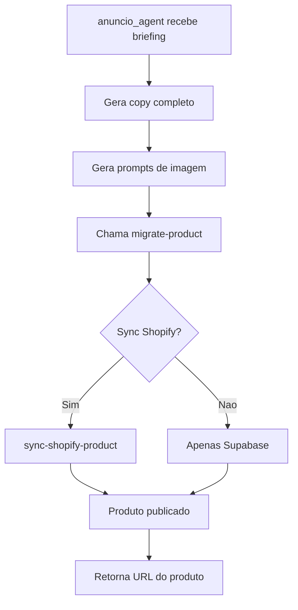

# Supabase Admin Setup - Autonomia do anuncio_agent

## Objetivo

Configurar acesso administrativo ao Supabase para que o `anuncio_agent` possa operar de forma autonoma no site GATO3, incluindo:

- Criar/atualizar produtos
- Sincronizar com Shopify
- Gerenciar imagens
- Atualizar metadados SEO

---

## Arquitetura de Integracao

```
anuncio_agent (Claude Code)
       |
       v
  Edge Functions (Admin)
       |
       +-- migrate-product
       +-- sync-shopify-product
       +-- fetch-from-shopify
       |
       v
  Supabase Database + Shopify
```

---

## 1. Obtendo Credenciais

### 1.1 Service Role Key (Admin)

**IMPORTANTE**: Esta chave tem acesso total. Nunca exponha em frontend.

```bash
# Localizacao no Supabase Dashboard:
# Project Settings > API > service_role key (secret)
```

**Formato**: `eyJhbGciOiJIUzI1NiIsInR5cCI6IkpXVCJ9...`

### 1.2 Anon Key (Publica)

```bash
# Project Settings > API > anon key (public)
# Usada apenas para funcoes publicas (chat, checkout)
```

### 1.3 Project URL

```
https://fuuguegkqnpzrrhwymgw.supabase.co
```

---

## 2. Configuracao de Ambiente

### 2.1 Arquivo .env (Local)

Criar arquivo `.env` na raiz do projeto:

```bash
# Supabase
SUPABASE_URL=https://fuuguegkqnpzrrhwymgw.supabase.co
SUPABASE_ANON_KEY=eyJ...seu_anon_key
SUPABASE_SERVICE_ROLE_KEY=eyJ...seu_service_role_key

# Shopify (para sync)
SHOPIFY_STORE_DOMAIN=gatoaocubo.myshopify.com
SHOPIFY_ACCESS_TOKEN=shpat_...seu_token

# OpenAI (para anuncio_agent)
OPENAI_API_KEY=sk-...
```

### 2.2 Verificar .gitignore

```bash
# Confirmar que .env esta ignorado
grep ".env" .gitignore || echo ".env" >> .gitignore
```

---

## 3. Endpoints Admin para anuncio_agent

### 3.1 Criar/Migrar Produto

```bash
POST https://fuuguegkqnpzrrhwymgw.supabase.co/functions/v1/migrate-product
Authorization: Bearer <SERVICE_ROLE_KEY>
Content-Type: application/json

{
  "product": {
    "title": "Arranhador Vertical Premium",
    "description": "Arranhador de sisal...",
    "price": 189.90,
    "compareAtPrice": 249.90,
    "images": [
      "https://storage.supabase.co/..."
    ],
    "metafields": {
      "seo_title": "Arranhador para Gatos | GATO3",
      "seo_description": "O melhor arranhador...",
      "keywords": ["arranhador", "gatos", "sisal"]
    }
  },
  "syncToShopify": true
}
```

### 3.2 Atualizar Produto Existente

```bash
POST https://fuuguegkqnpzrrhwymgw.supabase.co/functions/v1/sync-shopify-product
Authorization: Bearer <SERVICE_ROLE_KEY>
Content-Type: application/json

{
  "productId": "123",
  "updates": {
    "title": "Novo Titulo",
    "description": "Nova descricao...",
    "metafields": {
      "seo_title": "Novo SEO Title"
    }
  },
  "direction": "supabase_to_shopify"
}
```

### 3.3 Buscar Produtos

```bash
POST https://fuuguegkqnpzrrhwymgw.supabase.co/functions/v1/fetch-from-shopify
Authorization: Bearer <SERVICE_ROLE_KEY>
Content-Type: application/json

{
  "query": "products",
  "filters": {
    "status": "active",
    "limit": 50
  }
}
```

---

## 4. Fluxo Autonomo do anuncio_agent

### 4.1 Workflow Completo



### 4.2 Script de Publicacao

```python
import os
import requests

SUPABASE_URL = os.getenv("SUPABASE_URL")
SERVICE_KEY = os.getenv("SUPABASE_SERVICE_ROLE_KEY")

def publish_product(anuncio_data: dict) -> dict:
    """
    Publica um anuncio completo no site.

    Args:
        anuncio_data: Output do anuncio_agent (titulo, descricao, bullets, etc)

    Returns:
        dict com product_id e urls
    """

    headers = {
        "Authorization": f"Bearer {SERVICE_KEY}",
        "Content-Type": "application/json"
    }

    # Transformar output do agent para schema do produto
    product = {
        "title": anuncio_data["titulo"],
        "description": anuncio_data["descricao_completa"],
        "bullets": anuncio_data["bullet_points"],
        "price": anuncio_data.get("preco", 0),
        "images": anuncio_data.get("image_urls", []),
        "metafields": {
            "seo_title": anuncio_data["seo"]["meta_title"],
            "seo_description": anuncio_data["seo"]["meta_description"],
            "keywords": anuncio_data["keywords"]
        }
    }

    response = requests.post(
        f"{SUPABASE_URL}/functions/v1/migrate-product",
        headers=headers,
        json={"product": product, "syncToShopify": True}
    )

    return response.json()
```

---

## 5. Permissoes RLS (Row Level Security)

### 5.1 Politicas para Service Role

O Service Role Key **bypassa RLS** automaticamente. Nenhuma configuracao adicional necessaria.

### 5.2 Tabelas Relevantes

```sql
-- products: Armazena produtos
-- product_images: Imagens dos produtos
-- product_metafields: SEO e metadata
-- categories: Categorias de produtos
```

---

## 6. Upload de Imagens

### 6.1 Bucket de Storage

```
Bucket: product-images
URL: https://fuuguegkqnpzrrhwymgw.supabase.co/storage/v1/object/public/product-images/
```

### 6.2 Upload via API

```python
from supabase import create_client

supabase = create_client(SUPABASE_URL, SERVICE_KEY)

def upload_image(file_path: str, product_slug: str) -> str:
    """Upload imagem e retorna URL publica."""

    with open(file_path, "rb") as f:
        filename = f"{product_slug}/{os.path.basename(file_path)}"

        result = supabase.storage.from_("product-images").upload(
            filename,
            f,
            {"content-type": "image/webp"}
        )

    public_url = supabase.storage.from_("product-images").get_public_url(filename)
    return public_url
```

---

## 7. Validacao e Testes

### 7.1 Testar Conexao

```bash
# Testar acesso admin
curl -X POST \
  'https://fuuguegkqnpzrrhwymgw.supabase.co/functions/v1/fetch-from-shopify' \
  -H "Authorization: Bearer $SUPABASE_SERVICE_ROLE_KEY" \
  -H 'Content-Type: application/json' \
  -d '{"query":"products","filters":{"limit":1}}'
```

### 7.2 Verificar Secrets

```bash
# Listar secrets configurados
npx supabase secrets list
```

### 7.3 Checklist de Setup

- [ ] SUPABASE_SERVICE_ROLE_KEY obtida
- [ ] .env configurado
- [ ] .env no .gitignore
- [ ] Edge Functions deployadas
- [ ] Teste de conexao OK
- [ ] Upload de imagem OK
- [ ] Sync com Shopify OK

---

## 8. Seguranca

### 8.1 Regras

1. **NUNCA** commitar .env
2. **NUNCA** expor SERVICE_ROLE_KEY no frontend
3. Usar apenas em servidor/CLI (anuncio_agent roda local)
4. Rotacionar keys periodicamente

### 8.2 Rotacao de Keys

```bash
# No Supabase Dashboard:
# Project Settings > API > Regenerate key

# Atualizar .env local
# Atualizar secrets das Edge Functions se necessario
```

---

## 9. Integracao com Claude Code

### 9.1 Configurar MCP Server (Opcional)

Para acesso direto via Claude Code, adicionar ao `settings.json`:

```json
{
  "mcpServers": {
    "supabase-gato3": {
      "command": "npx",
      "args": ["supabase-mcp-server"],
      "env": {
        "SUPABASE_URL": "https://fuuguegkqnpzrrhwymgw.supabase.co",
        "SUPABASE_SERVICE_ROLE_KEY": "${SUPABASE_SERVICE_ROLE_KEY}"
      }
    }
  }
}
```

### 9.2 Uso Direto via Bash

O anuncio_agent pode usar curl diretamente:

```bash
# Exemplo de chamada admin
curl -X POST "$SUPABASE_URL/functions/v1/migrate-product" \
  -H "Authorization: Bearer $SUPABASE_SERVICE_ROLE_KEY" \
  -H "Content-Type: application/json" \
  -d @anuncio_output.json
```

---

## 10. Troubleshooting

### Erro 401 - Unauthorized
- Verificar se SERVICE_ROLE_KEY esta correta
- Confirmar header "Authorization: Bearer ..."

### Erro 403 - Forbidden
- Checar RLS policies (service role deveria bypassar)
- Verificar se funcao existe

### Erro 500 - Server Error
- Ver logs: `npx supabase functions logs <nome>`
- Checar variaveis de ambiente da funcao

### Timeout
- Edge Functions tem limite de 60s
- Considerar batch para operacoes grandes

---

## Proximos Passos

1. Obter SERVICE_ROLE_KEY do Supabase
2. Configurar .env local
3. Testar conexao com curl
4. Integrar no workflow do anuncio_agent
5. Documentar fluxo especifico de publicacao

---

**Versao**: 1.0.0
**Atualizado**: 2025-11-28
**Responsavel**: Setup para autonomia do anuncio_agent
