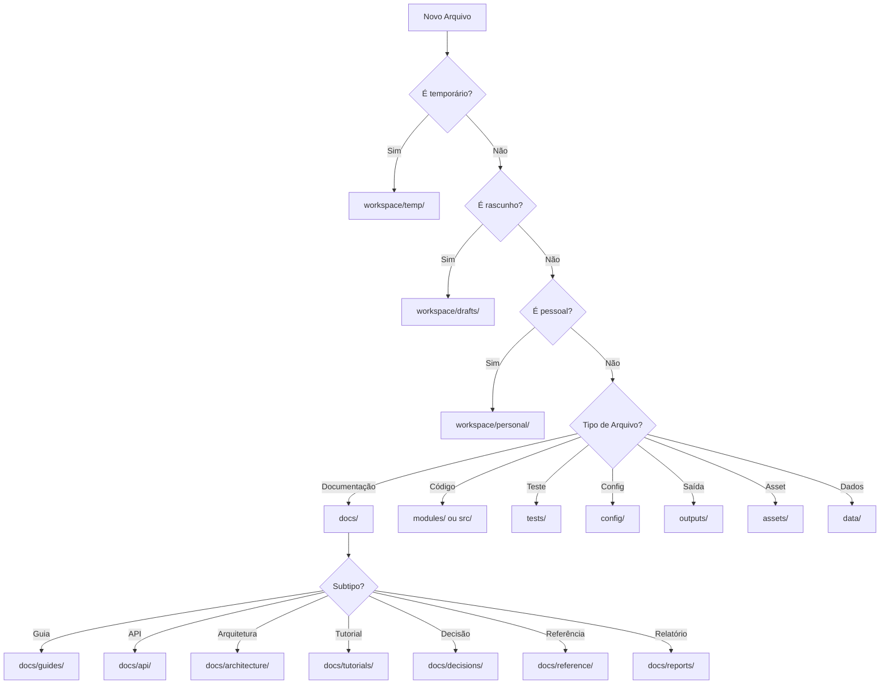

# 📍 DOCUMENT ROUTER - Guia Definitivo de Organização de Arquivos

> Nunca mais se pergunte "Onde salvo este arquivo?"

## 🎯 Árvore de Decisão Rápida



## 📂 Mapa Completo de Diretórios

### 🔧 Desenvolvimento Ativo

| Diretório | Propósito | Exemplos | Auto-limpeza |
|-----------|-----------|----------|--------------|
| `workspace/temp/` | Arquivos temporários de trabalho | `test.txt`, `debug.log`, `quick_note.md` | ✅ 7 dias |
| `workspace/drafts/` | Documentos em desenvolvimento | `draft_feature.md`, `wip_design.md` | ❌ Manual |
| `workspace/personal/` | Notas e arquivos pessoais | `ideas.md`, `my_notes.txt` | ❌ Nunca |
| `workspace/sessions/` | Arquivos de sessão de trabalho | `session_2024_01.md` | ✅ 30 dias |

### 📚 Documentação

| Diretório | Propósito | Exemplos |
|-----------|-----------|----------|
| `docs/guides/` | Guias e HOW-TOs | `SETUP_GUIDE.md`, `CONTRIBUTION_GUIDE.md` |
| `docs/api/` | Documentação de APIs | `REST_API.md`, `SDK_REFERENCE.md` |
| `docs/architecture/` | Decisões arquiteturais | `SYSTEM_DESIGN.md`, `DATABASE_SCHEMA.md` |
| `docs/tutorials/` | Tutoriais passo-a-passo | `GETTING_STARTED.md`, `ADVANCED_USAGE.md` |
| `docs/decisions/` | ADRs (Architecture Decision Records) | `ADR_001_DATABASE.md` |
| `docs/reference/` | Material de referência | `GLOSSARY.md`, `COMMANDS.md` |
| `docs/reports/` | Relatórios e análises | `PERFORMANCE_REPORT.md`, `AUDIT_2024.md` |

### 💻 Código e Implementação

| Diretório | Propósito | Exemplos |
|-----------|-----------|----------|
| `modules/` | Módulos Python do sistema | `crud_operations.py`, `scout_module.py` |
| `src/` | Código-fonte alternativo | `main.js`, `app.ts` |
| `tests/` | Testes automatizados | `test_crud.py`, `test_integration.py` |
| `scripts/` | Scripts utilitários (raiz) | `organize_files.py`, `validate.py` |

### 🔧 Configuração e Dados

| Diretório | Propósito | Exemplos |
|-----------|-----------|----------|
| `config/` | Arquivos de configuração | `.mcp.json`, `settings.yaml` |
| `data/` | Dados do sistema | `database.db`, `cache.json` |
| `outputs/` | Saídas geradas | `report_2024.pdf`, `export.csv` |
| `assets/` | Recursos estáticos | `logo.png`, `template.html` |
| `assets/templates/` | Templates reutilizáveis | `GUIDE_TEMPLATE.md` |

### 📦 Diretórios Especiais (Raiz do Projeto)

| Diretório | Propósito | Exemplos |
|-----------|-----------|----------|
| `.claude/` | Configuração do Claude Code | `commands/`, `settings.json` |
| `USER_DOCS/` | Documentos gerados para usuário | `produtos/`, `Marca/` |
| `knowledge-agent/` | Sistema de conhecimento | `Cards_Conhecimento/` |
| `{agent}-agent/` | Diretórios dos agentes | `anuncio-agent/`, `pesquisa-agent/` |

## 🎯 Decisões Rápidas por Tipo

### 📝 "Tenho um documento Markdown"

```bash
É pessoal? → workspace/personal/
É rascunho? → workspace/drafts/
É temporário? → workspace/temp/
É um guia? → docs/guides/
É sobre arquitetura? → docs/architecture/
É um relatório? → docs/reports/
É um tutorial? → docs/tutorials/
É uma referência? → docs/reference/
```

### 🐍 "Tenho código Python"

```bash
É um teste? → tests/
É um módulo do sistema? → modules/
É um script utilitário? → ../scripts/ (raiz)
É temporário/experimento? → workspace/temp/
```

### 🔧 "Tenho arquivo de configuração"

```bash
É pessoal/local? → workspace/personal/
É do sistema? → config/
É exemplo? → workspace/drafts/ ou assets/templates/
```

### 📊 "Tenho dados ou output"

```bash
É cache/temporário? → workspace/temp/
É output do sistema? → outputs/
É dados persistentes? → data/
É relatório? → docs/reports/
```

## 📋 Exemplos Práticos

### Exemplo 1: Novo Feature
```bash
# Início do desenvolvimento
echo "# Feature X" > workspace/drafts/draft_feature_x.md

# Testes rápidos
python workspace/temp/test_feature.py

# Código pronto
mv workspace/drafts/feature_x.py modules/feature_x.py

# Documentação finalizada
mv workspace/drafts/draft_feature_x.md docs/guides/FEATURE_X_GUIDE.md
```

### Exemplo 2: Análise de Dados
```bash
# Download temporário
wget data.csv -O workspace/temp/raw_data.csv

# Script de análise
vim workspace/drafts/analyze_data.py

# Executar análise
python workspace/drafts/analyze_data.py > outputs/analysis_2024.txt

# Relatório final
mv workspace/drafts/draft_analysis.md docs/reports/DATA_ANALYSIS_2024.md
```

### Exemplo 3: Debugging
```bash
# Logs temporários
python main.py 2> workspace/temp/debug.log

# Notas de debugging
echo "Bug found in line 42" >> workspace/personal/debug_notes.md

# Correção documentada
vim docs/decisions/ADR_042_BUG_FIX.md
```

## 🚀 Comandos Úteis

### Verificar onde salvar
```bash
# Sugestão automática
/organize suggest "meu_arquivo.py"

# Consultar este guia
cat docs/guides/DOCUMENT_ROUTER.md
```

### Organização automática
```bash
# Verificar arquivos mal posicionados
python ../scripts/organize_files.py check

# Corrigir automaticamente
python ../scripts/organize_files.py check --fix

# Modo interativo
python ../scripts/organize_files.py interactive
```

### Limpeza
```bash
# Limpar temporários antigos
find workspace/temp -mtime +7 -delete

# Promover rascunhos prontos
/organize promote --all-ready

# Arquivar documentos obsoletos
/organize archive --older-than 90
```

## 📊 Regras de Ouro

1. **Workspace é seu playground** - Use livremente para experimentos
2. **Temp se limpa sozinho** - Não guarde nada importante lá
3. **Drafts são promovidos** - Quando prontos, mova para local final
4. **Docs são organizados** - Use subpastas apropriadas
5. **Config é versionado** - Exceto arquivos locais/pessoais
6. **Outputs são gerados** - Não edite diretamente
7. **Tests ficam juntos** - Mantenha testes próximos ao código

## 🎨 Fluxo de Vida de um Arquivo

```
Criação → workspace/temp/ ou workspace/drafts/
   ↓
Desenvolvimento → workspace/drafts/
   ↓
Revisão → workspace/drafts/ (com prefixo draft_)
   ↓
Finalização → Local apropriado (docs/, modules/, etc.)
   ↓
Obsolescência → Arquivamento ou deleção
```

## 💡 Dicas Pro

### Para Máxima Produtividade
- Comece sempre em `workspace/temp/` se não tiver certeza
- Use `draft_` como prefixo em `workspace/drafts/`
- Mova arquivos quando estiverem maduros, não antes
- Delete `workspace/temp/` semanalmente
- Revise `workspace/drafts/` mensalmente

### Para Máxima Organização
- Execute `/organize check` diariamente
- Use templates de `assets/templates/`
- Mantenha nomes descritivos
- Agrupe arquivos relacionados
- Document decisões em `docs/decisions/`

## 🔄 Automação Disponível

| Comando | Ação | Frequência Recomendada |
|---------|------|------------------------|
| `/organize check` | Verifica organização | Diária |
| `/organize cleanup` | Limpa temporários | Semanal |
| `/organize promote` | Promove rascunhos | Quando prontos |
| `/organize archive` | Arquiva obsoletos | Mensal |
| `/organize suggest` | Sugere local para arquivo | Sob demanda |

---

> 💬 **Dúvidas?** Execute `/organize help` ou consulte este guia!